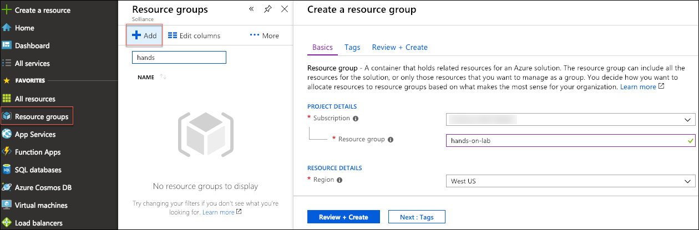
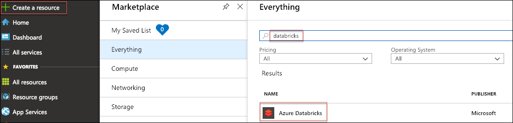
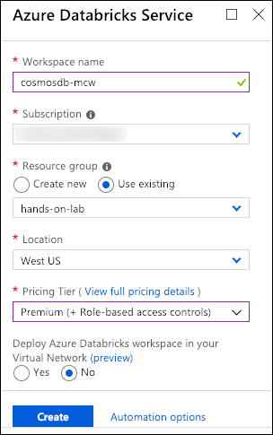
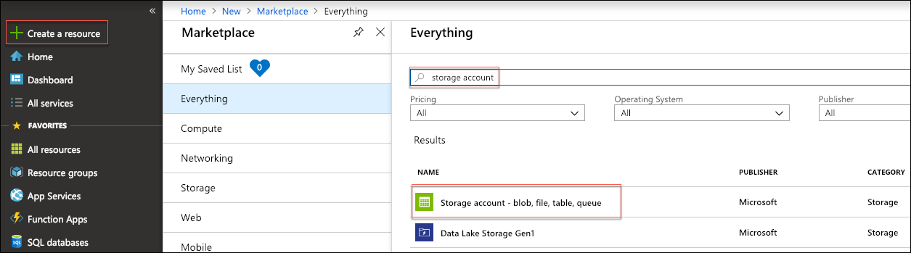
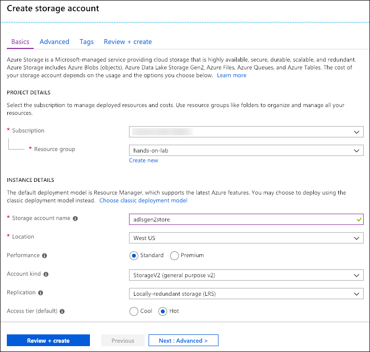
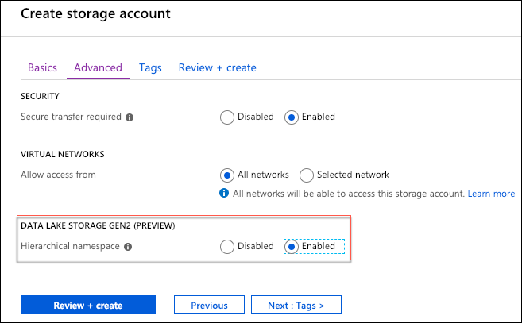
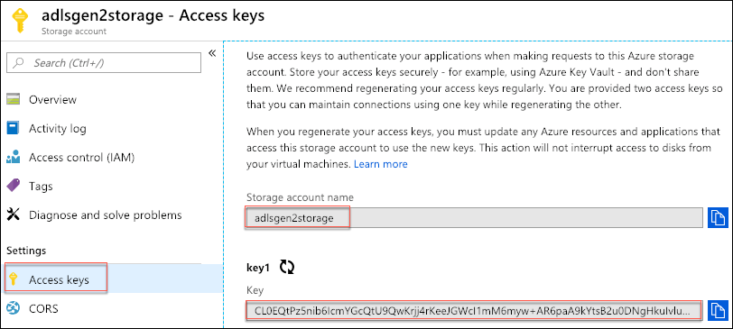
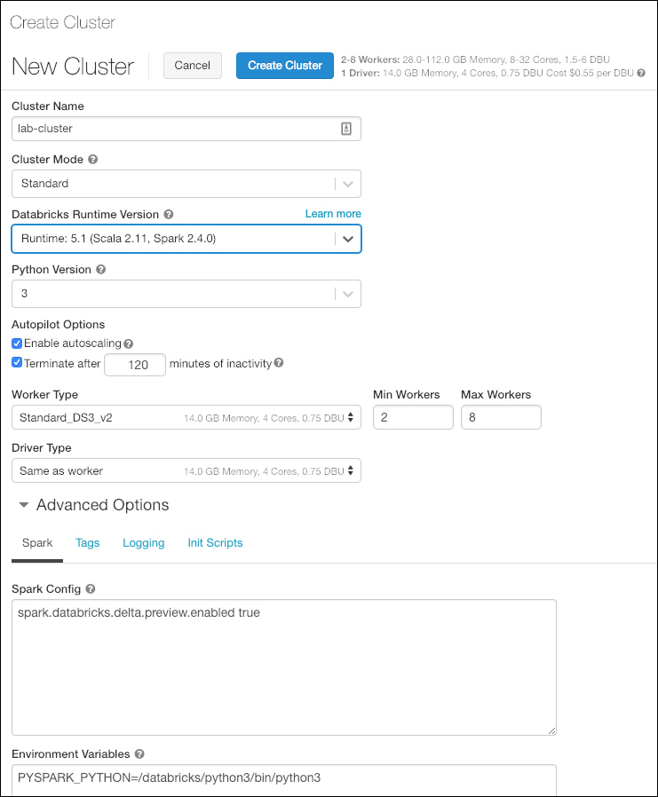

<div class="MCWHeader1">
Cosmos DB real-time advanced analytics
</div>

<div class="MCWHeader2">
Before the hands-on lab setup guide
</div>

<div class="MCWHeader3">
January 2019
</div>

Information in this document, including URL and other Internet Web site references, is subject to change without notice. Unless otherwise noted, the example companies, organizations, products, domain names, e-mail addresses, logos, people, places, and events depicted herein are fictitious, and no association with any real company, organization, product, domain name, e-mail address, logo, person, place or event is intended or should be inferred. Complying with all applicable copyright laws is the responsibility of the user. Without limiting the rights under copyright, no part of this document may be reproduced, stored in or introduced into a retrieval system, or transmitted in any form or by any means (electronic, mechanical, photocopying, recording, or otherwise), or for any purpose, without the express written permission of Microsoft Corporation.

Microsoft may have patents, patent applications, trademarks, copyrights, or other intellectual property rights covering subject matter in this document. Except as expressly provided in any written license agreement from Microsoft, the furnishing of this document does not give you any license to these patents, trademarks, copyrights, or other intellectual property.

The names of manufacturers, products, or URLs are provided for informational purposes only and Microsoft makes no representations and warranties, either expressed, implied, or statutory, regarding these manufacturers or the use of the products with any Microsoft technologies. The inclusion of a manufacturer or product does not imply endorsement of Microsoft of the manufacturer or product. Links may be provided to third party sites. Such sites are not under the control of Microsoft and Microsoft is not responsible for the contents of any linked site or any link contained in a linked site, or any changes or updates to such sites. Microsoft is not responsible for webcasting or any other form of transmission received from any linked site. Microsoft is providing these links to you only as a convenience, and the inclusion of any link does not imply endorsement of Microsoft of the site or the products contained therein.

© 2019 Microsoft Corporation. All rights reserved.

Microsoft and the trademarks listed at <https://www.microsoft.com/en-us/legal/intellectualproperty/Trademarks/Usage/General.aspx> are trademarks of the Microsoft group of companies. All other trademarks are property of their respective owners.

**Contents**

<!-- TOC -->

- [Cosmos DB real-time advanced analytics before the hands-on lab setup guide](#cosmos-db-real-time-advanced-analytics-before-the-hands-on-lab-setup-guide)
  - [Requirements](#requirements)
  - [Before the hands-on lab](#before-the-hands-on-lab)
    - [Task 1: Provision a resource group](#task-1-provision-a-resource-group)
    - [Task 2: Create an Azure Databricks workspace](#task-2-create-an-azure-databricks-workspace)
    - [Task 3: Provision Cosmos DB](#task-3-provision-cosmos-db)
    - [Task 4: Create an Azure Data Lake Storage Gen2 account](#task-4-create-an-azure-data-lake-storage-gen2-account)
    - [Task 5: Provision an Azure Machine Learning Service](#task-5-provision-an-azure-machine-learning-service)
    - [Task 6: Set up Azure Key Vault](#task-6-set-up-azure-key-vault)
    - [Task 7: Create an Azure Databricks cluster](#task-7-create-an-azure-databricks-cluster)

<!-- /TOC -->

# Cosmos DB real-time advanced analytics before the hands-on lab setup guide

## Requirements

1. Number and insert your custom workshop content here...

## Before the hands-on lab

Duration: 30 minutes

In the Before the hands-on lab exercise, you will set up your environment for use in the rest of the hands-on lab. You should follow all the steps provided in the Before the hands-on lab section to prepare your environment **before attending** the hands-on lab. Failure to do so will significantly impact your ability to complete the lab within the time allowed.

> **Important**: Most Azure resources require unique names. Throughout this lab you will see the word “SUFFIX” as part of resource names. You should replace this with your Microsoft alias, initials, or another value to ensure the resource is uniquely named.

### Task 1: Provision a resource group

In this task, you will create an Azure resource group for the resources used throughout this lab.

1. In the [Azure portal](https://portal.azure.com), select **Resource groups** from the left-hand navigation menu, select **+Add**, and then enter the following in the Create a resource group blade:

    - **Subscription**: Select the subscription you are using for this hands-on lab.

    - **Resource group name**: Enter hands-on-lab-SUFFIX.

    - **Region**: Select the region you would like to use for resources in this hands-on lab. Remember this location so you can use it for the other resources you'll provision throughout this lab.

        

2. Select **Review + create**.

3. On the Summary blade, select **Create** to provision your resource group.

### Task 2: Create an Azure Databricks workspace

1. In the [Azure portal](https://portal.azure.com), select **+ Create a resource** from the left-hand navigation menu, enter "databricks" into the Search the Marketplace box, select **Azure Databricks** from the results, and then select **Create**.

    

2. In the Azure Databricks Service blade, enter the following:

    - **Workspace name**: Enter a unique name, such as cosmosdb-mcw.
    - **Subscription**: Select the subscription you are using for this hands-on lab.
    - **Resource group**: Choose Use existing, and select the hands-on-lab-SUFFIX resource group from the list.
    - **Location**: Select the region you are using for resources in this hands-on lab.
    - **Pricing tier**: Select Premium (+ Role-based access controls).
    - Select **No** under Deploy Azure Databricks workspace in your Virtual Network.

    

3. Select **Create**. It can take 5 - 10 minutes to provision your Azure Databricks workspace. You can move on to the next task while provisioning completes.

### Task 3: Provision Cosmos DB

TODO: Enter steps for provisioning Cosmos DB.

### Task 4: Create an Azure Data Lake Storage Gen2 account

In this task, you will create an Azure Data Lake Storage Gen2 (ADLS Gen2) account, which will be used as the repository for the Databricks Delta tables you will be creating in this hands-on lab.

1. In the [Azure portal](https://portal.azure.com), select **+ Create a resource**, enter "storage account" into the Search the Marketplace box, select **Storage account - blob, file, table, queue** from the results, and then select **Create**.

    

2. On the Create storage account blade's **Basics** tab, enter the following:

   - **Subscription**: Select the subscription you are using for this hands-on lab.
   - **Resource group**: Choose the hands-on-lab-SUFFIX resource group.
   - **Storage account name**: Enter a globally unique name (indicated by a green check mark).
   - **Location**: Select the region you are using for resources in this hands-on lab.
   - **Performance**: Select Standard.
   - **Account kind**: Select StorageV2 (general purpose v2).
   - **Replication**: Choose Locally-redundant storage (LRS).
   - **Access tier (default)**: Select Hot.

   

3. Select **Next : Advanced >** to move on to the **Advanced** tab.

4. On the **Advanced** tab, set the Hierarchical namespace option to **Enabled** under Data Lake Storage Gen2 (Preview), and then select **Review + create**

    

5. On the **Review + create** tab, ensure the **Validation passed** message is displayed, and select **Create** to provision the new ADLS Gen2 instance.

    

6. Navigate to the newly provisioned ADLS Gen2 account in the Azure portal, then select **Access keys** under Settings on the left-hand menu and do the following:

    - Copy the **Storage account name** value and paste it into a text editor, such as Notepad, for later use.
  
    - Copy the key1 **Key** value and paste it into a text editor, such as Notepad, for later use.

        

### Task 5: Provision an Azure Machine Learning Service

TODO: Enter steps for this.

### Task 6: Set up Azure Key Vault

TODO: Enter steps for this.

You should follow all steps provided *before* performing the Hands-on lab.

### Task 7: Create an Azure Databricks cluster

In this task, you will connect to your Azure Databricks workspace and create a cluster to use for this hands-on lab.

1. Return to the [Azure portal](https://portal.azure.com), navigate to the Azure Databricks workspace you provisioned above, and select **Launch Workspace** from the overview blade, signing into the workspace with your Azure credentials, if required.

    

2. Select **Clusters** from the left-hand navigation menu, and then select **+ Create Cluster**.

    

3. On the Create Cluster screen, enter the following:

    - **Cluster Name**: Enter a name for your cluster, such as lab-cluster.
    - **Cluster Mode**: Select Standard.
    - **Databricks Runtime Version**: Select Runtime: 5.1 (Scala 2.11, Spark 2.4.0).
    - **Python Version**: Select 3.
    - **Enable autoscaling**: Ensure this is checked.
    - **Terminate after XX minutes of inactivity**: Leave this checked, and the number of minutes set to 120.
    - **Worker Type**: Select Standard_DS3_v2.
        - **Min Workers**: Leave set to 2.
        - **Max Workers**: Leave set to 8.
    - **Driver Type**: Set to Same as worker.
    - Expand Advanced Options and enter the following into the Spark Config box:

    ```bash
    spark.databricks.delta.preview.enabled true
    ```

    

4. Select **Create Cluster**. It will take 3-5 minutes for the cluster to be created and started.