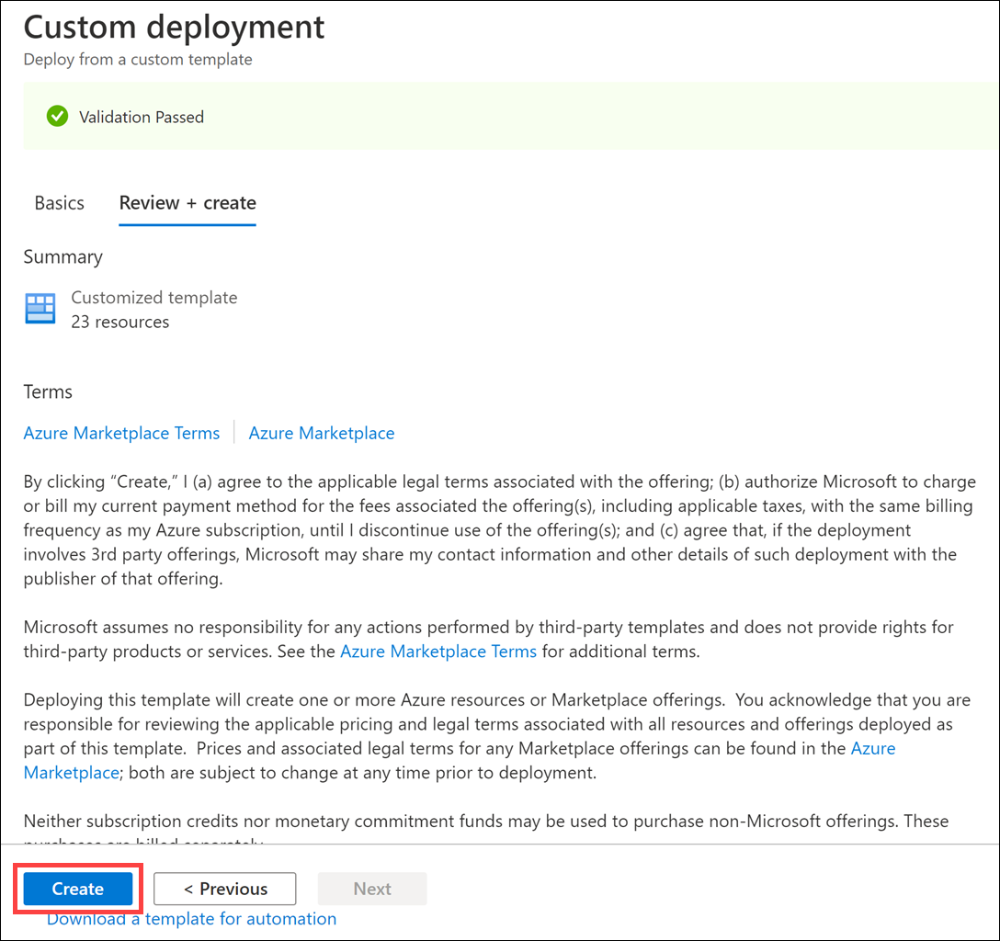

Cosmos DB real-time advanced analytics

Before the hands-on lab setup guide

October 2020

Information in this document, including URL and other Internet Web site references, is subject to change without notice. Unless otherwise noted, the example companies, organizations, products, domain names, e-mail addresses, logos, people, places, and events depicted herein are fictitious, and no association with any real company, organization, product, domain name, e-mail address, logo, person, place or event is intended or should be inferred. Complying with all applicable copyright laws is the responsibility of the user. Without limiting the rights under copyright, no part of this document may be reproduced, stored in or introduced into a retrieval system, or transmitted in any form or by any means (electronic, mechanical, photocopying, recording, or otherwise), or for any purpose, without the express written permission of Microsoft Corporation.

Microsoft may have patents, patent applications, trademarks, copyrights, or other intellectual property rights covering subject matter in this document. Except as expressly provided in any written license agreement from Microsoft, the furnishing of this document does not give you any license to these patents, trademarks, copyrights, or other intellectual property.

The names of manufacturers, products, or URLs are provided for informational purposes only and Microsoft makes no representations and warranties, either expressed, implied, or statutory, regarding these manufacturers or the use of the products with any Microsoft technologies. The inclusion of a manufacturer or product does not imply endorsement of Microsoft of the manufacturer or product. Links may be provided to third party sites. Such sites are not under the control of Microsoft and Microsoft is not responsible for the contents of any linked site or any link contained in a linked site, or any changes or updates to such sites. Microsoft is not responsible for webcasting or any other form of transmission received from any linked site. Microsoft is providing these links to you only as a convenience, and the inclusion of any link does not imply endorsement of Microsoft of the site or the products contained therein.

© 2020 Microsoft Corporation. All rights reserved.

Microsoft and the trademarks listed at <https://www.microsoft.com/en-us/legal/intellectualproperty/Trademarks/Usage/General.aspx> are trademarks of the Microsoft group of companies. All other trademarks are property of their respective owners.

**Contents**

<!-- TOC -->

- [Cosmos DB real-time advanced analytics before the hands-on lab setup guide](#cosmos-db-real-time-advanced-analytics-before-the-hands-on-lab-setup-guide)
  - [Requirements](#requirements)
  - [Before the hands-on lab](#before-the-hands-on-lab)
    - [Task 1: Download the starter files](#task-1-download-the-starter-files)
    - [Task 2: Download and install Power BI Desktop](#task-2-download-and-install-power-bi-desktop)
    - [Task 3: Provision a resource group](#task-3-provision-a-resource-group)
    - [Task 4: Deploy Environment](#task-4-deploy-environment)

<!-- /TOC -->

# Cosmos DB real-time advanced analytics before the hands-on lab setup guide

## Requirements

1. Microsoft Azure subscription (non-Microsoft subscription, must be a pay-as-you subscription).
2. **IMPORTANT**: To complete the OAuth 2.0 access components of this hands-on lab you must have permissions within your Azure subscription to create an App Registration and service principal within Azure Active Directory.

## Before the hands-on lab

Duration: 60 minutes

In the Before the hands-on lab exercise, you will set up your environment for use in the rest of the hands-on lab. You should follow all the steps provided in the Before the hands-on lab section to prepare your environment **before attending** the hands-on lab. Failure to do so will significantly impact your ability to complete the lab within the time allowed.

> **Important**: Most Azure resources require unique names. Throughout this lab you will see the word “SUFFIX” as part of resource names. You should replace this with your Microsoft alias, initials, or another value to ensure the resource is uniquely named.

### Task 1: Download the starter files

Download a starter project that includes a payment data generator that sends real-time payment data for processing by your lab solution, as well as data files used in the lab.

1. Download the starter files by downloading a .zip copy of the Cosmos DB real-time advanced analytics GitHub repo.

2. In a web browser, navigate to the [Cosmos DB real-time advanced analytics MCW repo](https://github.com/Microsoft/MCW-Cosmos-DB-Real-Time-Advanced-Analytics).

3. On the repo page, select **Clone or download**, then select **Download ZIP**.

   

4. Unzip the contents to the folder `C:\CosmosMCW\`.

### Task 2: Download and install Power BI Desktop

Power BI desktop is required to make a connection to your Azure Databricks environment when creating the Power BI dashboard.

1. Download and install [Power BI Desktop](https://powerbi.microsoft.com/desktop/).

### Task 3: Provision a resource group

In this task, you will create an Azure resource group for the resources used throughout this lab.

1. In the [Azure portal](https://portal.azure.com), select **Resource groups** from the left-hand navigation menu, select **+Add**, and then enter the following in the Create a resource group blade:

   - **Subscription**: Select the subscription you are using for this hands-on lab.

   - **Resource group name**: Enter hands-on-lab-SUFFIX.

   - **Region**: Select the region you would like to use for resources in this hands-on lab. Remember this location so you can use it for the other resources you'll provision throughout this lab.

     

2. Select **Review + create**.

3. On the Summary blade, select **Create** to provision your resource group.

### Task 4: Deploy Environment

1. Deploy the workspace through the following Azure ARM template (press the button below):

    

2. Enter the following values, then select **Review + create**:

   - Resource group: **Select the Resource Group created previously for the lab**.
   - Unique Suffix: **Enter a unique value, such as your initials followed by birth year**.
   - Autoscale Max Throughput: **Enter 4000 as the max RU/s for the Azure Cosmos DB containers**.

   

3. Select **Create** on the `Review + create` form.

    

4. The deployment will take approximately 15 - 20 minutes to complete.

    

You should follow all steps provided _before_ performing the Hands-on lab.
