<div class="MCWHeader1">
Cosmos DB real-time advanced analytics
</div>

<div class="MCWHeader2">
Hands-on lab step-by-step
</div>

<div class="MCWHeader3">
January 2019
</div>

Information in this document, including URL and other Internet Web site references, is subject to change without notice. Unless otherwise noted, the example companies, organizations, products, domain names, e-mail addresses, logos, people, places, and events depicted herein are fictitious, and no association with any real company, organization, product, domain name, e-mail address, logo, person, place or event is intended or should be inferred. Complying with all applicable copyright laws is the responsibility of the user. Without limiting the rights under copyright, no part of this document may be reproduced, stored in or introduced into a retrieval system, or transmitted in any form or by any means (electronic, mechanical, photocopying, recording, or otherwise), or for any purpose, without the express written permission of Microsoft Corporation.

Microsoft may have patents, patent applications, trademarks, copyrights, or other intellectual property rights covering subject matter in this document. Except as expressly provided in any written license agreement from Microsoft, the furnishing of this document does not give you any license to these patents, trademarks, copyrights, or other intellectual property.

The names of manufacturers, products, or URLs are provided for informational purposes only and Microsoft makes no representations and warranties, either expressed, implied, or statutory, regarding these manufacturers or the use of the products with any Microsoft technologies. The inclusion of a manufacturer or product does not imply endorsement of Microsoft of the manufacturer or product. Links may be provided to third party sites. Such sites are not under the control of Microsoft and Microsoft is not responsible for the contents of any linked site or any link contained in a linked site, or any changes or updates to such sites. Microsoft is not responsible for webcasting or any other form of transmission received from any linked site. Microsoft is providing these links to you only as a convenience, and the inclusion of any link does not imply endorsement of Microsoft of the site or the products contained therein.

© 2019 Microsoft Corporation. All rights reserved.

Microsoft and the trademarks listed at <https://www.microsoft.com/en-us/legal/intellectualproperty/Trademarks/Usage/General.aspx> are trademarks of the Microsoft group of companies. All other trademarks are property of their respective owners.

**Contents**

<!-- TOC -->

- [Cosmos DB real-time advanced analytics hands-on lab step-by-step](#cosmos-db-real-time-advanced-analytics-hands-on-lab-step-by-step)
  - [Abstract and learning objectives](#abstract-and-learning-objectives)
  - [Overview](#overview)
  - [Solution architecture](#solution-architecture)
  - [Requirements](#requirements)
  - [Before the hands-on lab](#before-the-hands-on-lab)
  - [Exercise 1: Collecting streaming transaction data](#exercise-1-collecting-streaming-transaction-data)
    - [Task 1: Configure Event Hubs and the transaction generator](#task-1-configure-event-hubs-and-the-transaction-generator)
    - [Task 2: Ingesting streaming data into Cosmos DB](#task-2-ingesting-streaming-data-into-cosmos-db)
    - [Task 3: Choosing between Cosmos DB and Event Hubs for ingestion](#task-3-choosing-between-cosmos-db-and-events-hubs-for-ingestion)
  - [Exercise 2: Understanding and preparing the transaction data at scale](#exercise-2-understanding-and-preparing-the-transaction-data-at-scale)
    - [Task 1: Create a service principal for OAuth access to the ADLS Gen2 filesystem](#task-1-create-a-service-principal-for-oauth-access-to-the-adls-gen2-filesystem)
    - [Task 2: Grant ADLS Gen2 access permissions to the service principal](#task-2-grant-adls-gen2-access-permissions-to-the-service-principal)
    - [Task 3: Retrieve your Azure AD tenant ID](#task-3-retrieve-your-azure-ad-tenant-id)
    - [Task 4: Install the Azure Cosmos DB Spark Connector in Databricks](#task-4-install-the-azure-cosmos-db-spark-connector-in-databricks)
    - [Task 5: Explore historical transaction data with Azure Databricks and Spark](#task-5-explore-historical-transaction-data-with-azure-databricks-and-spark)
    - [Task 6: Responding to streaming transactions using the Cosmos DB Change Feed and Spark Structured Streaming in Azure Databricks](#task-6-responding-to-streaming-transactions-using-the-cosmos-db-change-feed-and-spark-structured-streaming-in-azure-databricks)
  - [Exercise 3: Creating and evaluating fraud models](#exercise-3-creating-and-evaluating-fraud-models)
    - [Task 1: Task name](#task-1-task-name-2)
    - [Task 2: Task name](#task-2-task-name-2)
  - [Exercise 4: Scaling globally](#exercise-4-scaling-globally)
    - [Task 1: Distributing batch scored data globally using Cosmos DB](#task-1-distributing-batch-scored-data-globally-using-cosmos-db)
    - [Task 2: Distributing models globally](#task-2-distributing-models-globally)
    - [Task 3: Scheduling Azure Databricks jobs to batch score transactions on a schedule](#task-3-scheduling-azure-databricks-jobs-to-batch-score-transactions-on-a-schedule)
  - [After the hands-on lab](#after-the-hands-on-lab)
    - [Task 1: Delete the hands-on-lab resource group](#task-1-delete-the-hands-on-lab-resource-group)

<!-- /TOC -->

# Cosmos DB real-time advanced analytics hands-on lab step-by-step

## Abstract and learning objectives

Woodgrove Bank, who provides payment processing services for commerce, is looking to design and implement a PoC of an innovative fraud detection solution. They want to provide new services to their merchant customers, helping them save costs by applying machine learning and advanced analytics to detect fraudulent transactions. Their customers are around the world, and the right solutions for them would minimize any latencies experienced using their service by distributing as much of the solution as possible, as closely as possible, to the regions in which their customers use the service.

In this hands-on lab session, you will implement a PoC of the data pipeline that could support the needs of Woodgrove Bank.

At the end of this workshop, you will be better able to implement solutions that leverage the strengths of Cosmos DB in support of advanced analytics solutions that require high throughput ingest, low latency serving and global scale in combination with scalable machine learning, big data and real-time processing capabilities.

## Overview

Woodgrove Bank, who provides payment processing services for commerce, is looking to design and implement a proof-of-concept (PoC) of an innovative fraud detection solution. They want to provide new services to their merchant customers, helping them save costs by applying machine learning and advanced analytics to detect fraudulent transactions. Their customers are around the world, and the right solutions for them would minimize any latencies experienced using their service by distributing as much of the solution as possible, as closely as possible, to the regions in which their customers use the service.

## Solution architecture

Below is a diagram of the solution architecture you will build in this lab. Please study this carefully, so you understand the whole of the solution as you are working on the various components.


The solution begins with the payment transaction systems writing transactions to Azure Cosmos DB. With change feed enabled in Cosmos DB, the transactions can be read as a stream of incoming data within an Azure Databricks notebook, using the `azure-cosmosdb-spark` connector, and stored long-term within an Azure Databricks Delta table backed by Azure Data Lake Storage. The Delta tables efficiently manage inserts and updates (e.g., upserts) to the transaction data. Tables created in Databricks over this data can be accessed by business analysts using dashboards and reports in Power BI, by using Power BI's Spark connector. Data scientists and engineers can create their own reports against this data, using Azure Databricks notebooks. Azure Databricks also supports training and validating the machine learning model, using historical data stored in Azure Data Lake Storage. The model can be periodically re-trained using the data stored in Delta tables or other historical tables. The Azure Machine Learning service is used to deploy the trained model as a real-time scoring web service running on a highly available Azure Kubernetes Service cluster (AKS cluster). The trained model is also used in scheduled offline scoring through Databricks jobs, and the "suspicious activity" output is stored in Azure Cosmos DB so it is globally available in regions closest to Woodgrove Bank's customers through their web applications. Finally, Azure Key Vault is used to securely store secrets, such as account keys and connection strings, and serves as a backing for Azure Databricks secret scopes.

> **Note**: The preferred solution is only one of many possible, viable approaches.

## Requirements

1. Microsoft Azure subscription (non-Microsoft subscription, must be a pay-as-you subscription).
2. An Azure Databricks cluster running Databricks Runtime 5.1 or above. Azure Databricks integration with Azure Data Lake Storage Gen2 is **fully supported in Databricks Runtime 5.1**.
   - **IMPORTANT**: To complete the OAuth 2.0 access components of this hands-on lab you must:
     - Have a cluster running Databricks Runtime 5.1 and above.
     - Have permissions within your Azure subscription to create an App Registration and service principal within Azure Active Directory.

## Exercise 1: Collecting streaming transaction data

Duration: 30 minutes

In this exercise, you will configure a payment transaction generator to write real-time streaming online payments to both Event Hubs and Azure Cosmos DB. By the end, you will have selected the best ingest option before continuing to the following exercise where you will process the generated data.

### Task 1: Configuring Event Hubs and the transaction generator

In this task, you will configure the payment transaction data generator project by completing TODO items in the source code and adding connection information for your Event Hub.

1. Open File Explorer on your machine or VM and navigate to the location you extracted the MCW repo .zip file to (C:\\CosmosMCW\\).

2. Open **TransactionGenerator.sln** in the `Hands-on lab\lab-files\TransactionGenerator` directory. This will open the solution in Visual Studio.

   

3. Double-click `appsettings.json` in the Solution Explorer to open it. This file contains the settings used by the console app to connect to your Azure services and to configure application behavior settings. The console app is programmed to either use values stored in this file, or within the machine's environment variables. This makes you capable of distributing the executable or containerizing it and passing in environment variables via the command line.

   

   The `appsettings.json` file contains the following:

   ```javascript
   {
       "EVENT_HUB_1_CONNECTION_STRING": "",
       "EVENT_HUB_2_CONNECTION_STRING": "",
       "EVENT_HUB_3_CONNECTION_STRING": "",

       "COSMOS_DB_ENDPOINT": "",
       "COSMOS_DB_AUTH_KEY": "",

       "SECONDS_TO_LEAD": "0",
       "SECONDS_TO_RUN": "600",
       "ONLY_WRITE_TO_COSMOS_DB": "false"
   }
   ```

   `SECONDS_TO_LEAD` is the amount of time to wait before sending payment transaction data. Default value is `0`.

   `SECONDS_TO_RUN` is the maximum amount of time to allow the generator to run before stopping transmission of data. The default value is `600`. Data will also stop transmitting after the included `Untagged_Transactions.csv` file's data has been sent.

   If the `ONLY_WRITE_TO_COSMOS_DB` property is set to `true`, no records will be sent to the Event Hubs instances. Default value is `false`.

4. Copy your Event Hub connection string value you saved during the steps you completed in the before the hands-on lab setup guide. Paste this value into the double-quotes located next to `EVENT_HUB_1_CONNECTION_STRING`.

   

5. Save the file.

6. Open `Program.cs` in the Visual Studio Solution Explorer.

7. In Visual Studio, select **View**, then **Task List** from the dropdown menu.

   

   This will display the TODO items within the code comments as a list of tasks you can double-click to jump to its location.

   

8. Go to **TODO 1** located in `Program.cs` by double-clicking the item in the Task List. Paste the following code under TODO 1, which uses the Event Hub client to send the event data, setting the partition key to `IpCountryCode`:

   ```csharp
   await eventHubClient.SendAsync(eventData: eventData,
       partitionKey: transaction.IpCountryCode).ConfigureAwait(false);
   ```

   Your completed code should look like the following:

   

9. Paste the code below under **TODO 2** to increment the count of the number of Event Hub requests that succeeded:

   ```csharp
   _eventHubRequestsSucceededInBatch++;
   ```

10. Paste the code below under **TODO 3** to instantiate a new Event Hub client and add it to the `eventHubClients` collection:

    ```csharp
    EventHubClient.CreateFromConnectionString(
        arguments.EventHubConnectionString
    ),
    ```

11. Save your changes.

### Task 2: Ingesting streaming data into Cosmos DB

In this task, you will configure Cosmos DB's time-to-live (TTL) settings to On with no default. This will allow the data generator to expire, or delete, the ingested messages after any desired period of time by setting the TTL value (object property of `ttl`) on individual messages as they are sent.

Next you will pass in the Azure Cosmos DB URI and Key values to the data generator so it can connect to and send events to your collection.

1. Navigate to your Azure Cosmos DB account in the Azure portal, then select **Data Explorer** on the left-hand menu.

   

2. Expand your **Woodgrove** database and your **transactions** collection, then select **Scale & Settings**.

3. Under Settings within the Scale & Settings blade, select the **On (no default)** option for Time to Live. This setting is required to allow documents added to the collection to be configured with their own TTL values.

   

4. Select **Save** to apply your settings.

5. Open Visual Studio to go back to the TransactionGenerator project.

6. Open the `appsettings.json` file once more. Paste your Cosmos DB endpoint value next to `COSMOS_DB_ENDPOINT`, and the Cosmos DB authorization key next to `COSMOS_DB_AUTH_KEY`. You recorded these values during the Cosmos DB provisioning steps in the before the hands-on lab setup guide. For example:

   

7. Open `Program.cs` and paste the code below under **TODO 4** to send the generated transaction data to Cosmos DB and store the returned `ResourceResponse` object into a new variable for statistics about RU/s used:

   ```csharp
   var response = await _cosmosDbClient.CreateDocumentAsync(collectionUri, transaction)
       .ConfigureAwait(false);
   ```

8. Paste the code below under **TODO 5** to append the number of RU/s consumed to the `_cosmosRUsPerBatch` variable:

   ```csharp
   _cosmosRUsPerBatch += response.RequestCharge;
   ```

9. Paste the code below under **TODO 6** to set the Cosmos DB connection policy:

   ```csharp
   var connectionPolicy = new ConnectionPolicy
   {
       ConnectionMode = ConnectionMode.Direct,
       ConnectionProtocol = Protocol.Tcp
   };
   ```

10. Save your changes.

11. Run the console app by clicking **Debug**, then **Start Debugging** in the top menu in Visual Studio, or press _F-5_ on your keyboard.

    

12. The PaymentGenerator console window will open, and you should see it start to send data after a few seconds. You may close the window or press `Ctrl+C` or `Ctrl+Break` at any time to stop sending data to Event Hubs and Cosmos DB.

    

    The top of the output displays information about the Cosmos DB collection you created (transactions), the requested RU/s as well as estimated hourly and monthly cost. After every 1,000 records are requested to be sent, you will see output statistics so you can compare Event Hubs to Cosmos DB. Be on the lookout for the following:

    - Compare Event Hub to Cosmos DB statistics. They should have similar processing times and successful calls.
    - Inserted line shows successful inserts in this batch and throughput for writes/second with RU/s usage and estimated monthly ingestion rate added to Cosmos DB statistics.
    - Processing time: Shows whether the processing time for the past 1,000 requested inserts is faster or slower than the other service.
    - Total elapsed time: Running total of time taken to process all documents.
    - If this value continues to be grow higher for Cosmos DB vs. Event Hubs, that is a good indicator that the Cosmos DB requests are being throttled. Consider increasing the RU/s for the container.
    - Succeeded shows number of accumulative successful inserts to the service.
    - Pending are items in the bulkhead queue. This amount will continue to grow if the service is unable to keep up with demand.
    - Accumulative failed requests that encountered an exception.

    > The obvious and recommended method for sending a lot of data is to do so in batches. This method can multiply the amount of data sent with each request by hundreds or thousands. However, the point of our exercise is not to maximize throughput and send as much data as possible, but to compare the relative performance between Event Hubs and Cosmos DB.

13. As an experiment, scale the number of requested RU/s for your Cosmos DB collection down to 750. After doing so, you should see increasingly slower transfer rates to Cosmos DB due to throttling. You will also see the pending queue growing at a higher rate. The reason for this is because when the number of writes (remember, writes use 5 RU/s vs. just 1 RU/s for reads) exceeds the allotted amount of RU/s, Cosmos DB sends a 429 response with a _retry_after_ header value to tell the consumer that it is resource-constrained. The SDK automatically handles this by waiting for the specified amount of time, then retrying. After you are done experimenting, set the RU/s back to 15,000.

### Task 3: Choosing between Cosmos DB and Event Hubs for ingestion

Woodgrove Bank has a number of requirements around ingesting payment data, including data retention of the hot data and geographic locations to which the data is replicated for high availability and global distribution of the data for processing. There are many similarities between Event Hubs and Cosmos DB that allow both to work well for data ingestion. However, these services have some significant differences in their overall feature set that you need to evaluate to choose the best option for this customer situation.

In this exercise, you will use the data generator to send data to both Event Hubs and Cosmos DB and compare the performance of the two. You will also configure the generator and the services to set message retention and to send data to various global regions.

1. Open Visual Studio and paste the code below under **TODO 7** (located within `Transaction.cs`) to set the time to live (TTL) value to 60 days (in seconds):

   ```csharp
   tx.TimeToLive = 60 * 60 * 24 * 60;
   ```

   This configures Cosmos DB to automatically delete the ingested messages after 60 days by setting the TTL value (`ttl` property) on individual messages as they are sent. This optimization helps save in storage costs while meeting Woodgrove Bank's requirement to keep the streaming data available for that amount of time so they can reprocess in Azure Databricks, or query the raw data within the collection as needed.

   > Setting the TTL for documents saved to Cosmos DB individually for any length of time desired (even beyond 7 days) is an advantage Cosmos DB has over Event Hubs when used for ingesting streaming data.

2. Save your changes.

3. Navigate to your Event Hubs namespace for this lab in the Azure portal. Select **Event Hubs** from the left-hand menu.

   

4. Select your **transactions** event hub.

5. Select **Properties** on the left-hand menu.

6. Drag the **Message Retention** slider all the way to the right to set the value to 7. Unfortunately, this is as long as you can set message retention for Event Hubs messages using the portal UI. It is possible to contact Microsoft to set the value to as many as 4 weeks. Unfortunately, this does not meet Woodgrove Bank's requirements for retaining this hot data for 60 days.

   

7. Select **Save Changes**.

    > Woodgrove Bank wants to write all transaction data simultaneously to three different geographic locations: United States, Great Britain, and East Asia. All data should be able to be read from these locations with as little latency as possible. They require this for redundancy purposes as well as being able to better process the data in those regions.

8. Create two more Event Hubs namespaces and event hubs within to ingest transaction data. In the [Azure portal](https://portal.azure.com), select **+ Create a resource**, enter "event hubs" into the Search the Marketplace box, select **Event Hubs** from the results, and then select **Create**.

   

9. On the Create Namespace blade, enter the following:

   - **Name**: Enter a globally unique name (indicated by a green check mark).
   - **Pricing tier**: Select Standard.
   - **Enable Kafka**: Unchecked.
   - **Make this namespace zone redundant**: Unchecked.
   - **Subscription**: Select the subscription you are using for this hands-on lab.
   - **Resource group**: Choose the hands-on-lab-SUFFIX resource group.
   - **Location**: Select **UK South**. (If you already selected this for the first Event Hub namespace, select a US region)
   - **Throughput Units**: Set the slider all the way to the left, setting the value to 1.
   - **Enable Auto-Inflate**: Unchecked.

   

10. Select **Create**.

11. Navigate to the newly provisioned Event Hubs namespace in the Azure portal, then select **Event Hubs** under Entities on the left-hand menu.

    

12. Select **+ Event Hub** in the top toolbar.

    

13. In the **Create Event Hub** blade, configure the following:

    - **Name**: Enter "transactions".
    - **Partition Count**: Move the slider to set the value to 10.
    - **Message Retention**: Set to 7.
    - **Capture**: Off.

    

14. Select **Create**.

15. After the new Event Hub is created, select it then select **Shared access policies** under Settings in the left-hand menu.

    

16. Select **+ Add** in the top toolbar.

    

17. In the **Add SAS Policy** blade, configure the following:

    - **Policy name**: Enter "Sender".
    - **Manage**: Unchecked.
    - **Send**: Checked.
    - **Listen**: Unchecked.

    

18. Select **Create**.

19. Select **+ Add** in the top toolbar to add another policy.

    

20. In the **Add SAS Policy** blade, configure the following:

    - **Policy name**: Enter "Listener".
    - **Manage**: Unchecked.
    - **Send**: Unchecked.
    - **Listen**: Checked.

    

21. Select **Create**.

22. Select the **Sender** access policy.

23. Copy the **Connection string-primary key** value. Save this value for the Sender policy in Notepad or similar for later.

24. Follow the step above to copy the **Connection string-primary key** value for the Listener policy and save for later.

25. **Repeat steps 8 through 24 above** to create a new Event Hub namespace in the **East Asia** region.

    

26. Open Visual Studio to go back go the TransactionGenerator project.

27. Open the `appsettings.json` file once more. Paste your two new Event Hub connection strings into the values for `EVENT_HUB_2_CONNECTION_STRING` and `EVENT_HUB_3_CONNECTION_STRING`, respectively.

    

28. Save your changes.

29. Open `Program.cs` and paste the below code underneath **TODO 8** to add two new Event Hub clients to the `eventHubClients` collection, using the two new connection string values:

    ```csharp
    EventHubClient.CreateFromConnectionString(
        arguments.EventHub2ConnectionString
    ),
    EventHubClient.CreateFromConnectionString(
        arguments.EventHub3ConnectionString
    )
    ```

    

30. Now, we will add the two additional regions to Cosmos DB. Navigate to the Azure portal and select your Cosmos DB account you created for this lab.

31. Select **Replicate data globally** underneath Settings in the left-hand menu.

    

32. Within the Replicate data globally blade, select **+ Add region** above the listed regions in the Configure regions section.

    

    > Notice that there are already two regions and they each have both reads and writes enabled. This is because you enabled the geo-redundancy and multi-region writes options when you provisioned Cosmos DB.

33. Select **East Asia** in the dropdown list, then select **OK** to add the region.

    

34. Select **+ Add region** again, this time selecting **UK South** in the dropdown list. Select **OK** to add the new region.

    

35. Notice that the two new regions are highlighted on the world map, and each have both reads and writes enabled. Congratulations! You completed all the steps to write to and read from multiple regions around the world with Cosmos DB! Finally, select **Save** to save your changes.

    

    > You may have to wait several minutes for the change to take effect. In the meantime, you can feel free to continue and run the transaction generator. Cosmos DB can still ingest data as regions are being added. There should be no performance impact during this time or after the provisioning is complete.

36. Open Visual Studio and debug the TransactionGenerator project. Let it run for at least 1 minute, or long enough to send 5,000 messages.

    

    Results will vary depending on machine specifications and network speeds, but overall, it will likely take longer to send the data to the three Event Hub instances than to Cosmos DB. You may also notice the Event Hubs pending queue filling up quite a bit more. Also notice that you did not have to make any code changes to write to the additional Cosmos DB regions.

37. Open each of the three Event Hubs namespaces you have created for this lab. You should see an equal number of messages that were sent to each. The graph is shown on the bottom of the Overview blade. Select the **Messages** metric above the graph to view the number of messages received. The screenshot below is of the UK South Event Hub:

    

38. View the data that was saved to Cosmos DB. Navigate to the Cosmos DB account for this lab in the Azure portal. Select **Data Explorer** on the left-hand menu. Expand the **Woodgrove** database and **transactions** collection, then select **Documents**. Select one of the documents from the list to view it. If you selected a more recently added document, notice that it contains a `ttl` value of 5,184,000 seconds, or 60 days. Also, there is a `collectionType` value of "Transaction". This allows consumers to query documents stored within the collection by the type. This is needed because a collection can contain any number of document types within, since it does not enforce any type of schema.

    

Given the requirements provided by the customer, Cosmos DB is the best choice for ingesting data for this PoC. Cosmos DB allows for more flexible, and longer, TTL (message retention) than Event Hubs, which is capped at 7 days, or 4 weeks when you contact Microsoft to request the extra capacity. Another option for Event Hubs is to use Event Hubs Capture to simultaneously save ingested data to Blob Storage or Azure Data Lake Store for longer retention and cold storage. However, this will require additional development, including automatic clearing of the data after a period of time. In addition, Woodgrove Bank wanted to be able to easily query this data during the 60-day message retention period, from a database. This could also be accomplished through Azure Data Warehouse using Polybase to query the files, but that requires yet another service they may otherwise not need, as well as additional development, administration, and cost.

Finally, the requirement to synchronize/write the ingested data to multiple regions, which could grow at any time, makes Cosmos DB a more favorable choice. As you can see, there are more steps required to send data to additional regions using Event Hubs, since you have to provision new namespaces and Event Hub instances in each region. You would also have to account for all those instances on the consuming side, which we will not cover in this lab for sake of time. The ability to read/write to multiple regions by adding and removing them at will with no code or changes required is a great value that Cosmos DB adds. Plus, the fact that Cosmos DB will be used in this solution for serving batch-processed fraudulent data on a global scale means that Cosmos DB can be used to meet both the data ingest and delivery needs with no additional services, like Event Hubs, required.

We will continue the lab using Cosmos DB for data ingestion.

## Exercise 2: Understanding and preparing the transaction data at scale

Duration: 45 minutes

In this exercise, you will create connections from your Databricks workspace to ADLS Gen2 and Cosmos DB. Then, using Azure Databricks you will import and explore some of the historical raw transaction data provided by Woodgrove to gain a better understanding of the preparation that needs to be done prior to using the data for building and training a machine learning model. You will then use the connection to Cosmos DB from Databricks to read streaming transactions directly from the Cosmos DB Change Feed. Finally, you will write the incoming streaming transaction data into an Azure Databricks Delta table stored in your data lake.

### Task 1: Create a service principal for OAuth access to the ADLS Gen2 filesystem

As an added layer of security when accessing an ADLS Gen2 filesystem using Databricks you can use OAuth 2.0 for authentication. In this task, you will create an identity in Azure Active Directory (Azure AD) known as a service principal to facilitate the use of OAuth authentication.

> **IMPORTANT**: You must have permissions within your Azure subscription to create an App registration and service principal within Azure Active Directory to complete this task.

1. In the [Azure portal](https://portal.azure.com), select **Azure Active Directory** from the left-hand navigation menu, select **App registrations**, and then select **+ New application registration**.

   

2. On the Create blade, enter the following:

   - **Name**: Enter a unique name, such as woodgrove-sp (this name must be unique within your Azure AD subscription, as indicated by a green check mark).
   - **Application type**: Select Web app / API.
   - **Sign-on URL**: Enter <https://woodgrove.com>.

   

3. Select **Create**.

4. To provide access your ADLS Gen2 account from Azure Databricks you will use secrets stored in your Azure Key Vault account to provide the credentials of your newly created service principal within Databricks. On the Registered app blade that appears, copy the **Application ID** and paste it into a text editor, such as Notepad, for use in an upcoming step to create a new secret in Key Vault.

   

5. Next, select **Settings** on the Registered app blade, and then select **Keys**.

   

6. On the Keys blade, you will create a new password by doing the following under Passwords:

   - **Description**: Enter a description, such as Databricks-ADLS.
   - **Expires**: Select a duration, such as **In 1 year**.

   

7. Select **Save**, and then copy the key displayed under **Value**, and paste it into a text editor, such as Notepad, for use in an upcoming step to create a new secret in Key Vault. **Note**: This value will not be accessible once you navigate away from this screen, so make sure you copy it before leaving the Keys blade.

   

8. Navigate to your Azure Key Vault account in the Azure portal, then select **Secrets** under Settings on the left-hand menu. On the Secrets blade, select **+ Generate/Import** on the top toolbar.

   

9. On the Create a secret blade, enter the following:

   - **Upload options**: Select Manual.
   - **Name**: Enter "Woodgrove-SP-Client-ID".
   - **Value**: Paste the Application ID value you copied in an earlier step.

   

10. Select **Create**.

11. Select **+ Generate/Import** again on the top toolbar to create another secret.

12. On the Create a secret blade, enter the following:

    - **Upload options**: Select Manual.
    - **Name**: Enter "Woodgrove-SP-Client-Key".
    - **Value**: Paste the Password value you copied in an earlier step.

    

13. Select **Create**.

### Task 2: Grant ADLS Gen2 access permissions to the service principal

In this task, you will assign the required permissions to the service principal to grant access to your ADLS Gen2 account.

1. In the [Azure portal](https://portal.azure.com), navigate to the ADLS Gen2 account you created above, select **Access control (IAM)** from the left-hand menu, and then select **+ Add role assignment**.

   

2. On the Add role assignment blade, set the following:

   - **Role**: Select **Storage Blob Data Contributor (Preview)** from the list.
   - **Assign access to**: Choose **Azure AD user, group, or service principal**.
   - **Select**: Enter the name of the service principal you created above, and then select it from the list.

   

3. Select **Save**

4. You will now see the service principal listed under **Role assignments** on the Access control (IAM) blade.

### Task 3: Retrieve your Azure AD tenant ID

To perform authentication using the service principal account in Databricks you will also need to provide your Azure AD Tenant ID.

1. To retrieve your tenant ID, select **Azure Active Directory** from the left-hand navigation menu in the Azure portal, then select **Properties**, and select the copy button next to **Directory ID** on the Directory Properties blade.

   

2. Navigate to your Azure Key Vault account in the Azure portal, then select **Secrets** under Settings on the left-hand menu. On the Secrets blade, select **+ Generate/Import** on the top toolbar.

   

3. On the Create a secret blade, enter the following:

   - **Upload options**: Select Manual.
   - **Name**: Enter "Azure-Tenant-ID".
   - **Value**: Paste the Directory ID value you copied in an earlier step.

   

4. Select **Create**.

### Task 4: Install the Azure Cosmos DB Spark Connector and scikit-learn libraries in Databricks

In this task, you will install the [Azure Cosmos DB Spark Connector](https://github.com/Azure/azure-cosmosdb-spark) and scikit-learn libraries on your Databricks cluster. The Cosmos DB connector allows you to easily read from and write to Azure Cosmos DB via Apache Spark DataFrames.

1. Navigate to your Azure Databricks workspace in the [Azure portal](https://portal.azure.com/), and select **Launch Workspace** from the overview blade, signing into the workspace with your Azure credentials, if required.

   

2. Select **Workspace** from the left-hand menu, then select the drop down arrow next to **Shared** and select **Create** and **Library** from the context menus.

   

3. On the Create Library page, select **Maven** under Library Source, and then select **Search Packages** next to the Coordinates text box.

    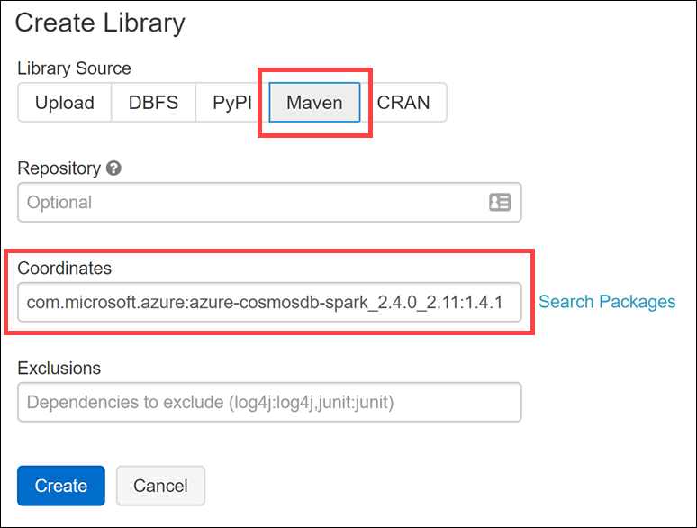

4. On the Search Packages dialog, select **Maven Central** from the source drop down, enter **azure-cosmosdb-spark** into the search box, and click **Select** next to Artifact Id `azure-cosmosdb-spark_2.4.0_2.11` release `1.3.5`.

    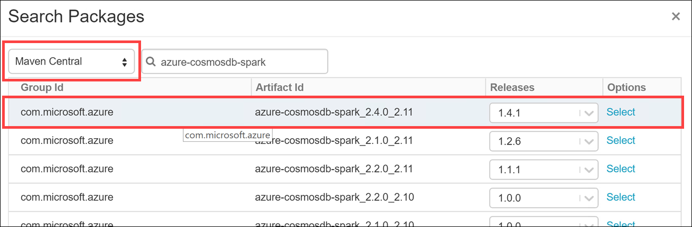

5. Select **Create** to finish installing the library.

    

6. On the following screen, check the box for **Install automatically on all clusters**, and select **Confirm** when prompted.

   

7. Select the Shared folder under your workspace again, and select **Create** and  **Library** from the context menus.

8. In the Create Library dialog, select **PyPI** as the Library Source, and enter **scikit-learn==0.20.1** in the Package box, and then select **Create**

    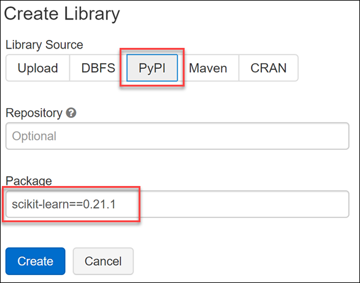

9. On the following screen, check to box for **Install automatically on all clusters**, and select **Confirm** when prompted.

### Task 5: Explore historical transaction data with Azure Databricks and Spark

In this task, you will use an Azure Databricks notebook to download and explore historical transaction data.

1. In your Databricks workspace, select **Workspace** from the left-hand menu, then select **Users** and your user account.

   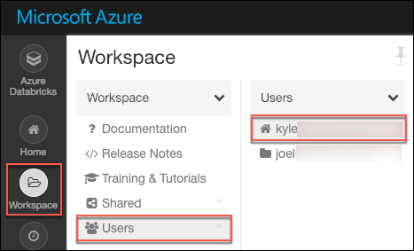

2. In your user workspace, select the **CosmosDbAdvancedAnalytics** folder, then select the **Exercise 2** folder, and select the notebook named **1-Exploring-Historical-Transactions**.

    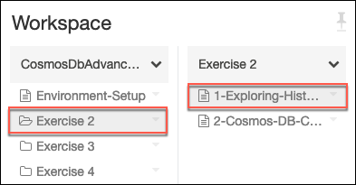

3. In the **1-Exploring-Historical-Transactions** notebook, follow the instructions to complete the remaining steps of this task.

> **NOTE**: There will be a link at the bottom of each notebook in this exercise to move on to the notebook for the next task, so you will not need to jump back and forth between this document and the Databricks notebooks for this exercise.

### Task 6: Responding to streaming transactions using the Cosmos DB Change Feed and Spark Structured Streaming in Azure Databricks

In this task, you will use an Azure Databricks notebook to create a connection to your Cosmos DB instance from an Azure Databricks notebook, and query streaming data from the Cosmos DB Change Feed.

1. In your Databricks workspace, select **Workspace** from the left-hand menu, then select **Users** and your user account.

2. In your user workspace, select the **CosmosDbAdvancedAnalytics** folder, then select the **Exercise 2** folder, and select the notebook named **2-Cosmos-DB-Change-Feed**.

   

3. In the **2-Cosmos-DB-Change-Feed** notebook, follow the instructions to complete the remaining steps of this task.

## Exercise 3: Creating and evaluating fraud models

Duration: X minutes

In this exercise, you create and evaluate a fraud model that is used for real-time scoring of transactions as they occur at the web front-end. The goal is to block fraudulent transactions before they are processed. You will then create a model for detecting suspicious transactions, which gets executed during batch processing that will take place in Exercise 4. Finally, you will deploy the fraudulent transactions model and test it through HTTP REST calls, all within Databricks notebooks.

### Task 1: Install the AzureML and Scikit-Learn libraries in Databricks

In this task, you will install the required `AzureML` and `Scikit-Learn` libraries on your Databricks cluster. These libraries are used when training and deploying your machine learning models. It is important to install these in the order shown.

1. Navigate to your Azure Databricks workspace in the [Azure portal](https://portal.azure.com/), and select **Launch Workspace** from the overview blade, signing into the workspace with your Azure credentials, if required.

   

2. Select **Clusters** from the left-hand menu, then select your cluster in the list of interactive clusters.

   

3. Select the **Libraries** tab, which displays the list of libraries installed on the cluster. You should see the Azure Cosmos DB Spark connector installed. Select **Install New** above the list of libraries.

   

4. In the dialog that appears, select **PyPI** as the **Library Source**. Enter `azureml-sdk[automl_databricks]` in the **Package** field, then select **Install**.

   

5. Important: **Wait** until the status for the AzureML library shows **Installed**. This must be completed prior to installing Scikit-Learn.

   

6. Select **Install New** again.

7. In the dialog that appears, select **PyPi** as the **Library Source**. Enter `scikit-learn==0.20.1` in the **Package** field, then select **Install**.

   

8. After the Scikit-Learn library is installed, your list of libraries should look like the following:

   

### Task 2: Prepare and deploy scoring web service

In this task, you will use an Azure Databricks notebook to explore the transaction and account data. You will also do some data cleanup and create a feature engineering pipeline that applies these transformations each time data is passed to the model for scoring. Finally, you will train and deploy a machine learning model that detects fraudulent transactions.

1. In your Databricks workspace, select **Workspace** from the left-hand menu, then select **Users** and your user account.

   

2. In your user workspace, select the **CosmosDbAdvancedAnalytics** folder, then select the **Exercise 3** folder, and select the notebook named **1-Prepare-Scoring-Web-Service**.

   

3. In the **1-Prepare-Scoring-Web-Service** notebook, follow the instructions to complete the remaining steps of this task.

> **NOTE**: There will be a link at the bottom of each notebook in this exercise to move on to the notebook for the next task, so you will not need to jump back and forth between this document and the Databricks notebooks for this exercise.

### Task 3: Prepare batch scoring model

In this task, you will use an Azure Databricks notebook to prepare a model used to detect suspicious activity that will be used for batch scoring.

1. In your Databricks workspace, select **Workspace** from the left-hand menu, then select **Users** and your user account.

   

2. In your user workspace, select the **CosmosDbAdvancedAnalytics** folder, then select the **Exercise 3** folder, and select the notebook named **2-Prepare-Batch-Scoring-Model**.

   

3. In the **2-Prepare-Batch-Scoring-Model** notebook, follow the instructions to complete the remaining steps of this task.

## Exercise 4: Scaling globally

When you set up Cosmos DB you enabled both geo-redundancy and multi-region writes, and in Exercise 1 you added more regions to your Cosmos DB instance.

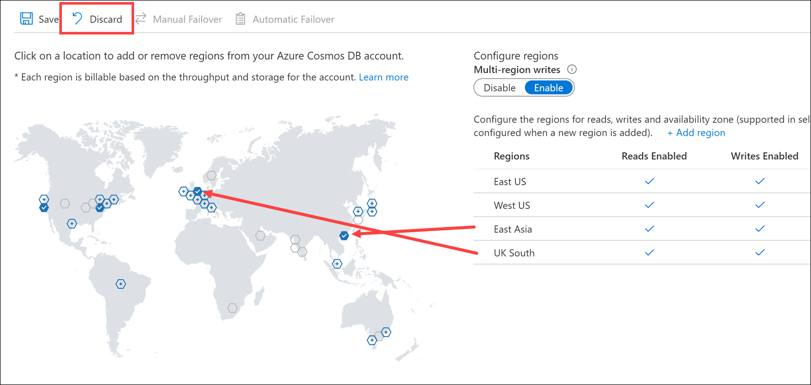

In this exercise, you will score the batch transaction data stored in Databricks Delta with your trained ML model, and write any transactions that are marked as "suspicious" to Cosmos DB via the Azure Cosmos DB Spark Connector. Cosmos with automatically distribute that data globally, using the [default consistency level](https://docs.microsoft.com/en-us/azure/cosmos-db/consistency-levels). To learn more see [Global data distribution with Azure Cosmos DB - under the hood](https://docs.microsoft.com/en-us/azure/cosmos-db/global-dist-under-the-hood).

### Task 1: Distributing batch scored data globally using Cosmos DB

In this task, you will use an Azure Databricks notebook to batch stored the data stored in the `transactions` Databricks Delta table with your machine learning model. The scoring results will be written to a new `scored_transactions` Delta table, and any suspicious transactions will also be written back to Cosmos DB.

1. In your Databricks workspace, select **Workspace** from the left-hand menu, then select **Users** and your user account.

    

2. In your user workspace, select the **CosmosDbAdvancedAnalytics** folder, then select the **Exercise 4** folder, and select the notebook named **1-Distributing-Data-Globally**.

    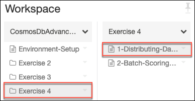

3. In the **1-Distributing-Data-Globally** notebook, follow the instructions to complete the remaining steps of this task.

### Task 2: Using an Azure Databricks job to batch score transactions on a schedule

In this task, you will create an Azure Databricks job, which will execute a notebook that performs batch scoring on transactions on an hourly schedule.

1. Navigate to your Databricks workspace, select **Jobs** from the left-hand menu, and then select **+ Create Job**.

    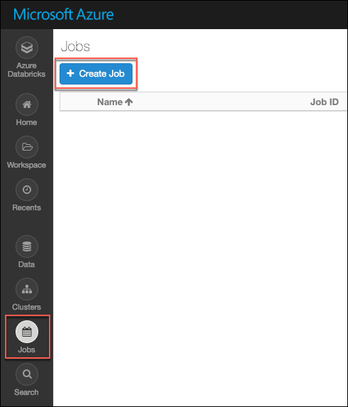

2. On the untitled job screen, complete the following steps:

    - Enter a title, such as **Batch-Scoring-Job**.

    - Select the **Select Notebook** link next to Task, and on the Select Notebook dialog select **Users --> Your user account --> CosmosDbAdvancedAnalytics --> Exercise 4** and then select the `2-Batch-Scoring-Job` notebook and select **OK**.

        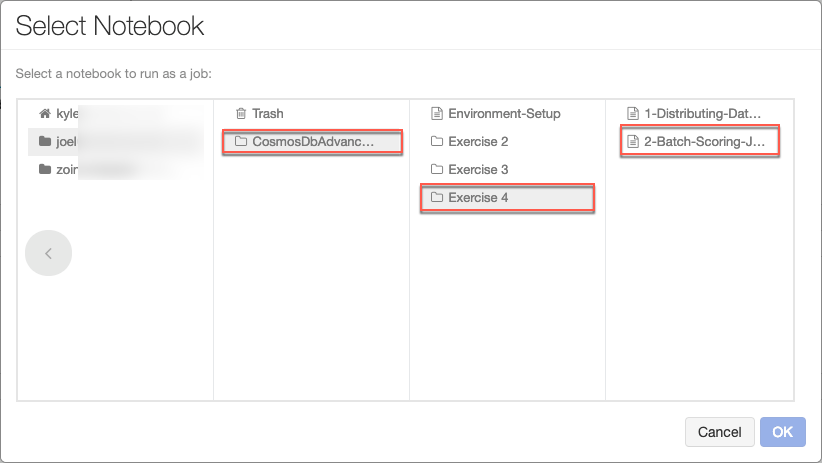

    - Select **Add** next to Dependent Libraries, navigate to the Shared folder, select the **azure-cosmosdb-spark** library and select **OK**.

    - Repeat the step above to add the **scikit-learn==0.20.1** library as well.

        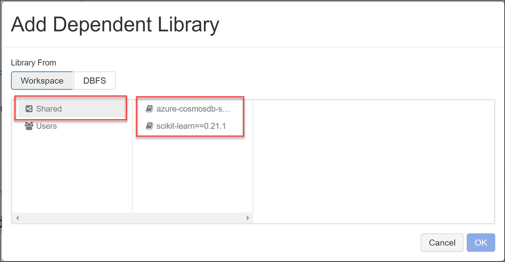

    - Select **Edit** next to Cluster, and select the following:
        - Databricks Runtime Version: Runtime 5.1 (Scala 2.11, Spark 2.4.0)
        - Python Version: 3
        - Worker Type: Standard_D24_v2
        - Workers: 8
        - Driver Type: Same as worker
        - Expand Advanced and ensure that `spark.databricks.delta.preview.enabled true` is entered into the Spark Config box.

            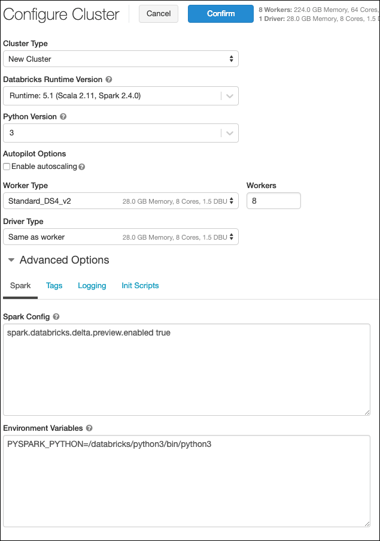

    - Select **Confirm** to save the cluster configuration.

    - Select **Edit** next to Schedule, and on the Schedule Job dialog set the schedule to Every hour starting at a minute value that is close to the current time, so you can see it triggered in a reasonable amount of time. Select your time zone, and select **Confirm**.

    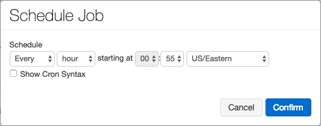

3. Your final job screen should look something like the following:

    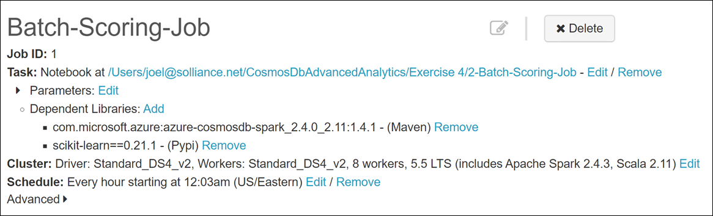

4. Select **< All Jobs** to return to the Jobs list when complete.

5. While waiting for your job to start, select **Workspace** from the left-hand menu, and navigate to the `3-Batch-Score-Transactions` notebook under the Exercise 4 folder.

6. Open the notebook, and take a few minutes to understand the steps that are being used to perform the batch scoring process. As you will see, they are almost identical to the steps you've gone through already in preparing and transforming the transaction data in the previous task.

7. You can monitor your job progress by selecting **Clusters** from the left-hand menu in Databricks, and then selecting **Job Run** for your Job Cluster. This will display the notebook, and you can view execution times and results within the notebook.

    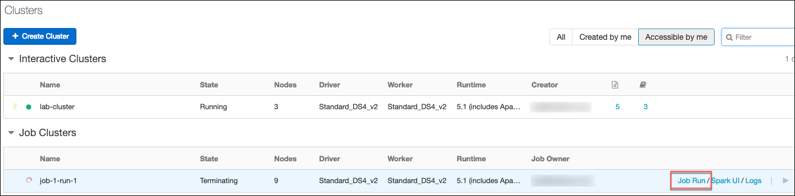

## Exercise 5: Reporting

Duration: X minutes

In this exercise, you create dashboards and reports in Power BI for business analysts to use, as well as within Azure Databricks for data scientists and analysts to query and visualize the data interactively.

### Task 1: Utilizing Power BI to summarize and visualize global fraud trends

In this task, you will use the JDBC URL for your Azure Databricks cluster to connect to from Power BI desktop. Then you will create reports and add them to a dashboard to summarize and visualize global fraud trends to gain more insight into the data.

1.  Navigate to your Azure Databricks workspace in the [Azure portal](https://portal.azure.com/), and select **Launch Workspace** from the overview blade, signing into the workspace with your Azure credentials, if required.

    

2.  Select **Clusters** from the left-hand menu, then select your cluster in the list of interactive clusters.

    

3.  Scroll down and expand the **Advanced Options** section, then select the **JDBC/ODBC** tab. Copy the first **JDBC URL** value.

    

4.  Now, you need to modify the JDBC URL to construct the JDBC server address that you will use to set up your Spark cluster connection in Power BI Desktop.

    - In the JDBC URL:
      - Replace `jdbc:hive2` with `https`
      - Remove everything in the path between the port number and `/sql`
      - Remove the following string from the end of the URL: `;AuthMech=3;UID=token;PWD=<personal-access-token>`, retaining the components indicated by the highlights in the image below

    

    - In our example, the server address would be: `https://eastus.azuredatabricks.net:443/sql/protocolv1/o/8433778235244215/0210-035431-quad242`

    - Copy your server address.

5.  Open Power BI Desktop, then select **Get data**.

    

6.  In the Get Data dialog, search for `spark`, then select **Spark** from the list of results.

    

7.  Enter the Databricks server address you created above into the Server field.

8.  Set the Protocol to HTTP.

9.  Select DirectQuery as the data connectivity mode, then select OK.

    

    > Setting the data connectivity mode to DirectQuery lets you offload processing to Spark. This is ideal when you have a large volume of data or when you want near real-time analysis.

10. Before you can enter credentials on the next screen, you need to create an Access token in Azure Databricks. In your Databricks workspace, select the Account icon in the top right corner, then select User settings from the menu.

    

11. On the User Settings page, select Generate New Token, enter "Power BI Desktop" in the comment, and select Generate.

    

12. Copy the generated token, and save it as you will need it more than once below. **NOTE**: You will not be able to access the token in Databricks once you close the Generate token dialog, so be sure to save this value to a text editor or another location you can access during this lab.

13. Back in Power BI Desktop, enter "token" for the user name, and paste the access token you copied from Databricks into the password field.

    

14. Select the `scored_transactions` and `percent_suspicious` tables, then select **Load**.

    

15. After a few moments, you will be redirected to a blank report screen with the tables listed on the right-hand side. Select the **Donut chart** visualization on the right-hand menu under Visualizations and next to the list of tables and fields.

    

16. Expand the `scored_transactions` table, then drag `ipCountryCode` under **Legend**, and `transactionAmountUSD` under **Values**.

    

17. Now select the **Format** tab for the donut chart and expand the **Legend** section underneath. Select **On** to turn on the legend, and select **Right** underneath **Position**. This turns on the legend for the chart and displays it to the right.

    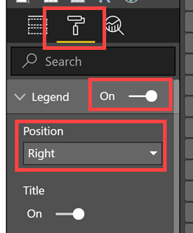

18. Your donut chart should look similar to the following, displaying the US dollar amount of transactions by country code:

    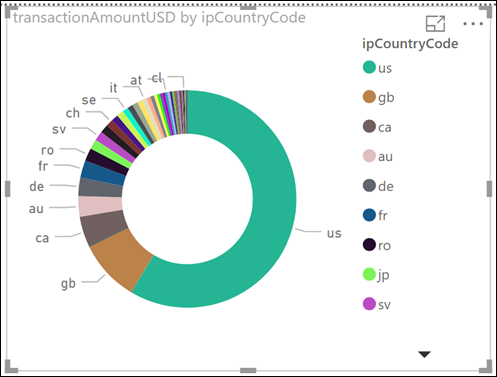

19. Select a blank area on the report to deselect the donut chart. Now select the **Treemap** visualization.

    

20. Drag the `ipCountryCode` field from the `scored_transactions` table under **Group**, then drag `isSuspicious` under **Values**.

    

21. The treemap should look similar to the following, displaying the number of suspicious transactions per country:

    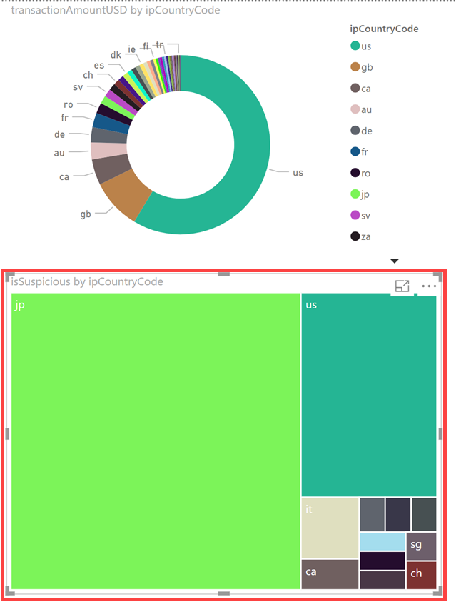

22. Select a blank area on the report to deselect the treemap. Now select the **Treemap** visualization once more to add a new treemap. Drag the `transactionAmountUSD` field from the `scored_transactions` table under **Group**, then drag `isSuspicious` under **Values**.

    

23. The new treemap should look similar to the following, displaying the US dollar amounts that tend to have suspicious transactions, with the larger boxes representing higher suspicious transactions compared to smaller boxes:

    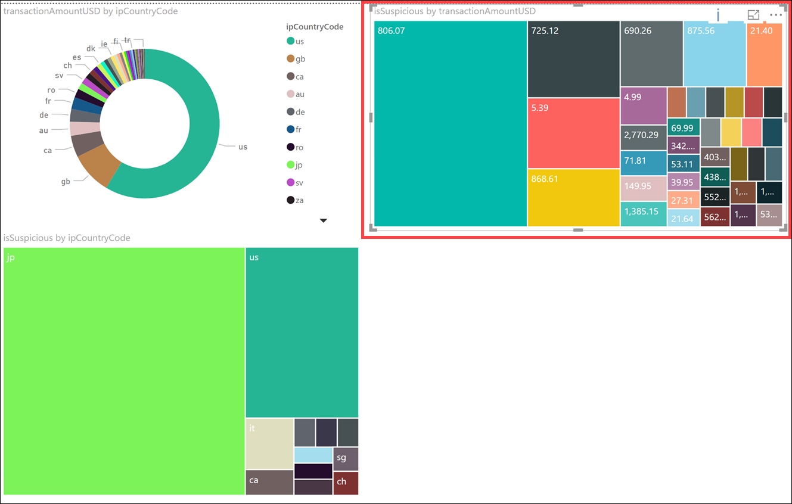

24. Select a blank area on the report to deselect the treemap. Now select the **Donut chart** visualization. Drag the `localHour` field from the `scored_transactions` table under **Legend**, then drag `isSuspicious` under **Values**.

    

25. The donut chart should look similar to the following, displaying which hours of the day tend to have a higher number of suspicious activity overall:

    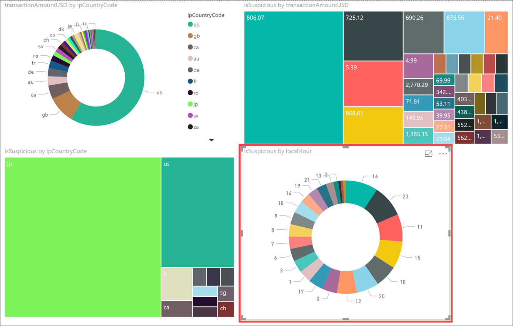

26. Select a blank area on the report to deselect the donut chart. Now select the **Map** visualization. Drag the `ipCountryCode` field from the `scored_transactions` table under **Location**, then drag `isSuspicious` under **Size**.

    

27. The map should look similar to the following, showing circles of varying sizes on different regions of the map. The larger the circle, the more suspicious transactions there are in that region. You may also resize the charts to optimize your layout:

    

28. Now add a new page to your report. Select the **+** button on the bottom-left next to **Page 1**. This will create a new blank report page to add a few more visualizations.

    

29. Select a blank area on the report, then select the **Donut chart** visualization. Drag the `cvvVerifyResult` field from the `scored_transactions` table under **Legend**, then drag `isSuspicious` under **Values**.

    

30. Now select the **Format** tab for the donut chart and expand the **Legend** section underneath. Select **On** to turn on the legend, and select **Right** underneath **Position**. This turns on the legend for the chart and displays it to the right.

    

31. The donut chart should look similar to the following, displaying which CVV2 credit card verification codes correlate with the most suspicious transactions:

    

    The CVV2 codes have the following meaning in the data set:

    | Code  | Meaning
    | ----- | ---------
    | M     | CVV2 Match
    | N     | CVV2 No Match
    | P     | Not Processed
    | S     | Issuer indicates that CVV2 data should be present on the card, but the merchant has indicated data is not present on the card
    | U     | Issuer has not certified for CVV2 or Issuer has not provided Visa with the CVV2 encryption keys

32. Select a blank area on the report, then select the **100% Stacked column chart** visualization. Drag the `isSuspicious` field from the `scored_transactions` table under **Axis**, then drag `digitalItemCount` under **Value**, and finally `physicalItemCount` under **Value** as well.

    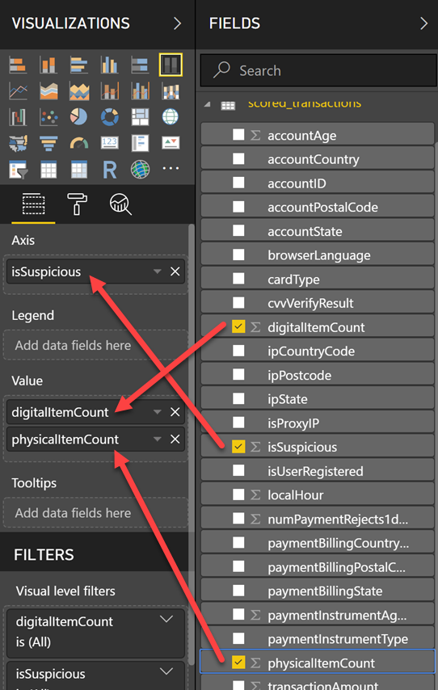

33. The 100% stacked column chart should look similar to the following, displaying the percentage of the number of physical items and digital items purchased for transactions that were not suspicious (value of 0) in one column, and the percentage of the number of both types of items purchased with suspicious transactions (value of 1):

    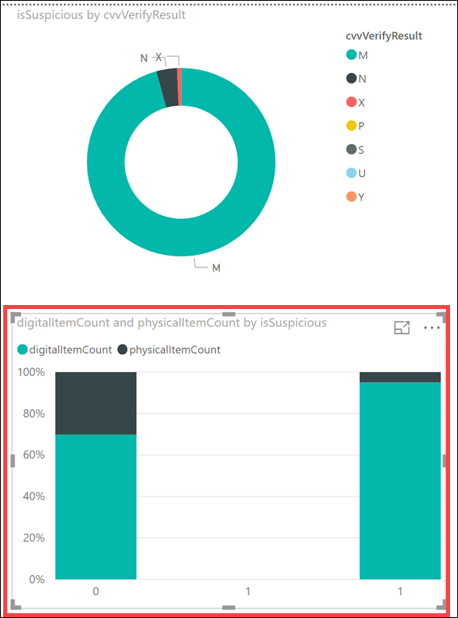

34. Select a blank area on the report, then select the **ArcGIS Maps for Power BI** visualization. If you are prompted to accept the terms for using this visualization, please do so now. Drag the `ipCountryCode` field from the `percent_suspicious` table under **Location**, then drag `SuspiciousTransactionCount` under **Color**.

    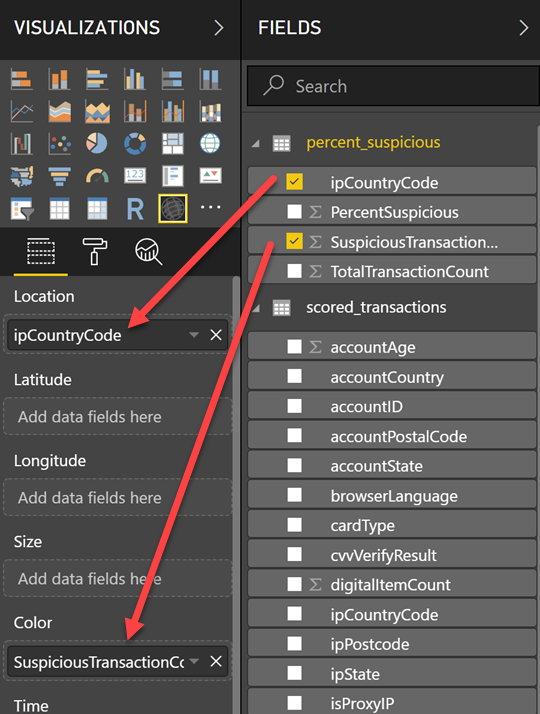

35. The ArcGIS Map should look similar to the following, displaying countries that have a higher number of suspicious transactions in darker colors than those with lower amounts:

    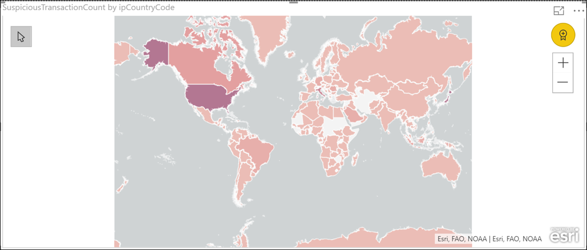

36. Select a blank area on the report, then select the **Donut chart** visualization. Drag the `ipCountryCode` field from the `percent_suspicious` table under **Legend**, then drag `PercentSuspicious` under **Values**.

    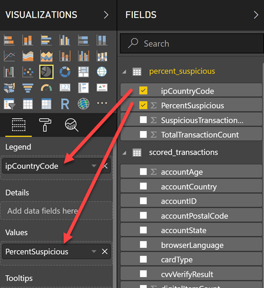

37. The donut chart should look similar to the following, displaying the percent of suspicious transactions by country code:

    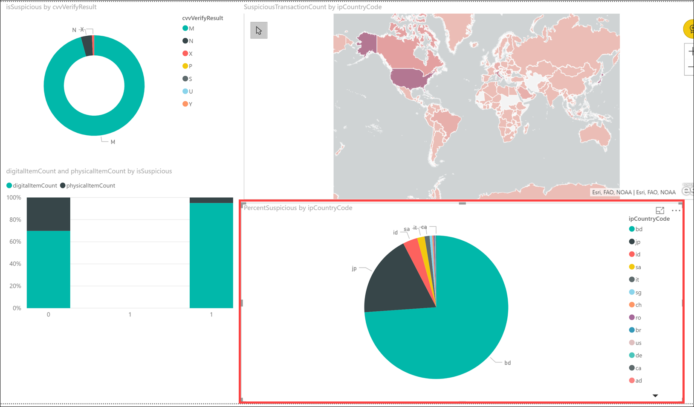

You may save your chart to local disk. Once saved, you are able to upload the chart to the Power BI website, making it available online with all the charts and data connections intact.

### Task 2: Creating dashboards in Azure Databricks

In this task, you will use an Azure Databricks notebook to build a dashboard, for displaying visualization in Azure Databricks.

1. In your Databricks workspace, select **Workspace** from the left-hand menu, then select **Users** and your user account.

2. In your user workspace, select the **CosmosDbAdvancedAnalytics** folder, then select the **Exercise 5** folder, and select the notebook named **1-Databricks-Dashboards**.

   

3. In the **1-Databricks-Dashboards** notebook, follow the instructions to complete the remaining steps of this task.

## After the hands-on lab

Duration: 10 mins

In this exercise, you will delete any Azure resources that were created in support of the lab. You should follow all steps provided after attending the Hands-on lab to ensure your account does not continue to be charged for lab resources.

### Task 1: Delete the resource group

1. Using the [Azure portal](https://portal.azure.com), navigate to the Resource group you used throughout this hands-on lab by selecting Resource groups in the left menu.
2. Search for the name of your research group, and select it from the list.
3. Select Delete in the command bar, and confirm the deletion by re-typing the Resource group name, and selecting Delete.

You should follow all steps provided _after_ attending the Hands-on lab.