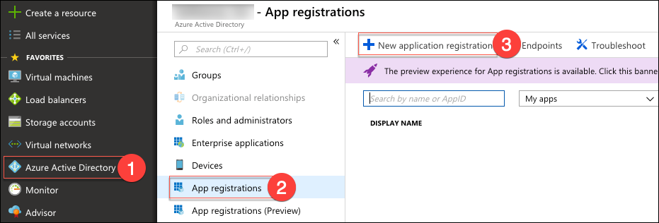
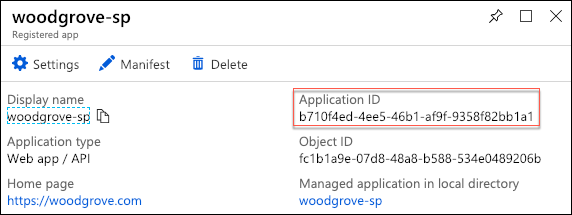
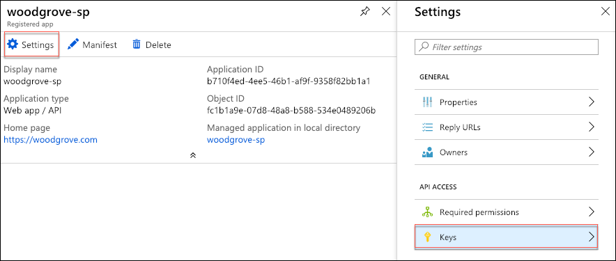
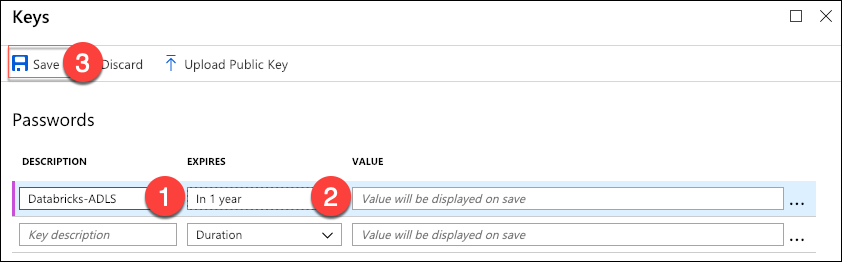
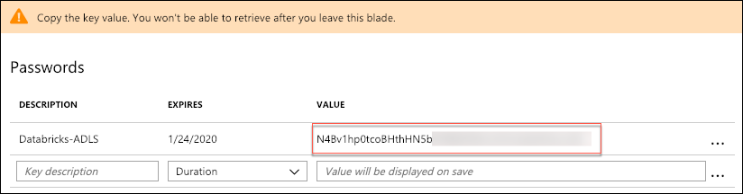
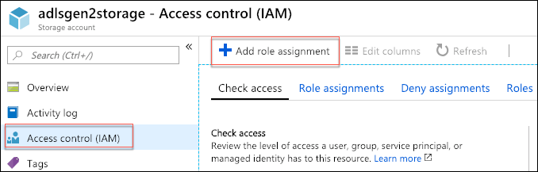
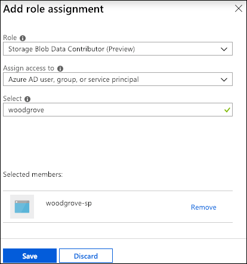
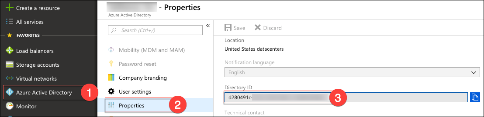

Cosmos DB real-time advanced analytics

Hands-on lab step-by-step

January 2019

Information in this document, including URL and other Internet Web site references, is subject to change without notice. Unless otherwise noted, the example companies, organizations, products, domain names, e-mail addresses, logos, people, places, and events depicted herein are fictitious, and no association with any real company, organization, product, domain name, e-mail address, logo, person, place or event is intended or should be inferred. Complying with all applicable copyright laws is the responsibility of the user. Without limiting the rights under copyright, no part of this document may be reproduced, stored in or introduced into a retrieval system, or transmitted in any form or by any means (electronic, mechanical, photocopying, recording, or otherwise), or for any purpose, without the express written permission of Microsoft Corporation.

Microsoft may have patents, patent applications, trademarks, copyrights, or other intellectual property rights covering subject matter in this document. Except as expressly provided in any written license agreement from Microsoft, the furnishing of this document does not give you any license to these patents, trademarks, copyrights, or other intellectual property.

The names of manufacturers, products, or URLs are provided for informational purposes only and Microsoft makes no representations and warranties, either expressed, implied, or statutory, regarding these manufacturers or the use of the products with any Microsoft technologies. The inclusion of a manufacturer or product does not imply endorsement of Microsoft of the manufacturer or product. Links may be provided to third party sites. Such sites are not under the control of Microsoft and Microsoft is not responsible for the contents of any linked site or any link contained in a linked site, or any changes or updates to such sites. Microsoft is not responsible for webcasting or any other form of transmission received from any linked site. Microsoft is providing these links to you only as a convenience, and the inclusion of any link does not imply endorsement of Microsoft of the site or the products contained therein.

© 2019 Microsoft Corporation. All rights reserved.

Microsoft and the trademarks listed at <https://www.microsoft.com/en-us/legal/intellectualproperty/Trademarks/Usage/General.aspx> are trademarks of the Microsoft group of companies. All other trademarks are property of their respective owners.

**Contents**

<!-- TOC -->

- [Cosmos DB real-time advanced analytics hands-on lab step-by-step](#cosmos-db-real-time-advanced-analytics-hands-on-lab-step-by-step)
  - [Abstract and learning objectives](#abstract-and-learning-objectives)
  - [Overview](#overview)
  - [Solution architecture](#solution-architecture)
  - [Requirements](#requirements)
  - [Before the hands-on lab](#before-the-hands-on-lab)
  - [Exercise 1: Collecting streaming transaction data](#exercise-1-collecting-streaming-transaction-data)
    - [Task 1: Task name](#task-1-task-name)
    - [Task 2: Task name](#task-2-task-name)
  - [Exercise 2: Understanding and preparing the transaction data at scale](#exercise-2-understanding-and-preparing-the-transaction-data-at-scale)
    - [Task 1: Querying streaming transactions with Azure Databricks and Spark Structured Streaming](#task-1-querying-streaming-transactions-with-azure-databricks-and-spark-structured-streaming)
    - [Task 2: Querying transactions directly from Cosmos DB with Azure Databricks and Spark](#task-2-querying-transactions-directly-from-cosmos-db-with-azure-databricks-and-spark)
    - [Task 3: Responding to transactions using the Cosmos DB Change Feed and Azure Databricks Delta](#task-3-responding-to-transactions-using-the-cosmos-db-change-feed-and-azure-databricks-delta)
  - [Exercise 3: Creating and evaluating fraud models](#exercise-3-creating-and-evaluating-fraud-models)
    - [Task 1: Task name](#task-1-task-name-2)
    - [Task 2: Task name](#task-2-task-name-2)
  - [After the hands-on lab](#after-the-hands-on-lab)
    - [Task 1: Task name](#task-1-task-name-3)
    - [Task 2: Task name](#task-2-task-name-3)

<!-- /TOC -->

# Cosmos DB real-time advanced analytics hands-on lab step-by-step

## Abstract and learning objectives

Woodgrove Bank, who provides payment processing services for commerce, is looking to design and implement a PoC of an innovative fraud detection solution. They want to provide new services to their merchant customers, helping them save costs by applying machine learning and advanced analytics to detect fraudulent transactions. Their customers are around the world, and the right solutions for them would minimize any latencies experienced using their service by distributing as much of the solution as possible, as closely as possible, to the regions in which their customers use the service.

In this hands-on lab session, you will implement a PoC of the data pipeline that could support the needs of Woodgrove Bank.

At the end of this workshop, you will be better able to implement solutions that leverage the strengths of Cosmos DB in support of advanced analytics solutions that require high throughput ingest, low latency serving and global scale in combination with scalable machine learning, big data and real-time processing capabilities.

## Overview

Woodgrove Bank, who provides payment processing services for commerce, is looking to design and implement a proof-of-concept (PoC) of an innovative fraud detection solution. They want to provide new services to their merchant customers, helping them save costs by applying machine learning and advanced analytics to detect fraudulent transactions. Their customers are around the world, and the right solutions for them would minimize any latencies experienced using their service by distributing as much of the solution as possible, as closely as possible, to the regions in which their customers use the service.

## Solution architecture

Below is a diagram of the solution architecture you will build in this lab. Please study this carefully, so you understand the whole of the solution as you are working on the various components.

The solution begins with the payment transaction systems writing transactions to Azure Cosmos DB. With change feed enabled in Cosmos DB, the transactions can be read as a stream of incoming data within an Azure Databricks notebook, using the `azure-cosmosdb-spark` connector, and stored long-term within an Azure Databricks Delta table backed by Azure Data Lake Storage. The Delta tables efficiently manage inserts and updates (e.g., upserts) to the transaction data. Tables created in Databricks over this data can be accessed by business analysts using dashboards and reports in Power BI, by using Power BI's Spark connector. Data scientists and engineers can create their own reports against this data, using Azure Databricks notebooks. Azure Databricks also supports training and validating the machine learning model, using historical data stored in Azure Data Lake Storage. The model can be periodically re-trained using the data stored in Delta tables or other historical tables. The Azure Machine Learning service is used to deploy the trained model as a real-time scoring web service running on a highly available Azure Kubernetes Service cluster (AKS cluster). The trained model is also used in scheduled offline scoring through Databricks jobs, and the "suspicious activity" output is stored in Azure Cosmos DB so it is globally available in regions closest to Woodgrove Bank's customers through their web applications. Finally, Azure Key Vault is used to securely store secrets, such as account keys and connection strings, and serves as a backing for Azure Databricks secret scopes.

> **Note**: The preferred solution is only one of many possible, viable approaches.

## Requirements

1. Microsoft Azure subscription (non-Microsoft subscription, must be a pay-as-you subscription).
2. An Azure Databricks cluster running Databricks Runtime 5.1 or above. Azure Databricks integration with Azure Data Lake Storage Gen2 is **fully supported in Databricks Runtime 5.1**.
    - **IMPORTANT**: To complete the OAuth 2.0 access components of this hands-on lab you must:
        - Have a cluster running Databricks Runtime 5.1 and above.
        - Have permissions within your Azure subscription to create an App Registration and service principal within Azure Active Directory.

## Exercise 1: Collecting streaming transaction data

Duration: 30 minutes

In this exercise, you will configure a payment transaction generator to write real-time streaming online payments to both Event Hubs and Azure Cosmos DB. By the end, you will have selected the best ingest option before continuing to the following exercise where you will process the generated data.

### Task 1: Configuring Event Hubs and the transaction generator

1.  Number and insert your custom workshop content here . . .

    a. Insert content here

        i.

### Task 2: Ingesting streaming data to Cosmos DB

In this task, you will configure Cosmos DB's time-to-live (TTL) settings to On with no default. This will allow the data generator to expire ingested messages after 24 hours by setting the TTL value on individual messages as they are sent. This optimization helps save in storage costs while providing an ample window in which messages can be processed in Azure Databricks.

Next you will pass in the Azure Cosmos DB URI and Key values to the data generator so it can connect to and send events to your collection.

1.  Navigate to your Azure Cosmos DB account in the Azure portal, then select **Data Explorer** on the left-hand menu.

    

2.  Expand your **Woodgrove** database and your **transactions** collection, then select **Scale & Settings**.

3.  Under Settings within the Scale & Settings blade, select the **On (no default)** option for Time to Live. This setting is required to allow documents added to the collection to be configured with their own TTL values.

    

4.  Select **Save** to apply your settings.

### Task 3: Choosing between Cosmos DB and Event Hubs for ingestion

1.  Number and insert your custom workshop content here . . .

    a. Insert content here

        i.

## Exercise 2: Understanding and preparing the transaction data at scale

Duration: X minutes

In this exercise, you will use Azure Databricks to explore the transaction data stored in Cosmos DB and respond to transactions directly from the Cosmos DB Change Feed. You will also mount Azure Data Lake Storage Gen2 (ADLS Gen2) in Databricks, and write the incoming streaming transaction data into Azure Databricks Delta tables stored in your data lake.

### Task 1: Create a service principal for OAuth access to the ADLS Gen2 filesystem

Mounting an ADLS Gen2 filesystem using Databricks requires that you use OAuth 2.0 for authentication. In this task, you will create an identity in Azure Active Directory (Azure AD) known as a service principal to facilitate the use of OAuth authentication.

> **IMPORTANT**: You must have permissions within your Azure subscription to create an App registration and service principal within Azure Active Directory to complete this task.

1. In the [Azure portal](https://portal.azure.com), select **Azure Active Directory** from the left-hand navigation menu, select **App registrations**, and then select **+ New application registration**.

    

2. On the Create blade, enter the following:

    - **Name**: Enter a unique name, such as woodgrove-sp (this name must be unique, as indicated by a green check mark).
    - **Application type**: Select Web app / API.
    - **Sign-on URL**: Enter <https://woodgrove.com>.

    

3. Select **Create**.

4. To access your ADLS Gen2 account from Azure Databricks you will need to provide the credentials of your newly created service principal within Databricks. On the Registered app blade that appears, copy the **Application ID** and paste it into a text editor, such as Notepad, for use in the Databricks notebook in an upcoming task.

   

5. Next, select **Settings** on the Registered app blade, and then select **Keys**.

   

6. On the Keys blade, you will create a new password by doing the following under Passwords:

    - **Description**: Enter a description, such as Databricks-ADLS.
    - **Expires**: Select a duration, such as **In 1 year**.

    

7. Select **Save**, and then copy the key displayed under **Value**, and paste it into a text editor, such as Notepad, for use in the Databricks notebook in an upcoming task. **Note**: This value will not be accessible once you navigate away from this screen, so make sure you copy it before leaving the Keys blade.

    

### Task 2: Grant ADLS Gen2 permissions to the service principal

In this task, you will assign the required permissions to the service principal in your ADLS Gen2 account.

1. In the [Azure portal](https://portal.azure.com), navigate to the ADLS Gen2 account you created above, select **Access control (IAM)** from the left-hand menu, and then select **+ Add role assignment**.

   

2. On the Add role assignment blade, set the following:

    - **Role**: Select **Storage Blob Data Contributor (Preview)** from the list.
    - **Assign access to**: Choose **Azure AD user, group, or service principal**.
    - **Select**: Enter the name of the service principal you created above, and then select it from the list.
  
    

3. Select **Save**

4. You will now see the service principal listed under **Role assignments** on the Access control (IAM) blade.

### Task 3: Retrieve your Azure AD tenant ID

To perform authentication using the service principal account in Databricks you will also need to provide your Azure AD Tenant ID.

1. To retrieve your tenant ID, select **Azure Active Directory** from the left-hand navigation menu in the Azure portal, then select **Properties**, and select the copy button next to **Directory ID** on the Directory Properties blade.

   

2. Paste the copied value into a text editor, such as Notepad, for use in the Databricks notebook in an upcoming task.

### Task 5: Mount ADLS Gen2 filesystem with Databricks

To connect Azure Databricks to ADLS Gen2, you can either create a direct connection, or mount it. Mounting makes the access point available to all clusters in your Databricks workspace, so for this hands-on lab, you will mount ADLS Gen2 in DBFS.

1. In the [Azure portal](https://portal.azure.com), navigate to your Databricks workspace and select **Launch workspace**.

    

2. Select **Workspace** from the left-hand menu, and 

### Task 6: Install the Azure Cosmos DB Spark Connector in Databricks

In this task, you will install the [Azure Cosmos DB Spark Connector](https://github.com/Azure/azure-cosmosdb-spark) on your Databricks cluster. The connector allows you to easily read to and write from Azure Cosmos DB via Apache Spark DataFrames in `python` and `scala`. It also allows you to easily create a lambda architecture for batch-processing, stream-processing, and a serving layer while being globally replicated and minimizing the latency involved in working with big data.

1. In a web browser, download the latest [azure-cosmosdb-spark library](https://search.maven.org/remotecontent?filepath=com/microsoft/azure/azure-cosmosdb-spark_2.3.0_2.11/1.2.2/azure-cosmosdb-spark_2.3.0_2.11-1.2.2-uber.jar) from here: <https://search.maven.org/remotecontent?filepath=com/microsoft/azure/azure-cosmosdb-spark_2.3.0_2.11/1.2.2/azure-cosmosdb-spark_2.3.0_2.11-1.2.2-uber.jar>.

2. Upload the download JAR file to Databricks...

3. Install the uploaded library into your Databricks cluster.

### Task 2: Querying streaming transactions with Azure Databricks and Spark Structured Streaming

1. Within your databricks workspace...
2. Import the DBC file into Databricks from the GitHub repo
    - Add steps for this
3. The DBC file contains multiple notebooks. Open the Exercise 2 notebook...
4. Follow the instructions within the notebook to complete this task. You will return here to move on to the next task when you are done with the notebook...

### Task 2: Querying transactions directly from Cosmos DB with Azure Databricks and Spark

In this task, you will create a connection to your Cosmos DB instance from an Azure Databricks notebook, and write queries to retrieve transaction data directly from Cosmos DB and Spark SQL.

1. Number and insert your custom workshop content here

### Task 3: Responding to transactions using the Cosmos DB Change Feed and Azure Databricks Delta

1. xxx

## Exercise 3: Creating and evaluating fraud models

Duration: X minutes

\[insert your custom Hands-on lab content here . . .\]

### Task 1: Task name

1.  Number and insert your custom workshop content here . . .

    a. Insert content here

        i.

### Task 2: Task name

1.  Number and insert your custom workshop content here . . .

    a. Insert content here

        i.

## After the hands-on lab

Duration: 10 mins

In this exercise, you will delete any Azure resources that were created in support of the lab. You should follow all steps provided after attending the Hands-on lab to ensure your account does not continue to be charged for lab resources.

### Task 1: Delete the resource group

1. Using the [Azure portal](https://portal.azure.com), navigate to the Resource group you used throughout this hands-on lab by selecting Resource groups in the left menu.
2. Search for the name of your research group, and select it from the list.
3. Select Delete in the command bar, and confirm the deletion by re-typing the Resource group name, and selecting Delete.

You should follow all steps provided _after_ attending the Hands-on lab.
