<div class="MCWHeader1">
Cosmos DB real-time advanced analytics
</div>

<div class="MCWHeader2">
Hands-on lab step-by-step
</div>

<div class="MCWHeader3">
October 2020
</div>

Information in this document, including URL and other Internet Web site references, is subject to change without notice. Unless otherwise noted, the example companies, organizations, products, domain names, e-mail addresses, logos, people, places, and events depicted herein are fictitious, and no association with any real company, organization, product, domain name, e-mail address, logo, person, place or event is intended or should be inferred. Complying with all applicable copyright laws is the responsibility of the user. Without limiting the rights under copyright, no part of this document may be reproduced, stored in or introduced into a retrieval system, or transmitted in any form or by any means (electronic, mechanical, photocopying, recording, or otherwise), or for any purpose, without the express written permission of Microsoft Corporation.

Microsoft may have patents, patent applications, trademarks, copyrights, or other intellectual property rights covering subject matter in this document. Except as expressly provided in any written license agreement from Microsoft, the furnishing of this document does not give you any license to these patents, trademarks, copyrights, or other intellectual property.

The names of manufacturers, products, or URLs are provided for informational purposes only and Microsoft makes no representations and warranties, either expressed, implied, or statutory, regarding these manufacturers or the use of the products with any Microsoft technologies. The inclusion of a manufacturer or product does not imply endorsement of Microsoft of the manufacturer or product. Links may be provided to third party sites. Such sites are not under the control of Microsoft and Microsoft is not responsible for the contents of any linked site or any link contained in a linked site, or any changes or updates to such sites. Microsoft is not responsible for webcasting or any other form of transmission received from any linked site. Microsoft is providing these links to you only as a convenience, and the inclusion of any link does not imply endorsement of Microsoft of the site or the products contained therein.

© 2020 Microsoft Corporation. All rights reserved.

Microsoft and the trademarks listed at <https://www.microsoft.com/en-us/legal/intellectualproperty/Trademarks/Usage/General.aspx> are trademarks of the Microsoft group of companies. All other trademarks are property of their respective owners.

**Contents**

<!-- TOC -->

- [Cosmos DB real-time advanced analytics hands-on lab step-by-step](#cosmos-db-real-time-advanced-analytics-hands-on-lab-step-by-step)
  - [Abstract and learning objectives](#abstract-and-learning-objectives)
  - [Overview](#overview)
  - [Solution architecture](#solution-architecture)
  - [Requirements](#requirements)
  - [Exercise 1: Collecting streaming transaction data](#exercise-1-collecting-streaming-transaction-data)
    - [Task 1: Retrieve Event Hubs Connection String](#task-1-retrieve-event-hubs-connection-string)
    - [Task 2: Configuring Event Hubs and the transaction generator](#task-2-configuring-event-hubs-and-the-transaction-generator)
    - [Task 3: Ingesting streaming data into Cosmos DB](#task-3-ingesting-streaming-data-into-cosmos-db)
    - [Task 4: Choosing between Cosmos DB and Event Hubs for ingestion](#task-4-choosing-between-cosmos-db-and-event-hubs-for-ingestion)
  - [Exercise 2: Understanding and preparing the transaction data](#exercise-2-understanding-and-preparing-the-transaction-data)
    - [Task 1: Configure access to the storage account from your workspace](#task-1-configure-access-to-the-storage-account-from-your-workspace)
    - [Task 2: Open Synapse Studio](#task-2-open-synapse-studio)
    - [Task 3: Upload historical data](#task-3-upload-historical-data)
    - [Task 4: Create Synapse Notebook to explore historical data](#task-4-create-synapse-notebook-to-explore-historical-data)
    - [Task 5: Review columns with `null` or unusable values](#task-5-review-columns-with-null-or-unusable-values)
    - [Task 6: Look for invalid values](#task-6-look-for-invalid-values)
    - [Task 7: Review column data types](#task-7-review-column-data-types)
  - [Exercise 3: Creating and evaluating fraud models](#exercise-3-creating-and-evaluating-fraud-models)
    - [Task 1: Create Azure ML datastore](#task-1-create-azure-ml-datastore)
    - [Task 2: Prepare and deploy scoring web service](#task-2-prepare-and-deploy-scoring-web-service)
    - [Task 3: View the deployed model endpoint](#task-3-view-the-deployed-model-endpoint)
    - [Task 4: Test the predictive maintenance model](#task-4-test-the-predictive-maintenance-model)
    - [Task 5: Prepare batch scoring model](#task-5-prepare-batch-scoring-model)
  - [Exercise 4: Create Synapse Linked Services and copy pipeline](#exercise-4-create-synapse-linked-services-and-copy-pipeline)
    - [Task 1: Open Synapse Studio](#task-1-open-synapse-studio)
    - [Task 2: Create Azure Cosmos DB linked service](#task-2-create-azure-cosmos-db-linked-service)
    - [Task 3: Create public data linked service](#task-3-create-public-data-linked-service)
    - [Task 4: Create copy pipeline](#task-4-create-copy-pipeline)
  - [Exercise 5: Scaling globally](#exercise-5-scaling-globally)
    - [Task 1: Explore streaming data with Apache Spark](#task-1-explore-streaming-data-with-apache-spark)
    - [Task 2: Explore analytical store with Apache Spark](#task-2-explore-analytical-store-with-apache-spark)
    - [Task 3: Distributing real-time and batch scored data globally using Cosmos DB](#task-3-distributing-real-time-and-batch-scored-data-globally-using-cosmos-db)
  - [Exercise 6: Querying Azure Cosmos DB with Azure Synapse serverless SQL](#exercise-6-querying-azure-cosmos-db-with-azure-synapse-serverless-sql)
    - [Task 1: Retrieve the Cosmos DB account name and key](#task-1-retrieve-the-cosmos-db-account-name-and-key)
    - [Task 2: Create Synapse SQL Serverless views](#task-2-create-synapse-sql-serverless-views)
  - [Exercise 7: Query the analytical store with Apache Spark](#exercise-7-query-the-analytical-store-with-apache-spark)
  - [Exercise 8: Reporting](#exercise-8-reporting)
    - [Task 1: Retrieve the Synapse SQL Serverless endpoint address](#task-1-retrieve-the-synapse-sql-serverless-endpoint-address)
    - [Task 2: Create Power BI workspace](#task-2-create-power-bi-workspace)
    - [Task 3: Utilizing Power BI to summarize and visualize global fraud trends](#task-3-utilizing-power-bi-to-summarize-and-visualize-global-fraud-trends)
    - [Task 4: Publish report and add Power BI Linked Service](#task-4-publish-report-and-add-power-bi-linked-service)
    - [Task 5: View the report in Synapse Studio](#task-5-view-the-report-in-synapse-studio)
  - [After the hands-on lab](#after-the-hands-on-lab)
    - [Task 1: Delete the resource group](#task-1-delete-the-resource-group)

<!-- /TOC -->

# Cosmos DB real-time advanced analytics hands-on lab step-by-step

## Abstract and learning objectives

Woodgrove Bank, who provides payment processing services for commerce, is looking to design and implement a PoC of an innovative fraud detection solution. They want to provide new services to their merchant customers, helping them save costs by applying machine learning and advanced analytics to detect fraudulent transactions. Their customers are around the world, and the right solutions for them would minimize any latencies experienced using their service by distributing as much of the solution as possible, as closely as possible, to the regions in which their customers use the service.

In this hands-on lab session, you will implement a PoC of the data pipeline that could support the needs of Woodgrove Bank.

At the end of this workshop, you will be better able to implement solutions that leverage the strengths of Cosmos DB in support of advanced analytics solutions that require high throughput ingest, low latency serving and global scale in combination with scalable machine learning, big data and real-time processing capabilities.

## Overview

Woodgrove Bank, who provides payment processing services for commerce, is looking to design and implement a proof-of-concept (PoC) of an innovative fraud detection solution. They want to provide new services to their merchant customers, helping them save costs by applying machine learning and advanced analytics to detect fraudulent transactions. Their customers are around the world, and the right solutions for them would minimize any latencies experienced using their service by distributing as much of the solution as possible, as closely as possible, to the regions in which their customers use the service.

## Solution architecture

Below is a diagram of the solution architecture you will build in this lab. Please study this carefully, so you understand the whole of the solution as you are working on the various components.


The data flow for the solution begins with the payment transaction systems writing transactions to Azure Cosmos DB. The lab deployment ARM template enables Synapse Link integration when provisioning the Azure Cosmos DB account. With this feature enabled, we turn on the analytical store when creating each of the containers, which serves as a fully isolated column store that is automatically populated when the payment transaction system writes data to the transactional container. The analytical store enables large-scale analytics against the operational data in Azure Cosmos DB, without impacting the transactional workloads or incurring resource unit (RU) costs. Woodgrove Bank's analysts query historical data within the analytical store and use it to join on reference data stored within the analytical store of other containers and the data lake. They execute these queries using Azure Synapse serverless Apache Spark pools and Azure Synapse serverless SQL pools.

Woodgrove requires that the data retention for payment transactions stored in Azure Cosmos DB is set to 60 days and that all payment transactions need to be stored in long-term storage. To meet these requirements, the 'Transactional Store Time to Live (Transactional TTL)' property on the transactions container is enabled, and the TTL value is set to 60 on the documents. This setting automatically deletes payment transactions from the transactional store after the 60-day time period. The 'Analytical Store Time To Live (Analytical TTL)' setting allows Woodgrove Bank to manage the lifecycle of data retained in the analytical store independently from the transactional store. The TTL on the analytical store is set never to expire, enabling Woodgrove to seamlessly tier and define the two stores' data retention period.

Azure Synapse Analytics serves as the end-to-end analytics platform that combines SQL data warehousing, big data analytics, and data integration, and is central to the architecture. Synapse Analytics is required when using the Synapse Link feature that enables the Azure Cosmos DB analytical store.

Azure Machine Learning (Azure ML) is used to train both the real-time and batch machine learning models. The Azure ML workspace stores and manages trained models and deploys the trained model as a real-time scoring web service running on a highly available Azure Kubernetes Service cluster (AKS cluster). Woodgrove Bank uses the batch-scoring machine learning model within Azure Synapse Analytics notebooks to predict fraud against the day's transactions, build aggregates showing statistics around fraudulent activity, and write the results to an Azure Cosmos DB container. The batch-scoring model is also used within a Synapse notebook to reduce prediction latency by scoring the Azure Cosmos DB change feed's streaming data, using Spark Structured Streaming. All transactions with "suspicious activity" output are stored in Azure Cosmos DB, so it is globally available in regions closest to Woodgrove Bank's customers through their web applications. The analytical store feature is enabled on the container that contains predicted suspicious activity. Azure Synapse serverless SQL views are created against this and other analytical stores. Business analysts can access them using dashboards and reports in Power BI, which are embedded within the Synapse Analytics workspace. Data scientists and engineers can create their own reports against the Azure Cosmos DB analytical store, using Synapse notebooks.

Finally, Azure Key Vault is used to securely store secrets, such as account keys and connection strings. The Synapse Linked Services securely access these secrets, hiding them from Synapse Analytics users who connect to the services.

> **Note**: The preferred solution is only one of many possible, viable approaches.

## Requirements

1. Microsoft Azure subscription (non-Microsoft subscription, must be a pay-as-you subscription).
2. Power BI pro license (optional)

## Exercise 1: Collecting streaming transaction data

Duration: 30 minutes

In this exercise, you will configure a payment transaction generator to write real-time streaming online payments to both Event Hubs and Azure Cosmos DB. By the end, you will have selected the best ingest option before continuing to the following exercise where you will process the generated data.

### Task 1: Retrieve Event Hubs Connection String

In this task, you will create Sender and Listener Access Policies on the Event Hub Namespace for this lab, and then copy the Connection Strings for them to be used later.

1. In the Azure Portal, navigate to the **Resource Group** created for this hands-on lab, then navigate to the **Event Hubs Namespace** resource.

    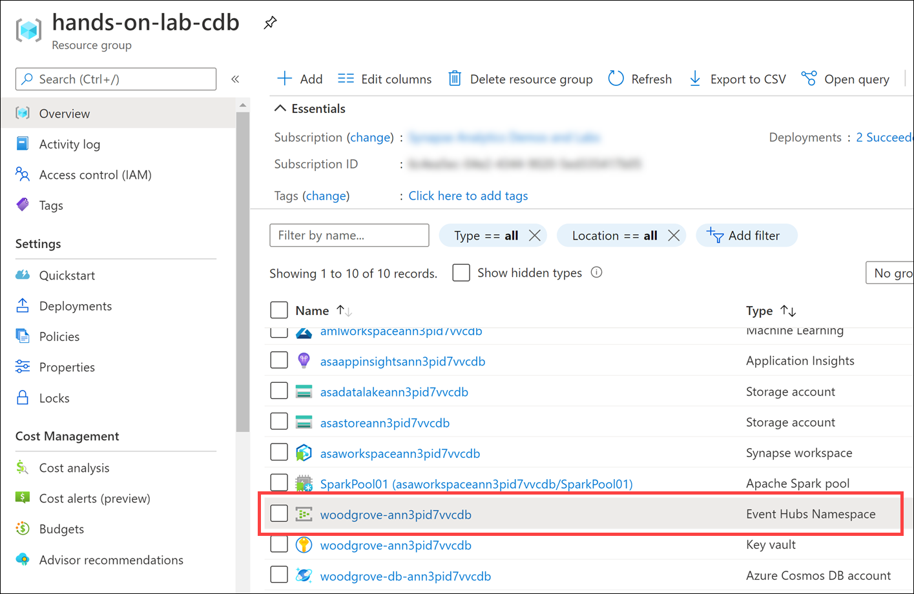

2. Select **Event Hubs**, then select the **transactions** Event Hub from the list.

    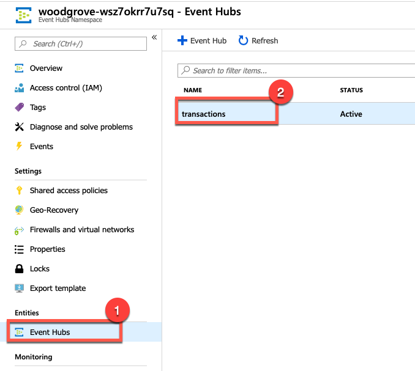

3. Select it then select **Shared access policies** under Settings in the left-hand menu.

    

4. Select **+ Add** in the top toolbar.

   

5. In the **Add SAS Policy** blade, configure the following:

    - **Policy name**: Enter **Sender**.
    - **Manage**: Unchecked
    - **Send**: Checked
    - **Listen**: Unchecked

    

6. Select **Create**.

7. Select **+ Add** in the top toolbar to add another policy.

    

8. In the **Add SAS Policy** blade, configure the following:

    - **Policy name**: Enter **Listener**.
    - **Manage**: Unchecked
    - **Send**: Unchecked
    - **Listen**: Checked

    

9. Select **Create**.

10. Select the **Sender** access policy.

11. Copy the **Connection string-primary key** value. Save this value for the Sender policy in Notepad or similar for later.

    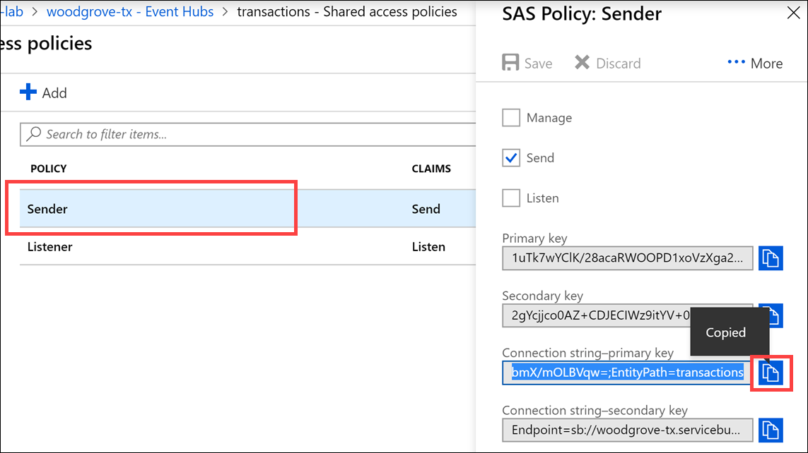

### Task 2: Configuring Event Hubs and the transaction generator

In this task, you will configure the payment transaction data generator project by completing TODO items in the source code and adding connection information for your Event Hub.

1. Open File Explorer on your machine or VM and navigate to the location you extracted the MCW repo .zip file to (C:\\CosmosMCW\\).

2. Open **TransactionGenerator.sln** in the `Hands-on lab\lab-files\TransactionGenerator` directory. This will open the solution in Visual Studio.

   

3. Double-click `appsettings.json` in the Solution Explorer to open it. This file contains the settings used by the console app to connect to your Azure services and to configure application behavior settings. The console app is programmed to either use values stored in this file, or within the machine's environment variables. This makes you capable of distributing the executable or containerizing it and passing in environment variables via the command line.

   

   The `appsettings.json` file contains the following:

    ```javascript
    {
        "EVENT_HUB_1_CONNECTION_STRING": "",
        "EVENT_HUB_2_CONNECTION_STRING": "",
        "EVENT_HUB_3_CONNECTION_STRING": "",

        "COSMOS_DB_ENDPOINT": "",
        "COSMOS_DB_AUTH_KEY": "",

        "SECONDS_TO_LEAD": "0",
        "SECONDS_TO_RUN": "600",
        "ONLY_WRITE_TO_COSMOS_DB": "false"
    }
    ```

   `SECONDS_TO_LEAD` is the amount of time to wait before sending payment transaction data. Default value is `0`.

   `SECONDS_TO_RUN` is the maximum amount of time to allow the generator to run before stopping transmission of data. The default value is `600`. Data will also stop transmitting after the included `Untagged_Transactions.csv` file's data has been sent.

   If the `ONLY_WRITE_TO_COSMOS_DB` property is set to `true`, no records will be sent to the Event Hubs instances. Default value is `false`.

4. Copy your Event Hub connection string value you copied from the `Sender` policy and saved during the steps you completed in the before the hands-on lab setup guide. Paste this value into the double-quotes located next to `EVENT_HUB_1_CONNECTION_STRING`.

   

5. Save the file.

6. Open `Program.cs` in the Visual Studio Solution Explorer.

7. In Visual Studio, select **View**, then **Task List** from the dropdown menu.

   

   This will display the TODO items within the code comments as a list of tasks you can double-click to jump to its location.

   

8. Go to **TODO 1** located in `Program.cs` by double-clicking the item in the Task List. Paste the following code under TODO 1, which uses the Event Hub client to send the event data, setting the partition key to `IpCountryCode`:

    ```csharp
    await eventHubClient.SendAsync(eventData: eventData,
        partitionKey: transaction.IpCountryCode).ConfigureAwait(false);
    ```

   Your completed code should look like the following:

   

   >**Note**: The /ipCountryCode partition was selected because the data will most likely include this value, and it allows us to partition by location from which the transaction originated. This field also contains a wide range of values, which is preferable for partitions.

9. Paste the code below under **TODO 2** to increment the count of the number of Event Hub requests that succeeded:

    ```csharp
    _eventHubRequestsSucceededInBatch++;
    ```

10. Paste the code below under **TODO 3** to instantiate a new Event Hub client and add it to the `eventHubClients` collection:

    ```csharp
    EventHubClient.CreateFromConnectionString(
        arguments.EventHubConnectionString
    ),
    ```

11. Save your changes.

### Task 3: Ingesting streaming data into Cosmos DB

In this task, you will configure Cosmos DB's time-to-live (TTL) settings to On with no default. This will allow the data generator to expire, or delete, the ingested messages after any desired period of time by setting the TTL value (object property of `ttl`) on individual messages as they are sent.

Next you will pass in the Azure Cosmos DB URI and Key values to the data generator so it can connect to and send events to your collection.

1. Navigate to your Azure Cosmos DB account in the Azure portal, then select **Data Explorer** on the left-hand menu.

   

2. Expand your **Woodgrove** database and your **transactions** container, then select **Settings**.

3. Under Settings within the Settings blade, select the **On (no default)** option for Time to Live. This setting is required to allow documents added to the container to be configured with their own TTL values.

   

4. Select **Save** to apply your settings.

5. On the **Azure Cosmos DB Account** blade, select **Keys** under **Settings**.

    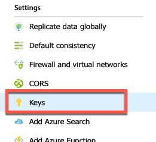

6. Copy the endpoint **URI** and **Primary Key** for Cosmos DB. Save this value to notepad or similar for use later.

    

7. Open Visual Studio to go back to the TransactionGenerator project.

8. Open the `appsettings.json` file once more. Paste your Cosmos DB endpoint value next to `COSMOS_DB_ENDPOINT`, and the Cosmos DB authorization key next to `COSMOS_DB_AUTH_KEY`. For example:

   

9. Open `Program.cs` and paste the code below under **TODO 4** to send the generated transaction data to Cosmos DB and store the returned `ResourceResponse` object into a new variable for statistics about RU/s used:

    ```csharp
    var response = await _cosmosDbClient.CreateDocumentAsync(collectionUri, transaction)
        .ConfigureAwait(false);
    ```

10. Paste the code below under **TODO 5** to append the number of RU/s consumed to the `_cosmosRUsPerBatch` variable:

    ```csharp
    _cosmosRUsPerBatch += response.RequestCharge;
    ```

11. Paste the code below under **TODO 6** to set the Cosmos DB connection policy:

    ```csharp
    var connectionPolicy = new ConnectionPolicy
    {
        ConnectionMode = ConnectionMode.Direct,
        ConnectionProtocol = Protocol.Tcp
    };
    ```

12. Save your changes.

13. Run the console app by selecting **Debug**, then **Start Debugging** in the top menu in Visual Studio, or press _F-5_ on your keyboard.

    

14. The PaymentGenerator console window will open, and you should see it start to send data after a few seconds. You may close the window or press `Ctrl+C` or `Ctrl+Break` at any time to stop sending data to Event Hubs and Cosmos DB.

    

    The top of the output displays information about the Cosmos DB container you created (transactions), the requested RU/s as well as estimated hourly and monthly cost. After every 1,000 records are requested to be sent, you will see output statistics so you can compare Event Hubs to Cosmos DB. Be on the lookout for the following:

    - Compare Event Hub to Cosmos DB statistics. They should have similar processing times and successful calls.
    - Inserted line shows successful inserts in this batch and throughput for writes/second with RU/s usage and estimated monthly ingestion rate added to Cosmos DB statistics.
    - Processing time: Shows whether the processing time for the past 1,000 requested inserts is faster or slower than the other service.
    - Total elapsed time: Running total of time taken to process all documents.
    - If this value continues to grow higher for Cosmos DB vs. Event Hubs, that is a good indicator that the Cosmos DB requests are being throttled. Consider increasing the RU/s for the container.
    - Succeeded shows number of accumulative successful inserts to the service.
    - Pending are items in the bulkhead queue. This amount will continue to grow if the service is unable to keep up with demand.
    - Accumulative failed requests that encountered an exception.

    > The obvious and recommended method for sending a lot of data is to do so in batches. This method can multiply the amount of data sent with each request by hundreds or thousands. However, the point of our exercise is not to maximize throughput and send as much data as possible, but to compare the relative performance between Event Hubs and Cosmos DB.

15. As an experiment, scale the number of requested RU/s for your Cosmos DB container down to 700. After doing so, you should see increasingly slower transfer rates to Cosmos DB due to throttling. You will also see the pending queue growing at a higher rate. The reason for this is because when the number of writes (remember, writes _typically_ use 5 RU/s vs. just 1 RU/s for reads on 1 KB-sized documents) exceeds the allotted amount of RU/s, Cosmos DB sends a 429 response with a _retry_after_ header value to tell the consumer that it is resource-constrained. The SDK automatically handles this by waiting for the specified amount of time, then retrying. After you are done experimenting, set the RU/s back to 15,000.

### Task 4: Choosing between Cosmos DB and Event Hubs for ingestion

Woodgrove Bank has a number of requirements around ingesting payment data, including data retention of the hot data and geographic locations to which the data is replicated for high availability and global distribution of the data for processing. There are many similarities between Event Hubs and Cosmos DB that allow both to work well for data ingestion. However, these services have some significant differences in their overall feature set that you need to evaluate to choose the best option for this customer situation.

In this exercise, you will use the data generator to send data to both Event Hubs and Cosmos DB and compare the performance of the two. You will also configure the generator and the services to set message retention and to send data to various global regions.

1. Open Visual Studio and paste the code below under **TODO 7** (located within `Transaction.cs`) to set the time to live (TTL) value to 60 days (in seconds):

   ```csharp
   tx.TimeToLive = 60 * 60 * 24 * 60;
   ```

   This configures Cosmos DB to automatically delete the ingested messages after 60 days by setting the TTL value (`ttl` property) on individual messages as they are sent. This optimization helps save in storage costs while meeting Woodgrove Bank's requirement to keep the streaming data available for that amount of time so they can reprocess in Azure Synapse Analytics, or query the raw data within the collection as needed.

   > Setting the TTL for documents saved to Cosmos DB individually for any length of time desired (even beyond 7 days) is an advantage Cosmos DB has over Event Hubs when used for ingesting streaming data.

2. Save your changes.

3. Navigate to your Event Hubs namespace for this lab in the Azure portal. Select **Event Hubs** from the left-hand menu.

   

4. Select your **transactions** event hub.

5. Select **Properties** on the left-hand menu.

6. Drag the **Message Retention** slider all the way to the right to set the value to 7. This is as long as you can set message retention for Event Hubs messages using the portal UI. It is possible to contact Microsoft to set the value to as many as 4 weeks. Unfortunately, this does not meet Woodgrove Bank's requirements for retaining this hot data for 60 days.

   

7. Select **Save Changes**.

   > Woodgrove Bank wants to write all transaction data simultaneously to three different geographic locations: United States, Great Britain, and East Asia. All data should be able to be read from these locations with as little latency as possible. They require this for redundancy purposes as well as being able to better process the data in those regions.

8. Create two more Event Hubs namespaces and event hubs within to ingest transaction data. In the [Azure portal](https://portal.azure.com), select **+ Create a resource**, enter "event hubs" into the Search the Marketplace box, select **Event Hubs** from the results, and then select **Create**.

   

9. On the Create Namespace blade, enter the following:

   - **Name**: Enter a globally unique name (indicated by a green check mark).
   - **Pricing tier**: Select Standard.
   - **Enable Kafka**: Unchecked
   - **Make this namespace zone redundant**: Unchecked
   - **Subscription**: Select the subscription you are using for this hands-on lab.
   - **Resource group**: Choose the hands-on-lab-SUFFIX resource group.
   - **Location**: Select **UK South**. (If you already selected this for the first Event Hub namespace, select a US region)
   - **Throughput Units**: Set the slider all the way to the left, setting the value to 1.
   - **Enable Auto-Inflate**: Unchecked

   

10. Select **Create**.

11. Navigate to the newly provisioned Event Hubs namespace in the Azure portal, then select **Event Hubs** under Entities on the left-hand menu.

    

12. Select **+ Event Hub** in the top toolbar.

    

13. In the **Create Event Hub** blade, configure the following:

    - **Name**: Enter **transactions**.
    - **Partition Count**: Move the slider to set the value to 10.
    - **Message Retention**: Set to 7.
    - **Capture**: Off

    

14. Select **Create**.

15. After the new Event Hub is created, select it then select **Shared access policies** under Settings in the left-hand menu.

    

16. Select **+ Add** in the top toolbar.

    

17. In the **Add SAS Policy** blade, configure the following:

    - **Policy name**: Enter **Sender**.
    - **Manage**: Unchecked
    - **Send**: Checked
    - **Listen**: Unchecked

    

18. Select **Create**.

19. Select **+ Add** in the top toolbar to add another policy.

    

20. In the **Add SAS Policy** blade, configure the following:

    - **Policy name**: Enter **Listener**.
    - **Manage**: Unchecked
    - **Send**: Unchecked
    - **Listen**: Checked

    

21. Select **Create**.

22. Select the **Sender** access policy.

23. Copy the **Connection string-primary key** value. Save this value for the Sender policy in Notepad or similar for later.

24. **Repeat steps 8 through 23 above** to create a new Event Hub namespace in the **East Asia** region.

    

25. Open Visual Studio to go back to the TransactionGenerator project.

26. Open the `appsettings.json` file once more. Paste your two new Event Hub connection strings into the values for `EVENT_HUB_2_CONNECTION_STRING` and `EVENT_HUB_3_CONNECTION_STRING`, respectively.

    

27. Save your changes.

28. Open `Program.cs` and paste the below code underneath **TODO 8** to add two new Event Hub clients to the `eventHubClients` collection, using the two new connection string values:

    ```csharp
    EventHubClient.CreateFromConnectionString(
        arguments.EventHub2ConnectionString
    ),
    EventHubClient.CreateFromConnectionString(
        arguments.EventHub3ConnectionString
    )
    ```

    

29. Now, we will add the two additional regions to Cosmos DB. Navigate to the Azure portal and select your Cosmos DB account you created for this lab.

30. Select **Replicate data globally** underneath Settings in the left-hand menu.

    

31. Within the Replicate data globally blade, select **+ Add region** above the listed regions in the Configure regions section.

    

    > Notice that there are already two regions and they each have both reads and writes enabled. This is because you enabled the geo-redundancy and multi-region writes options when you provisioned Cosmos DB.

32. Select **East Asia** in the dropdown list, then select **OK** to add the region.

    

33. Select **+ Add region** again, this time selecting **UK South** in the dropdown list. Select **OK** to add the new region.

    

34. Notice that the two new regions are highlighted on the world map, and each have both reads and writes enabled. Congratulations! You completed all the steps to write to and read from multiple regions around the world with Cosmos DB! Finally, select **Discard** to discard your changes.

    

    > **Note**: We **do not** need to add the two new regions to complete this lab. However, if you do decide to save the changes, you may have to wait several minutes for the change to take effect. In the meantime, you can feel free to continue and run the transaction generator. Cosmos DB can still ingest data as regions are being added. There should be no performance impact during this time or after the provisioning is complete.

35. Open Visual Studio and debug the TransactionGenerator project. Let it run for at least 2 minutes, or long enough to send 10,000 messages.

    

    Results will vary depending on machine specifications and network speeds, but overall, it will likely take longer to send the data to the three Event Hub instances than to Azure Cosmos DB. You may also notice the Event Hubs pending queue filling up quite a bit more. Also notice that you did not have to make any code changes to write to the additional Cosmos DB regions.

36. Open each of the three Event Hubs namespaces you have created for this lab. You should see an equal number of messages that were sent to each. The graph is shown on the bottom of the Overview blade. Select the **Messages** metric above the graph to view the number of messages received. The screenshot below is of the UK South Event Hub:

    

37. View the data that was saved to Azure Cosmos DB. Navigate to the Azure Cosmos DB account for this lab in the Azure portal. Select **Data Explorer** on the left-hand menu. Expand the **Woodgrove** database and **transactions** collection, then select **Documents**. Select one of the documents from the list to view it. If you selected a more recently added document, notice that it contains a `ttl` value of 5,184,000 seconds, or 60 days. Also, there is a `collectionType` value of "Transaction". This allows consumers to query documents stored within the collection by the type. This is needed because a collection can contain any number of document types within, since it does not enforce any type of schema.

    

Given the requirements provided by the customer, Azure Cosmos DB is the best choice for ingesting data for this PoC. Azure Cosmos DB allows for more flexible, and longer, TTL (message retention) than Event Hubs, which is capped at 7 days, or 4 weeks when you contact Microsoft to request the extra capacity. Another option for Event Hubs is to use Event Hubs Capture to simultaneously save ingested data to Blob Storage or Azure Data Lake Store for longer retention and cold storage. However, this will require additional development, including automatic clearing of the data after a period of time. In addition, Woodgrove Bank wanted to be able to easily query and replay the transactional data during the 60-day message retention period, from a database. Setting the TTL on the documents to 60 days keeps them in the Azure Cosmos DB transactional store for 60 days, where they can replay the transactions flowing through the change feed. However, with the addition of the analytical store that is enabled through Synapse Link, all data gets automatically copied to a low-cost Azure storage account in columnar format, giving Woodgrove easy access to all their data, regardless of the transactional store's TTL value, from within Synapse Analytics. Since these queries are executed against the analytical store, they do not use any RU/s allocated to the transaction store.

Finally, the requirement to synchronize/write the ingested data to multiple regions, which could grow at any time, makes Azure Cosmos DB a more favorable choice. As you can see, there are more steps required to send data to additional regions using Event Hubs, since you have to provision new namespaces and Event Hub instances in each region. You would also have to account for all those instances on the consuming side, which we will not cover in this lab for sake of time. The ability to read/write to multiple regions by adding and removing them at will with no code or changes required is a great value that Azure Cosmos DB adds. Plus, the fact that Azure Cosmos DB will be used in this solution for serving batch-processed fraudulent data on a global scale means that Azure Cosmos DB can be used to meet both the data ingest and delivery needs with no additional services, like Event Hubs, required.

We will continue the lab using Azure Cosmos DB for data ingestion.

## Exercise 2: Understanding and preparing the transaction data

Duration: 15 minutes

In this exercise, you will load historical transaction data to the primary ADLS Gen2 account within your Azure Synapse Analytics workspace. Then, using Synapse Spark notebooks, you will explore the historical raw transaction data provided by Woodgrove to gain a better understanding of the preparation that needs to be done prior to using the data for building and training a machine learning model.

### Task 1: Configure access to the storage account from your workspace

We will be exploring files in the Synapse Analytics workspace's primary ADLS Gen2 account. Before we can do this, we need to verify that the managed identities for the workspace as well as your user account have access to the storage account.

1. In the Azure Portal, navigate to the **Resource Group** created for this hands-on lab, then navigate to the storage account named **`asadatalakeSUFFIX`**.

    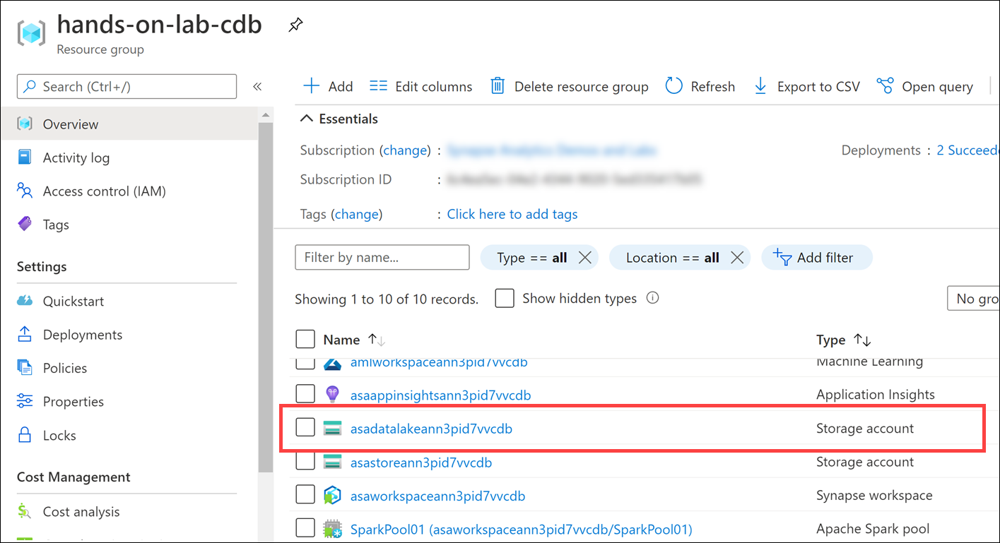

2. Select **Access Control (IAM)** in the left-hand menu, then select **Role assignments**.

    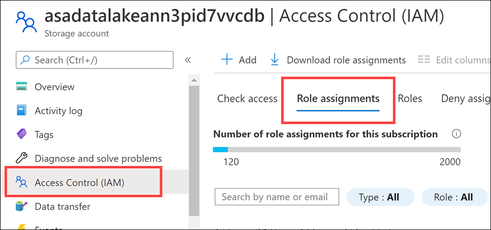

3. Scroll down the list of role assignments and verify that the Synapse Analytics workspace name is added to the **Storage Blob Data Contributor** role.

    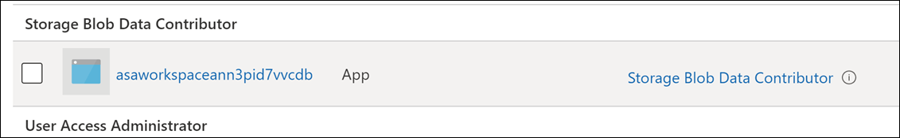

4. If you do not see your Azure account name assigned to this role, select **+ Add** above `Role assignments`, then select **Add role assignment**.

    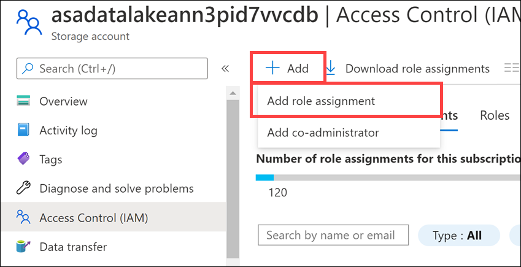

5. In the add role assignment form, select the **Storage Blob Data Contributor** role, search for and select your Azure user account, then select **Save**.

    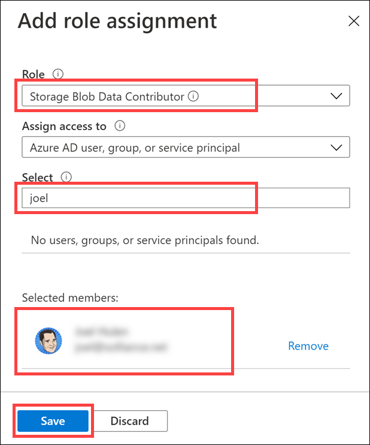

### Task 2: Open Synapse Studio

1. In the Azure Portal, navigate to the **Resource Group** created for this hands-on lab, then navigate to the **Synapse Analytics workspace** resource.

    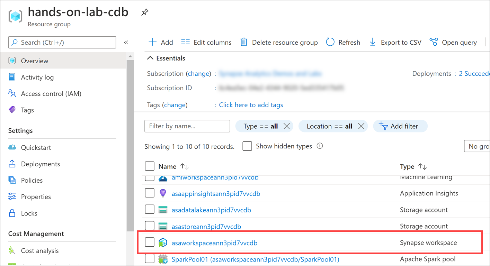

2. In the Synapse Analytics workspace Overview blade, select **Launch Synapse Studio**.

    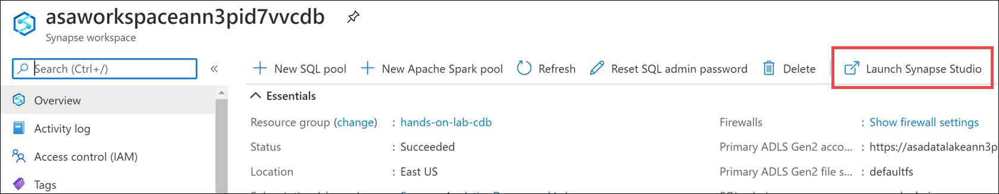

### Task 3: Upload historical data

Woodgrove Bank provided historical transaction data. We want to explore this data using Synapse Notebooks, and we want to use the data from Azure Machine Learning later on for model training. In this task, you will upload the historical files to the Synapse Analytics primary ADLS Gen2 account.

1. Navigate to the **Data** hub.

    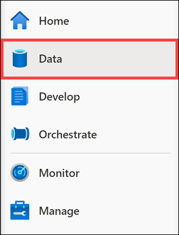

2. Select the **Linked** tab **(1)**, then expand the ADLS Gen2 account and select the **`defaultfs (Primary)`** container **(2)**. Navigate to the **`synapse`** folder **(3)**, then select **Upload (4)**.

    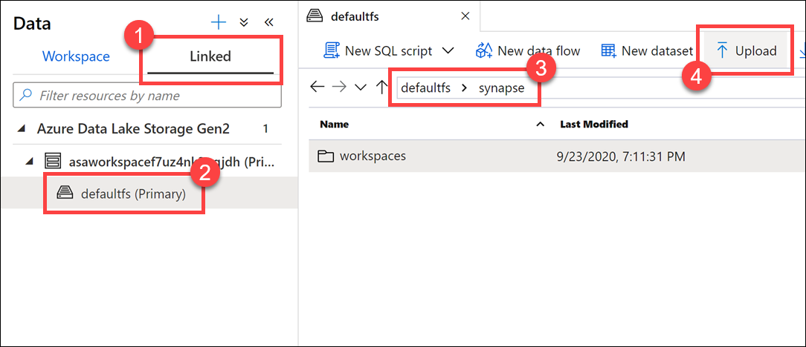

3. Browse to the location you extracted the MCW repo .zip file to (C:\\CosmosMCW\\) and navigate to the `Hands-on lab\Resources` directory. Select the three files in the directory, then select **Open**.

    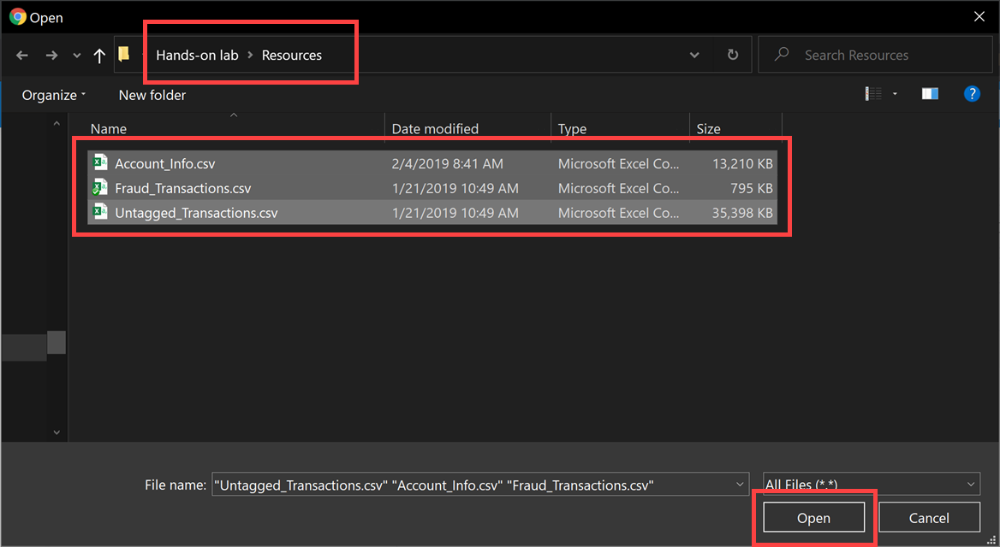

4. Confirm that the three files are included in the `Upload Files` blade, then select **Upload**.

    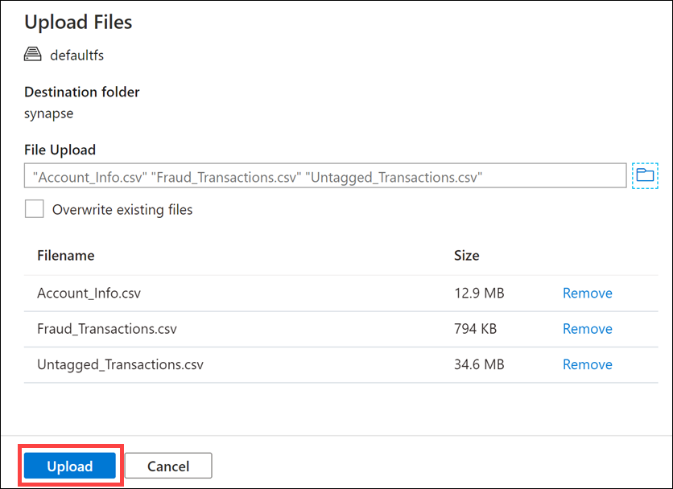

5. Verify that you can see the three files in the `synapse` folder after uploading. You may need to refresh the folder view after a few moments.

    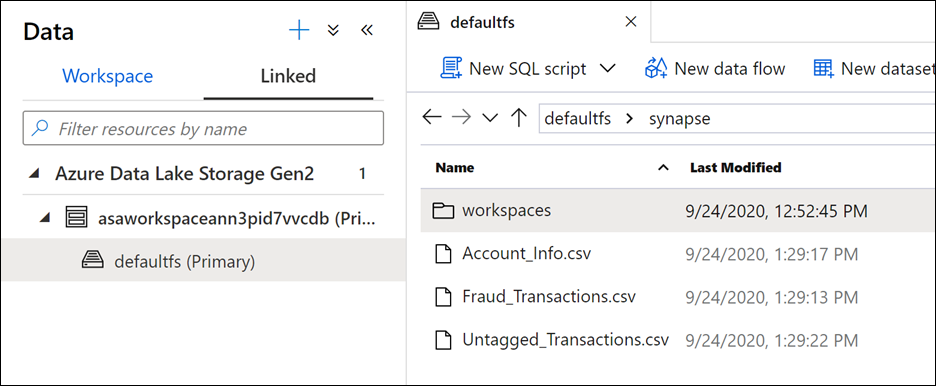

### Task 4: Create Synapse Notebook to explore historical data

Data preparation is an important step in the data engineering process. Before using data to create machine learning models, it is important to understand the data, and determine what features of the data set will be valuable for your intended purposes. To assist with this, Woodgrove has provided a CSV file contain some of its historical transactions for exploration.

In this notebook, you will explore this raw transaction data provided by Woodgrove to gain a better understanding of the types of transformations that need to be performed on the data to prepare it for use in building and training a machine learning model to detect fraud.

1. Right-click the **Untagged_Transactions.csv** file, select **New notebook**, then select **Load to DataFrame**.

    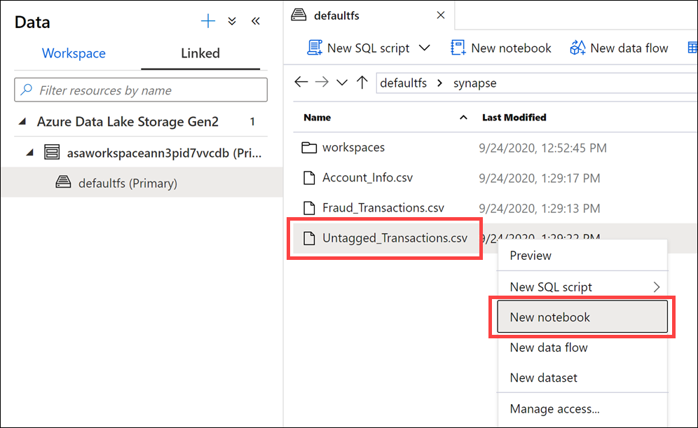

2. Update the cell to uncomment the `, header=True` line by removing the two pound symbols at the beginning of the line **(`##`)** **(1)**. Make sure the notebook is attached to **SparkPool01 (2)**, then select **Run all (3)**. It will take a few minutes to run this notebook the first time since the serverless Apache Spark pool needs start.

    

    Notice that the first cell uses the `spark.read.load` with a path to the CSV file to load the `df` DataFrame.

    The output from the `display()` command allows you to inspect the columns of data contained in the dataset, including column names and the values stored in each column. With this information, you can start performing an exploratory analysis of the transaction data, looking for fields which contain information which might be useful in determining if a transaction is potentially fraudulent, as well as columns containing empty and null values. This can help in making determinations about which columns might be useful for fraud analysis and which columns can potentially be removed from the dataset.

    Take a few minutes to look through some of the data to better understand the types of information being gathered in Woodgrove's transaction logs.

### Task 5: Review columns with `null` or unusable values

1. Hover your mouse below Cell 1's output, then select **{} Add code** to create a new code cell.

    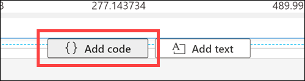

2. Paste and execute the following in the new cell to review columns with null values (Tip: you can execute a cell by entering **Ctrl+Enter**):

    ```python
    transactions = df

    transactions.select("browserType").distinct().show()
    ```

    Here we inspect a column with empty or `null` rows to get a list of the distinct values. Columns containing only empty or `null` values are good candidates to be dropped from the dataset used for building and training your machine learning model. Rerun the new cell for other columns in the DataFrame which contain empty values to determine if they contain only empty values, or if some records contain data.

3. Once done inspecting empty fields, another thing to review is columns with values, but possibly values that do not provide information useful for our fraud detection scenario. As an example, paste and execute the following command in a new cell to find the distinct values contained in the `transactionScenario` and `transactionType` fields:

    ```python
    transactions.select("transactionScenario").distinct().show()
    ```

    As you can see from the results above, both the `transactionScenario` and `transactionType` fields each contain only a single value, which provides little value in making a determination about whether the transaction might be fraudulent.

### Task 6: Look for invalid values

Before moving on, let's look at one more scenario that you should consider when doing your exploration of the data.

Woodgrove has provided you with a list of possible `cvvVerifyResult` values and the meaning of each.

| Code  | Meaning
| ----- | ---------
| Empty | Transaction failed because wrong CVV2 number was entered or no CVV2 number was entered
| M     | CVV2 Match
| N     | CVV2 No Match
| P     | Not Processed
| S     | Issuer indicates that CVV2 data should be present on the card, but the merchant has indicated data is not present on the card
| U     | Issuer has not certified for CVV2 or Issuer has not provided Visa with the CVV2 encryption keys

> The schema details for the data used here is available at: <https://microsoft.github.io/r-server-fraud-detection/input_data.html>.

1. Run the following in a new cell to view the distinct values contained in `cvvVerifyResult` field, and a count of each. In this case, we are using the `groupBy()` method to provide the distinct `cvvVerifyResult` values, along with a count of each:

    ```python
    transactions.groupBy("cvvVerifyResult").count().sort("cvvVerifyResult").show()
    ```

    The cell output should look like the following:

    ```cli
    +---------------+------+
    |cvvVerifyResult| count|
    +---------------+------+
    |           null| 22509|
    |              M|174965|
    |              N|   460|
    |              P|   561|
    |              S|    31|
    |              U|   289|
    |              X|  1142|
    |              Y|    43|
    +---------------+------+
    ```

    There are two interesting things to note for the values in the `cvvVerifyResult` field:

    1. We have some rows with empty values, which, according to the values listed provided by Woodgrove, indicates a failed transaction. For our fraud detection model, we are only concerned with completed transactions, so you might consider dropping rows where the `cvvVerifyResult` is empty. The count allows us to have some insight into the impact this will have on the size of our dataset.
    
    2. There are a small number of values (X or Y for instance) that are not valid values, according to the list of acceptable values. Since these rows don't contain valid transactions, some consideration should be given to how to handle them in your model.

### Task 7: Review column data types

Another aspect of the data to review is the data types of each column. To view the data type assigned to each column, you can use the `printSchema()` method on the DataFrame.

1. Run the following in a new cell to view the file schema:

    ```python
    transactions.printSchema()
    ```

    The output should look like the following:

    ```cli
    root
    |-- transactionID: string (nullable = true)
    |-- accountID: string (nullable = true)
    |-- transactionAmountUSD: string (nullable = true)
    |-- transactionAmount: string (nullable = true)
    |-- transactionCurrencyCode: string (nullable = true)
    |-- transactionCurrencyConversionRate: string (nullable = true)
    |-- transactionDate: string (nullable = true)
    |-- transactionTime: string (nullable = true)
    |-- localHour: string (nullable = true)
    |-- transactionScenario: string (nullable = true)
    |-- transactionType: string (nullable = true)
    |-- transactionMethod: string (nullable = true)
    |-- transactionDeviceType: string (nullable = true)
    |-- transactionDeviceId: string (nullable = true)
    |-- transactionIPaddress: string (nullable = true)
    |-- ipState: string (nullable = true)
    |-- ipPostcode: string (nullable = true)
    |-- ipCountryCode: string (nullable = true)
    |-- isProxyIP: string (nullable = true)
    |-- browserType: string (nullable = true)
    |-- browserLanguage: string (nullable = true)
    |-- paymentInstrumentType: string (nullable = true)
    |-- cardType: string (nullable = true)
    |-- cardNumberInputMethod: string (nullable = true)
    |-- paymentInstrumentID: string (nullable = true)
    |-- paymentBillingAddress: string (nullable = true)
    |-- paymentBillingPostalCode: string (nullable = true)
    |-- paymentBillingState: string (nullable = true)
    |-- paymentBillingCountryCode: string (nullable = true)
    |-- paymentBillingName: string (nullable = true)
    |-- shippingAddress: string (nullable = true)
    |-- shippingPostalCode: string (nullable = true)
    |-- shippingCity: string (nullable = true)
    |-- shippingState: string (nullable = true)
    |-- shippingCountry: string (nullable = true)
    |-- cvvVerifyResult: string (nullable = true)
    |-- responseCode: string (nullable = true)
    |-- digitalItemCount: string (nullable = true)
    |-- physicalItemCount: string (nullable = true)
    |-- purchaseProductType: string (nullable = true)
    ```

    When building your model, you will want to make sure each field in reflective of the type of data stored in the column, and considering casting some columns to a more appropriate type. For example, the `transactionIPaddress` field is currently represented as a `double`, but since it contains the last two octets of the user's IP address, it may be better represented as a `string` value.

## Exercise 3: Creating and evaluating fraud models

Duration: 45 minutes

In this exercise, you create and evaluate a fraud model that is used for real-time scoring of transactions as they occur at the web front-end. The goal is to block fraudulent transactions before they are processed. You will then create a model for detecting suspicious transactions, which gets executed during batch processing that will take place in Exercise 4. Finally, you will deploy the fraudulent transactions model and test it through HTTP REST calls, all within Azure Machine Learning.

### Task 1: Create Azure ML datastore

In this task, you create a new Azure Machine Learning datastore that points to the ADLS Gen2 account that contains the historical data you uploaded in an earlier exercise. The datastore enables you to easily access these files from within a notebook in your Azure ML workspace.

1. Navigate to the **Resource Group** in the [Azure portal](https://portal.azure.com) that you created for this lab.

2. Select the **amlworkspace#SUFFIX#** resource with a Type of **Machine Learning**.

    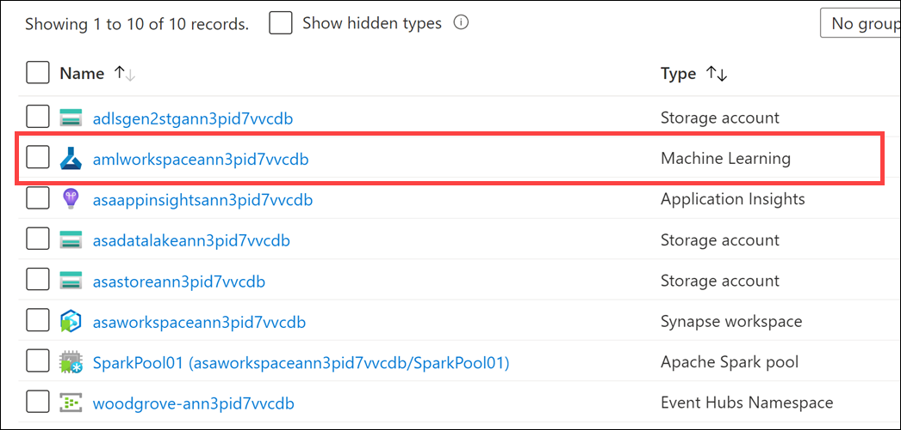

3. Select **Launch now** to open the Azure Machine Learning studio.

    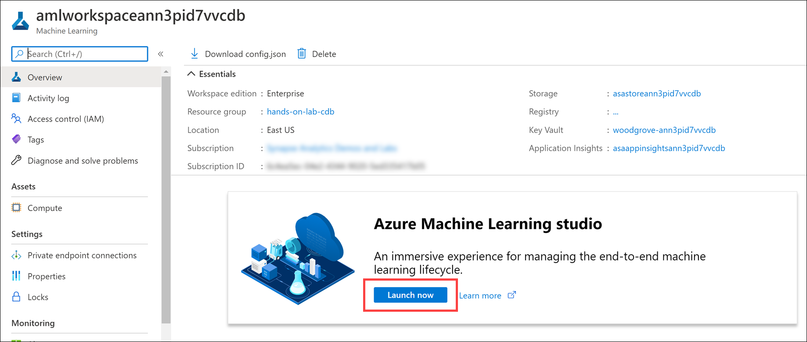

4. In the Azure Machine Learning studio, select the **Datastores** option in the Manage tab. Then, select the **+ New datastore** option.

    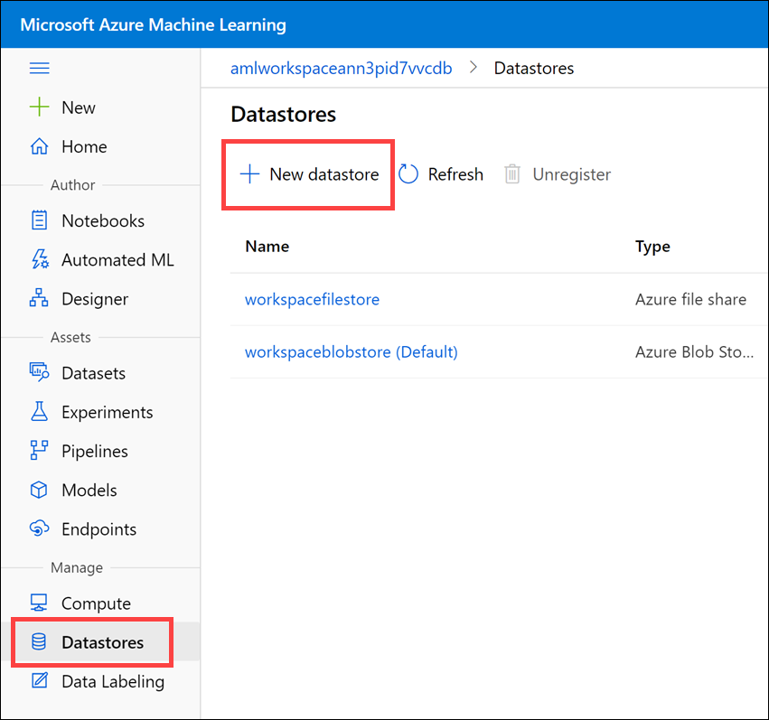

5. In the **New datastore** window, complete the following:

   | Field                          | Value                                              |
   | ------------------------------ | ------------------------------------------         |
   | Datastore name                 | _`woodgrovestorage`_                            |
   | Datastore type                 | _select `Azure Blob Storage`_                      |
   | Account selection method       | _select `From Azure subscription`_                 |
   | Subscription ID                | _select the appropriate subscription_              |
   | Storage account                | _select `asadatalake#SUFFIX#`_             |
   | Blob container                 | _select `defaultfs`_                                 |
   | Allow Azure ML Service...      | _select `No`_                                      |
   | Authentication type            | _select `Account key`_                             |
   | Account key                    | _enter the account key_                            |

   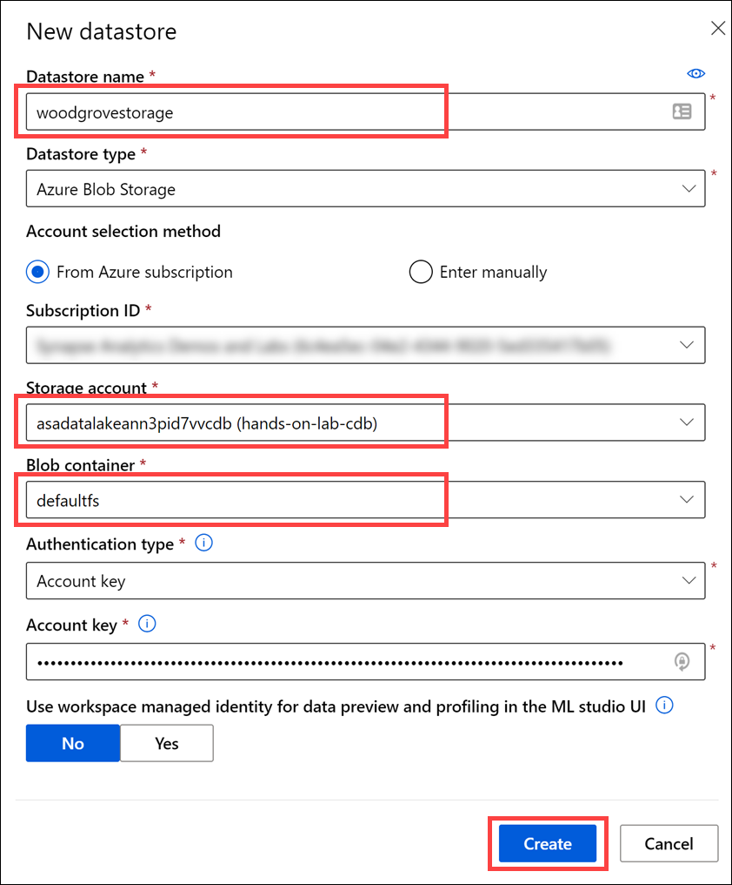

   >**Note**: If you have not stored your storage account key, navigate to your storage account. Then, in the **Settings** menu, select **Access keys** and copy the **Key** value in the **key1** section.

6. Select **Create** to add the new output.

### Task 2: Prepare and deploy scoring web service

In this task, you will use a notebook to explore the transaction and account data. You will also do some data cleanup and create a feature engineering pipeline that applies these transformations each time data is passed to the model for scoring. Finally, you will train and deploy a machine learning model that detects fraudulent transactions.

1. Navigate to the **Notebooks** section and then select the **Upload files** option.

    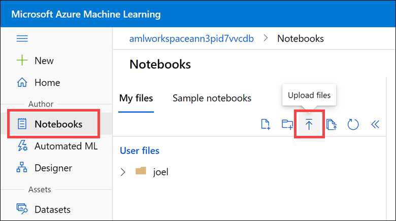

2. Browse to the location you extracted the MCW repo .zip file to (C:\\CosmosMCW\\) and navigate to the `Hands-on lab\lab-files` directory. Select the two **`.ipynb`** notebook files in the directory, then select **Open**.

    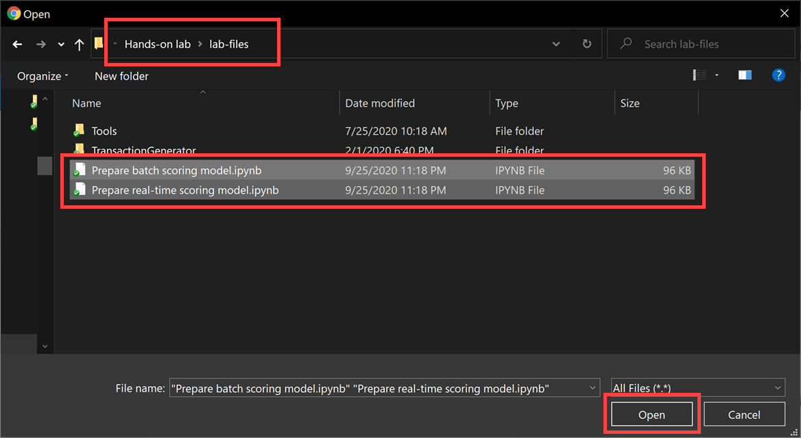

3. In the Upload files dialog, **Check** `I trust contents of these files`, then select **Upload**.

    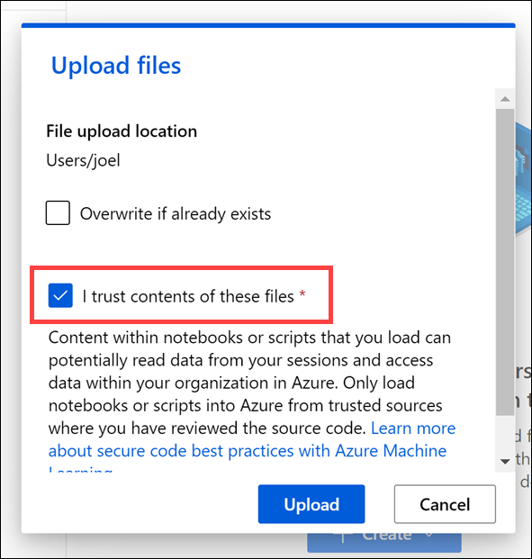

4. Select the **Prepare real-time scoring model.ipynb** notebook.

    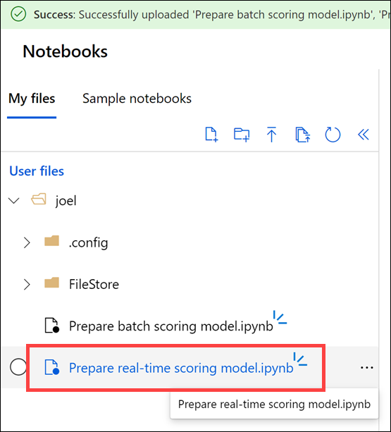

5. In the Compute menu, select **+** to add new compute.

    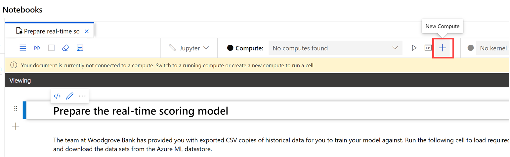

6. In the **Create compute instance** section, complete the following and then select **Next**.

    | Field                          | Value                                              |
    | ------------------------------ | ------------------------------------------         |
    | Virtual machine type           | _select `CPU`_           |
    | Virtual machine size           | _select `Select from recommended options`, then select `Standard_DS3_v2`_                         |

    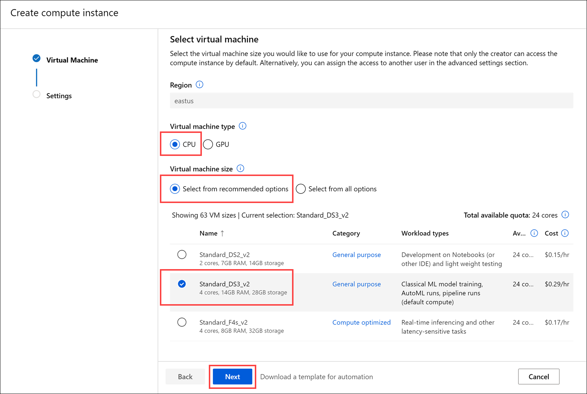

7. In the **Create compute instance** section, complete the following and then select **Create**.

   | Field                          | Value                                              |
   | ------------------------------ | ------------------------------------------         |
   | Compute name                   | _`woodgrove`_ or unique value |

   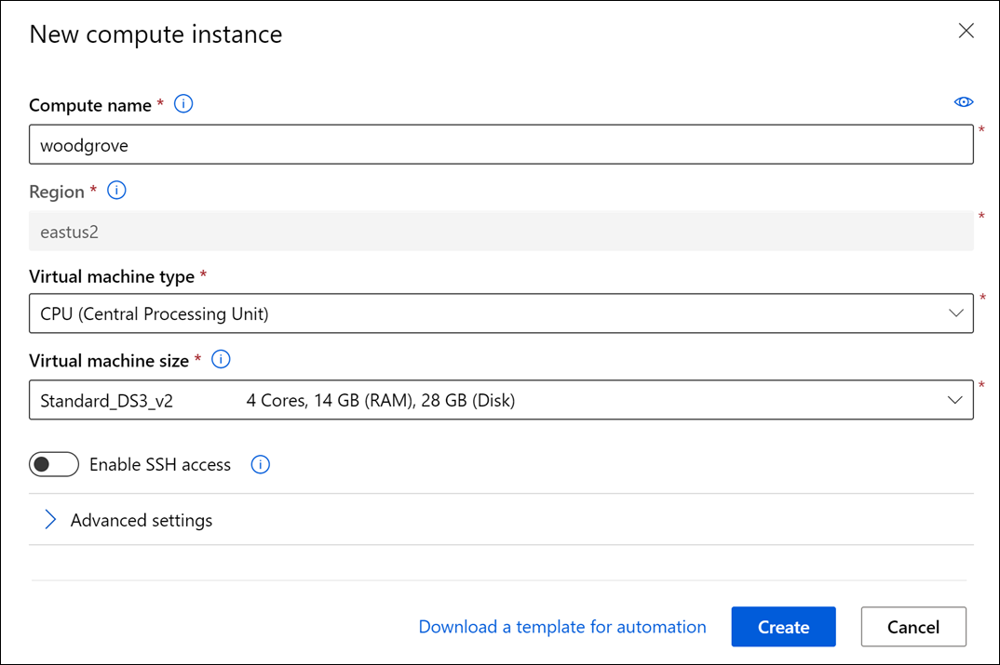

8. After the **Compute** has been created **(1)**, select **Editors**, then **{} Edit in Jupyter (2)** to open the notebook in the Jupyter editor, which provides an enhanced notebook experience.

    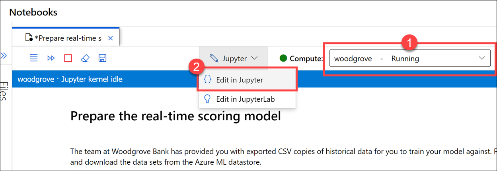

9. **Run** each cell in the notebook. You can select a cell and enter **Shift+Enter** to execute the cell and advance to the next one. Be sure to read and understand each cell and descriptions throughout the notebook.

    > If you receive errors after executing the first two cells, rerun them again. The first cell performs `!pip install` commands, which take a few moments to apply to all the worker nodes.

10. You may receive a prompt to sign in after executing the first cell. If you do, copy the code in your notebook and then select the link to authenticate.

    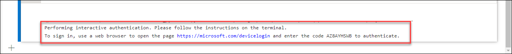

    After selecting the link, enter the code and select **Next**. You may be prompted to select an account; if so, choose your Azure account and continue.

    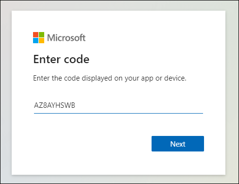

### Task 3: View the deployed model endpoint

In the notebook, you deployed the model to Azure Container Instances (ACI) and tested the endpoint with sample data. In this task, you view the registered model and deployed endpoint, then you obtain the REST endpoint value and test it from outside of the notebook.

1. Close the `Prepare real-time scoring model.ipynb` notebook if it is still open.

2. In Azure Machine Learning studio, navigate to the **Models** section and then select **fraud-score**. **Note**: If you have multiple versions of the model from running the notebook multiple times, select the `fraud-score` model with the highest version number.

    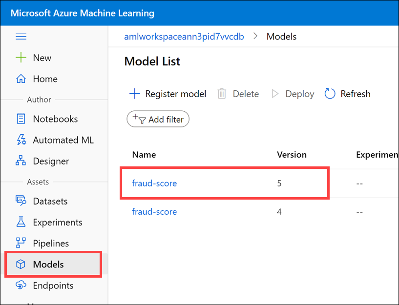

3. On the model's page, select the **Endpoints** tab, then select the **scoringservice** endpoint, which is the name we provided when deploying the model in the notebook. Notice that the **Compute type** is set to `ACI`.

    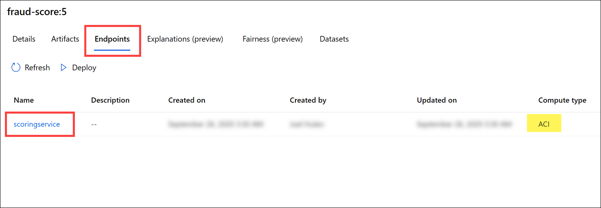

    >**Note**: in a production scenario, you will likely wish to deploy models with [Azure Machine Learning's MLOps](https://azure.microsoft.com/services/machine-learning/mlops/).

4. In the `scoringservice` endpoint, observe the current state. If the Deployment state is **Transitioning**, this means that Azure Machine Learning is still deploying the endpoint. In our case, the Deployment state is **Healthy**, meaning the deployment succeeded and your Azure Machine Learning deployment is ready to be consumed. **Copy** the **REST endpoint** value to a text editor.

    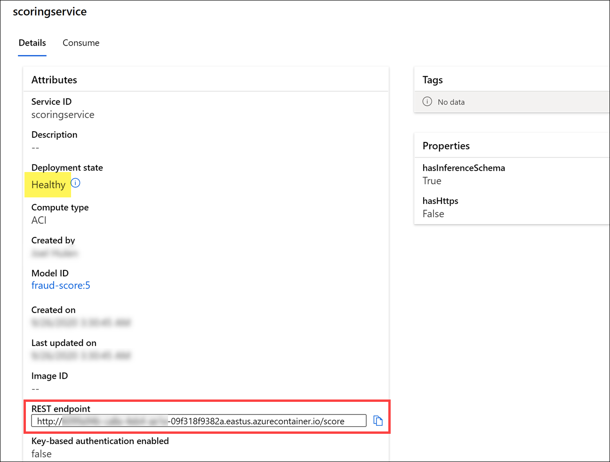

### Task 4: Test the predictive maintenance model

1. Open a command prompt and run the following command, replacing `{YOUR CONTAINER LOCATION}` at the end of the command with the URI of your Azure Container Instance.

    ```cmd
    curl -X POST -H "Content-Type: application/json" -d "{\"data\": [{\"accountID\":\"A985156985579195\",\"browserLanguage\":\"en-AU\",\"cardType\":\"VISA\",\"cvvVerifyResult\":\"M\",\"digitalItemCount\":1,\"ipCountryCode\":\"au\",\"ipPostcode\":\"3000\",\"ipState\":\"victoria\",\"isProxyIP\":false,\"localHour\":19.0,\"paymentBillingCountryCode\":\"AU\",\"paymentBillingPostalCode\":\"3122\",\"paymentBillingState\":\"Victoria\",\"paymentInstrumentType\":\"CREDITCARD\",\"physicalItemCount\":0,\"transactionAmount\":99.0,\"transactionAmountUSD\":103.48965,\"transactionCurrencyCode\":\"AUD\",\"transactionDate\":20130409,\"transactionID\":\"5EAC1EBD-1428-4593-898E-F4B56BC3FA06\",\"transactionIPaddress\":121.219,\"transactionTime\":95040},{\"accountID\":\"A985156966855837\",\"browserLanguage\":\"en-AU\",\"cardType\":\"VISA\",\"cvvVerifyResult\":\"M\",\"digitalItemCount\":0,\"ipCountryCode\":\"us\",\"ipPostcode\":\"14534\",\"ipState\":\"new york\",\"isProxyIP\":false,\"localHour\":null,\"paymentBillingCountryCode\":\"AU\",\"paymentBillingPostalCode\":\"2209\",\"paymentBillingState\":\"New South Wales\",\"paymentInstrumentType\":\"CREDITCARD\",\"physicalItemCount\":1,\"transactionAmount\":679.0,\"transactionAmountUSD\":709.79265,\"transactionCurrencyCode\":\"AUD\",\"transactionDate\":20130409,\"transactionID\":\"48C88D1C-3705-472B-A4A3-5FCE45A5429B\",\"transactionIPaddress\":216.15,\"transactionTime\":94256},{\"accountID\":\"A844428012992486\",\"browserLanguage\":\"nn-NO\",\"cardType\":\"MC\",\"cvvVerifyResult\":\"M\",\"digitalItemCount\":1,\"ipCountryCode\":\"no\",\"ipPostcode\":\"1006\",\"ipState\":\"oslo\",\"isProxyIP\":false,\"localHour\":10.0,\"paymentBillingCountryCode\":\"NO\",\"paymentBillingPostalCode\":\"7033\",\"paymentBillingState\":null,\"paymentInstrumentType\":\"CREDITCARD\",\"physicalItemCount\":0,\"transactionAmount\":1099.0,\"transactionAmountUSD\":199.75424,\"transactionCurrencyCode\":\"NOK\",\"transactionDate\":20130409,\"transactionID\":\"13B2A110-EA04-42CD-88CC-A85814A5C961\",\"transactionIPaddress\":94.246,\"transactionTime\":95257},{\"accountID\":\"A1055521358474530\",\"browserLanguage\":\"en-US\",\"cardType\":\"AMEX\",\"cvvVerifyResult\":\"M\",\"digitalItemCount\":0,\"ipCountryCode\":\"ae\",\"ipPostcode\":\"0\",\"ipState\":\"dubayy\",\"isProxyIP\":false,\"localHour\":14.0,\"paymentBillingCountryCode\":\"US\",\"paymentBillingPostalCode\":\"33071\",\"paymentBillingState\":\"FL\",\"paymentInstrumentType\":\"CREDITCARD\",\"physicalItemCount\":4,\"transactionAmount\":2405.33,\"transactionAmountUSD\":2405.33,\"transactionCurrencyCode\":\"USD\",\"transactionDate\":20130409,\"transactionID\":\"C34F7C20-6203-42F5-A41B-AF26177345BE\",\"transactionIPaddress\":92.97,\"transactionTime\":102958},{\"accountID\":\"A844428033864668\",\"browserLanguage\":\"it-IT\",\"cardType\":\"VISA\",\"cvvVerifyResult\":\"U\",\"digitalItemCount\":1,\"ipCountryCode\":\"it\",\"ipPostcode\":\"39100\",\"ipState\":\"bolzano\",\"isProxyIP\":false,\"localHour\":11.0,\"paymentBillingCountryCode\":\"IT\",\"paymentBillingPostalCode\":\"50133\",\"paymentBillingState\":\"Firenze\",\"paymentInstrumentType\":\"CREDITCARD\",\"physicalItemCount\":0,\"transactionAmount\":269.0,\"transactionAmountUSD\":362.5582,\"transactionCurrencyCode\":\"EUR\",\"transactionDate\":20130409,\"transactionID\":\"C78542E6-0951-4B63-B420-BEF750B98BCD\",\"transactionIPaddress\":95.229,\"transactionTime\":103514}]}" http://{YOUR CONTAINER LOCATION}/score
    ```

    You should receive back a JSON array with the values `[true, true, false, true, false]`.

    > **Note**: If you do not have the curl application installed, you may alternatively wish to install [Postman](https://www.postman.com/), a free tool for making web requests.

### Task 5: Prepare batch scoring model

In this task, you will use a notebook to prepare a model used to detect suspicious activity that will be used for batch scoring.

1. Navigate back to **Notebooks** and select the **Prepare batch scoring model.ipynb** notebook.

    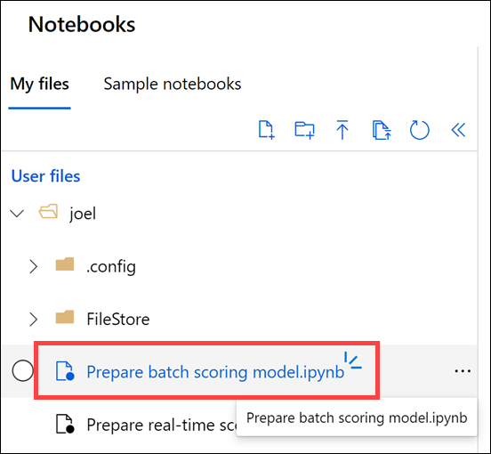

2. Ensure the **Compute** is running **(1)**, select **Jupyter**, then **{} Edit in Jupyter (2)** to open the notebook in the Jupyter editor, which provides an enhanced notebook experience.

    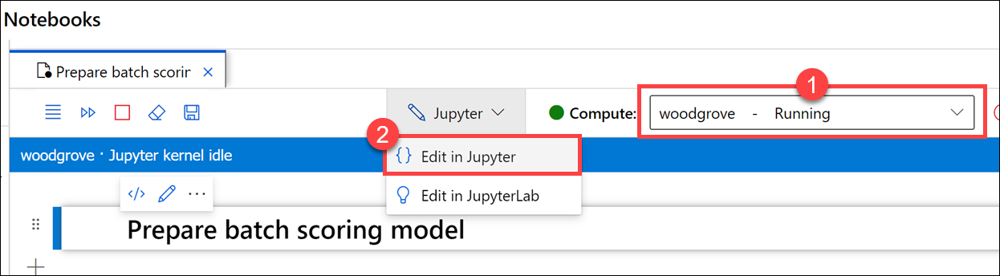

3. **Run** each cell in the notebook. You can select a cell and enter **Shift+Enter** to execute the cell and advance to the next one. Be sure to read and understand each cell and descriptions throughout the notebook.

4. **Copy the output of the last cell** of the notebook and save it to Notebook or similar text editor for a later exercise. The output contains information for connecting to your Azure Machine Learning workspace from a Synapse notebook. The output will look similar to the following:

    ```python
    subscription_id = '0a1b2c3d-0a1b-0a1b-0a1b-0a1b2c3d4e5f'
    resource_group = 'hands-on-lab-SUFFIX'
    workspace_name = 'amlworkspaceannSUFFIX'
    workspace_region = 'eastus2'
    ```

## Exercise 4: Create Synapse Linked Services and copy pipeline

Duration: 15 minutes

Woodgrove has provided JSON files exported from their customer relationship management (CRM) system containing user account data that they want to load into Azure Cosmos DB. This account data needs to be loaded to the `metadata` container.

To do this you will create a Synapse Analytics pipeline with a copy activity. Synapse Pipelines include over 90 built-in connectors, can load data by manual execution of the pipeline or by orchestration, supports common loading patterns, enables fully parallel loading into the data lake, SQL tables, Azure Cosmos DB, or any number of destinations. Synapse Pipelines share a code base with Azure Data Factory (ADF).

### Task 1: Open Synapse Studio

1. In the Azure Portal, navigate to the **Resource Group** created for this hands-on lab, then navigate to the **Synapse Analytics workspace** resource.

    

2. In the Synapse Analytics workspace Overview blade, select **Launch Synapse Studio**.

    

### Task 2: Create Azure Cosmos DB linked service

1. Navigate to the **Manage** hub.

    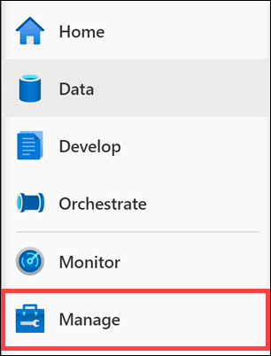

2. Select **Linked services** on the left-hand menu, then select **+ New**.

    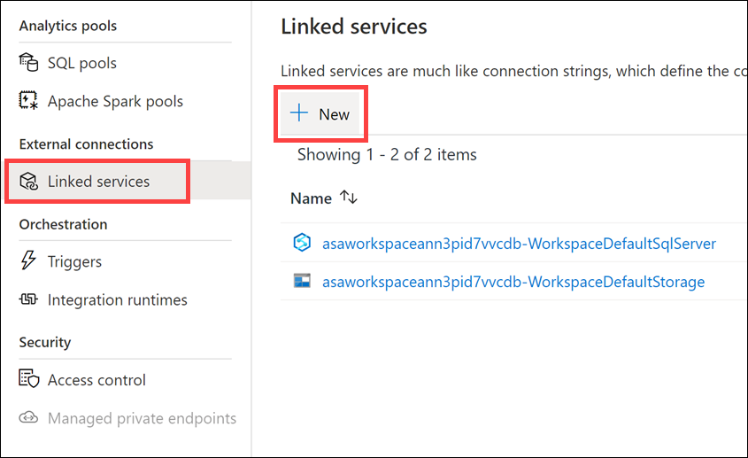

3. Select **Azure Cosmos DB (SQL API)**, then select **Continue** (make sure you do not select the MongoDB API).

    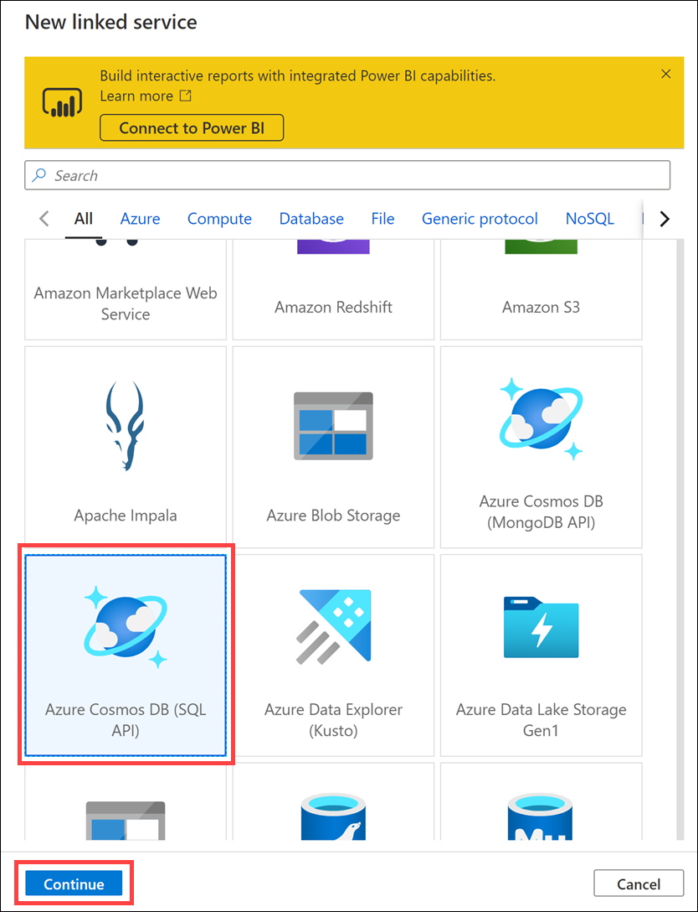

4. In the New linked service form, complete the following, test the connection, and then select **Create**:

   | Field                          | Value                                              |
   | ------------------------------ | ------------------------------------------         |
   | Name                   | _`WoodgroveCosmosDb`_                                   |
   | Account selection method           | _select `From Azure subscription`_           |
   | Azure subscription           | _select the subscription used for this lab_                         |
   | Azure Cosmos DB account name                   | _select the account named `woodgrove-db-SUFFIX`_                                   |
   | Database name           | _select `Woodgrove`_           |

   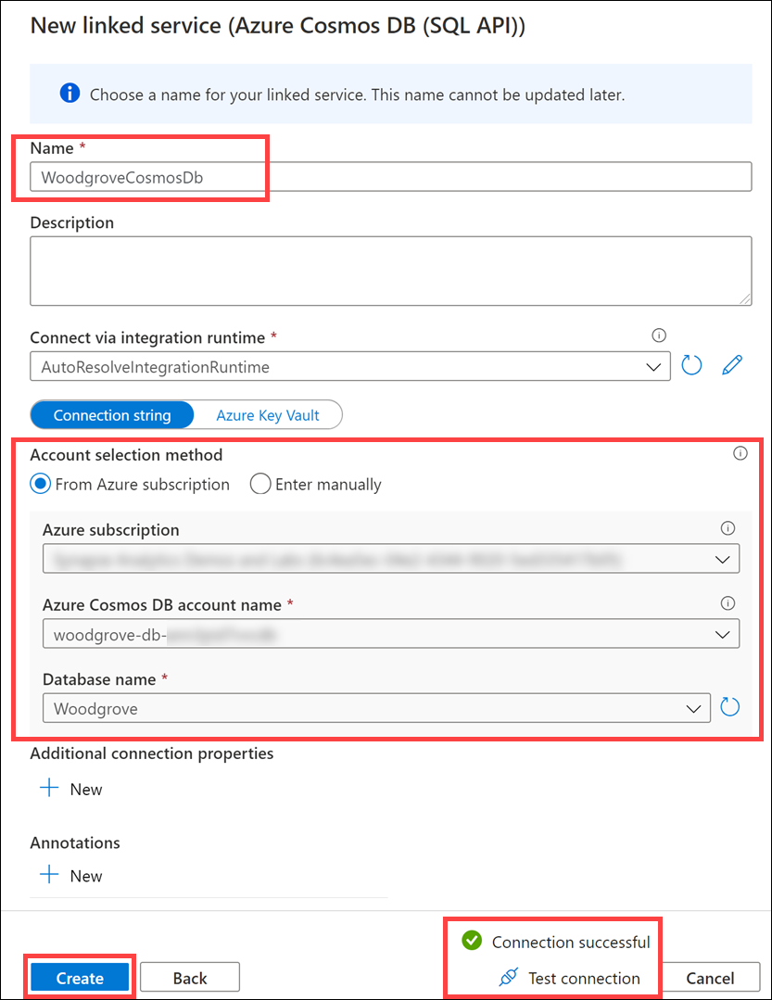

### Task 3: Create public data linked service

1. Within **Linked services**, select **+ New**.

    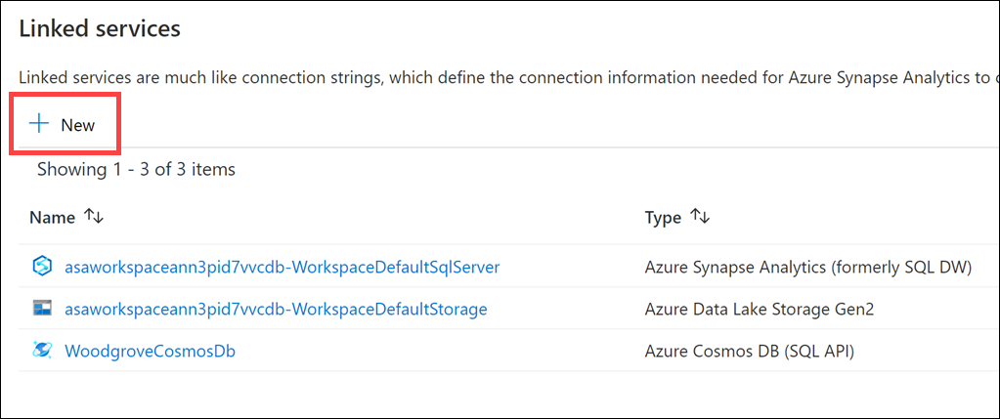

2. Select **Azure Blob Storage**, then select **Continue**.

    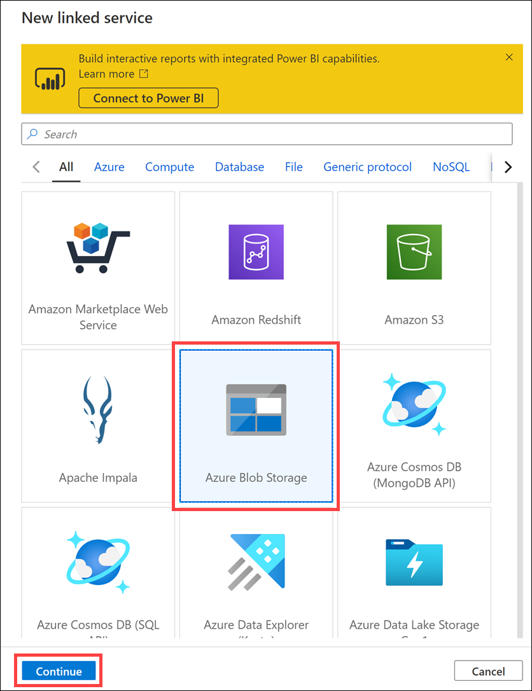

3. In the New linked service form, complete the following, test the connection, and then select **Create**:

   | Field                          | Value                                              |
   | ------------------------------ | ------------------------------------------         |
   | Name                   | _`publicdata`_                                   |
   | Authentication method           | _select `SAS URI`_           |
   | SAS URL           | `https://solliancepublicdata.blob.core.windows.net/mcw-cosmosdb`                         |
   | SAS token                   | _enter `''`_                                   |

   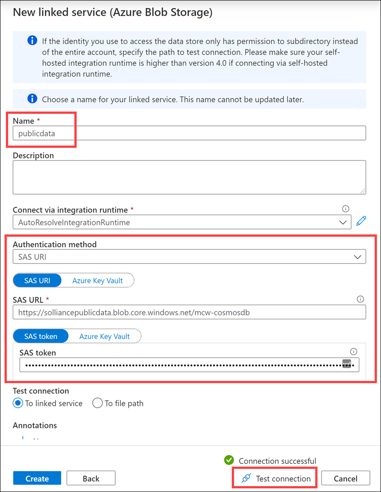

### Task 4: Create copy pipeline

1. Navigate to the **Integrate** hub.

    

2. Select **+** then **Copy data tool**.

    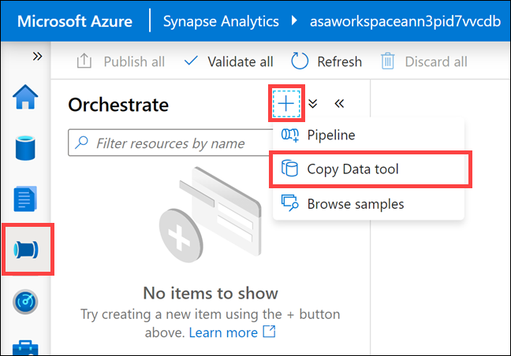

3. Enter **`CopyAccountData`** for the task name, then select **Next**.

    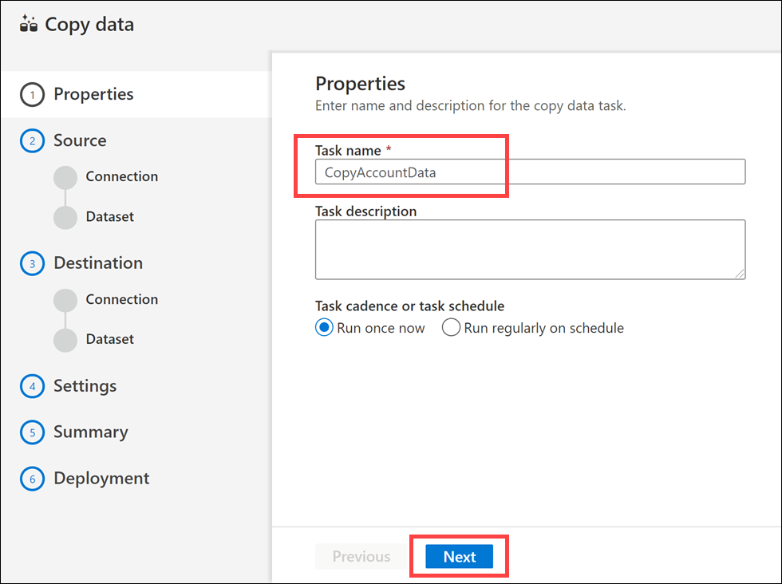

4. Select the **publicdata** source data store, then select **Next**.

    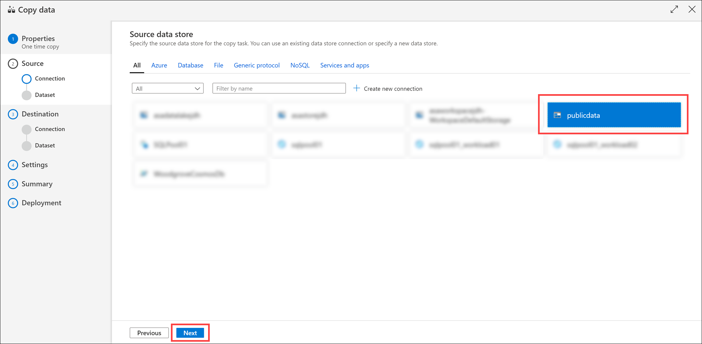

5. Copy and paste `mcw-cosmosdb/accounts/` for the folder path (you cannot browse the public data source), check **Recursively**, then select **Next**.

    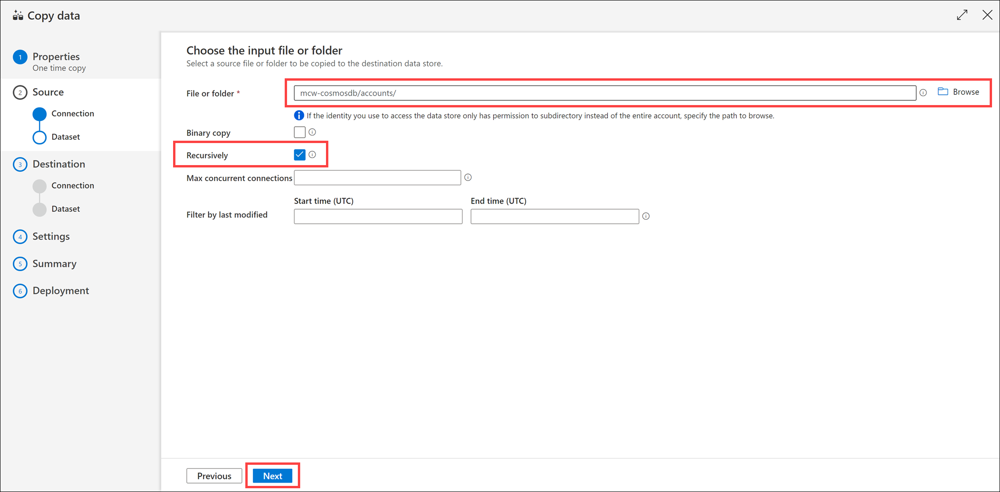

6. Select the `JSON` file format and check `Export as-is to JSON files or Cosmos DB collection`, then select **Next**.

    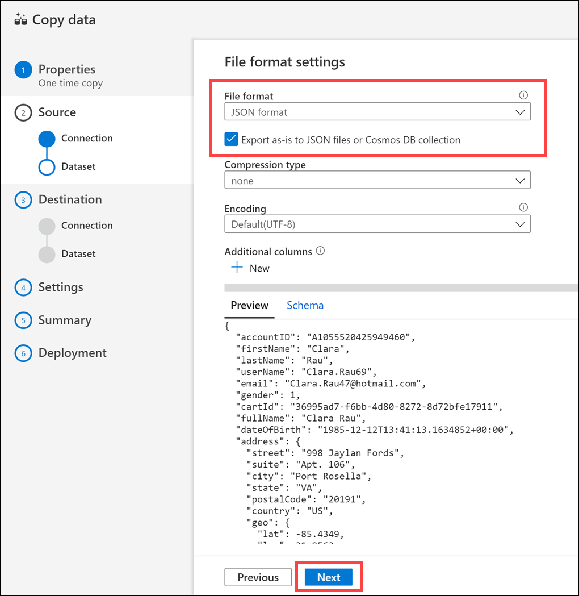

7. Select the **WoodgroveCosmosDb** destination data store, then select **Next**.

    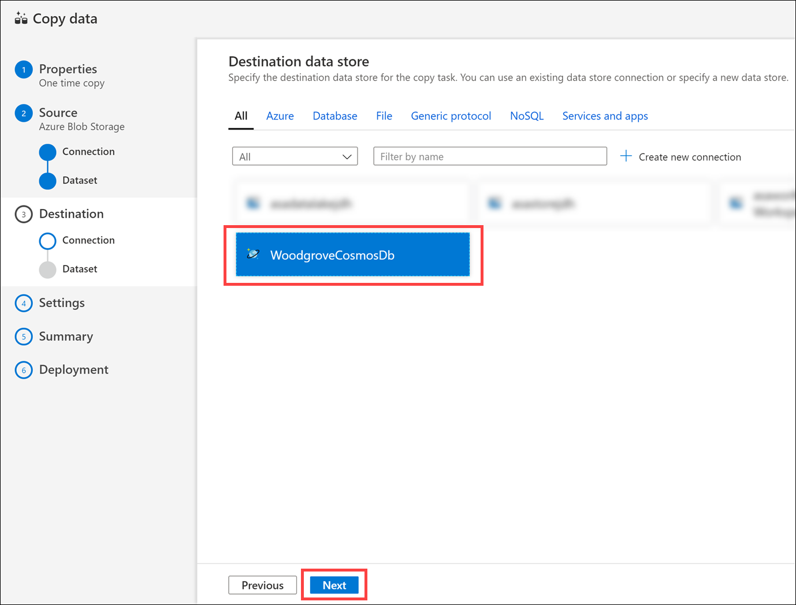

8. Select the `metadata` container as the destination, then select **Next**.

    

9. Expand the `Advanced settings` section under Settings, then set the degree of copy parallelism to **32**, then select **Next**.

    

10. In the Summary blade, select **Next**.

    

11. Once the deployment is complete, select **Monitor**.

    

12. It will take between 3 and 5 minutes for the pipeline run to complete. You may need to refresh the list a few times to see the status change.

    

    > You may move on to the next exercise while the pipeline runs.

## Exercise 5: Scaling globally

Duration: 45 minutes

When you set up Cosmos DB you enabled both geo-redundancy and multi-region writes, and in Exercise 1 you added more regions to your Cosmos DB instance.


In this exercise, you will score the batch transaction data stored in Cosmos DB with your trained ML model, and write any transactions that are marked as "suspicious" to Cosmos DB via the Azure Cosmos DB Spark Connector. Cosmos DB will automatically distribute that data globally, using the [default consistency level](https://docs.microsoft.com/azure/cosmos-db/consistency-levels). To learn more, see [Global data distribution with Azure Cosmos DB - under the hood](https://docs.microsoft.com/azure/cosmos-db/global-dist-under-the-hood).

### Task 1: Explore streaming data with Apache Spark

Now that we have added an Azure Cosmos DB Linked Service in Synapse Analytics, we can easily explore the data in the containers by using the built-in gestures. Let's use one of these gestures to explore streaming transaction data using Apache Spark in a Synapse Notebook.

1. Navigate to the **Data** hub.

    

2. Select the **Linked** tab **(1)**, expand the Azure Cosmos DB group (if you don't see this, select the Refresh button above), then expand the **WoodgroveCosmosDb** account **(2)**. Right-click on the **transactions** container **(3)**, select **New notebook (4)**, then select **Load streaming DataFrame from container (5)**.

    

3. Set the name of your notebook to `Stream processing` **(1)**, then select **Run all (2)** to run the notebook.

    

    The first cell contains auto-generated code **(3)** that populates a new DataFrame from the Azure Cosmos DB change feed stream from the `transactions` container. Notice that the `format` value is set to `cosmos.oltp`. This specifies that we are connecting to the transactional store instead of the analytical store. The `spark.cosmos.changeFeed.startFromTheBeginning` option ensures we process all the data streamed into the container.

    > The initial run of this notebook will take time while the Spark pool starts.

4. Select **{} Add code** underneath Cell 1 to create a new cell. Add the following to the cell and run it to indicate whether the `dfStream` DataFrame is a streaming type:

    ```python
    dfStream.isStreaming
    ```

    The output should be `True`.

5. Execute the following in a new cell to remove unwanted columns from the DataFrame:

    ```python
    # Remove unwanted columns from the columns collection
    cols = list(set(dfStream.columns) - {'_attachments','_etag','_rid','_self','_ts','collectionType','id','ttl'})

    changes_clean = dfStream.select(cols)
    ```

6. Execute the following in a new cell to write the stream to a new in-memory table named `transactions`:

    ```python
    query = (
    changes_clean
        .writeStream
        .format("memory")        # memory = store in-memory table (for testing only)
        .queryName("transactions")     # counts = name of the in-memory table
        .start()
    )
    ```

7. Execute the following in a new cell to count how many documents were written to the `transactions` container, using SQL syntax:

    ```sql
    %%sql
    SELECT COUNT(*) FROM transactions
    ```

    > If the count is `0`, wait a while and execute this cell again. You may need to execute it a couple of times before you start seeing the count increase.

8. We are done with this notebook. Select **Stop session** on the top-right of the notebook. This will free up serverless Apache Spark pool resources for other notebooks you will run.

    

### Task 2: Explore analytical store with Apache Spark

We have connected to the transactional (OLTP) data store, now let's use Apache Spark to run analytical queries against the `transactions` container. In this task, we will use built-in gestures in Synapse Studio to quickly create a Synapse Notebook that loads data from the analytical store of the Hybrid Transactional/Analytical Processing (HTAP)-enabled container, without impacting the transactional store.

1. Navigate to the **Data** hub.

    

2. Select the **Linked** tab **(1)**, expand the Azure Cosmos DB group (if you don't see this, select the Refresh button above), then expand the **WoodgroveCosmosDb** account **(2)**. Right-click on the **transactions** container **(3)**, select **New notebook (4)**, then select **Load to DataFrame (5)**.

    

3. Set the name of your notebook to `Spark table` **(1)**, then select **Run all (2)** to run the notebook.

    

    In the generated code within Cell 1 **(3)**, notice that the `spark.read` format is set to `cosmos.olap` this time. This instructs Synapse Link to use the container's analytical store. If we wanted to connect to the transactional store, like to read from the change feed or write to the container, we'd use `cosmos.oltp` instead.

    > **Note**: You cannot write to the analytical store, only read from it. If you want to load data into the container, you need to connect to the transactional store.

    The first `option` configures the name of the Azure Cosmos DB linked service. The second `option` defines the Azure Cosmos DB container from which we want to read. The last line displays the first 10 rows of the DataFrame.

    

    > The initial run of this notebook will take time while the Spark pool starts.

4. We are done with this notebook. Select **Stop session** on the bottom-left of the notebook. This will free up serverless Apache Spark pool resources for other notebooks you will run.

    

### Task 3: Distributing real-time and batch scored data globally using Cosmos DB

In this task, you will execute Synapse Notebooks to perform both near real-time scoring of transactions from the Cosmos DB change feed, and to connect to the analytical store to batch score transactions and store aggregated results. You will write the results from both notebooks to Cosmos DB.

1. Navigate to the **Develop** hub.

    

2. Select **+**, then select **Import**.

    

3. Browse to the location you extracted the MCW repo .zip file to (C:\\CosmosMCW\\) and navigate to the `Hands-on lab\lab-files\synapse` directory. Select the two **`.ipynb`** notebook files in the directory, then select **Open**.

    

4. Expand Notebooks and select the **Real-time-scoring** notebook.

    

5. In the **Real-time-scoring** notebook, follow the instructions to complete the remaining steps of this task.

    > In the cell that requires the Azure Machine Learning connection information, enter the same values you copied from the **Prepare batch scoring model** Azure ML notebook.

6. Select the **Batch-scoring-analytical-store** notebook.

    

7. In the **Batch-scoring-analytical-store** notebook, follow the instructions to complete the remaining steps of this task.

    > In the cell that requires the Azure Machine Learning connection information, enter the same values you copied from the **Prepare batch scoring model** Azure ML notebook.

8. If you receive an error stating "Session job is rejected because the session of the size specified cannot be allocated, due to core capacity being exceeded", then you need to stop the Spark session of the previous notebook.

    

    If the `Real-time-scoring` notebook is still open, select **Stop session** on the bottom-left of the notebook. This will free up serverless Apache Spark pool resources for other notebooks you will run.

    

## Exercise 6: Querying Azure Cosmos DB with Azure Synapse serverless SQL

Woodgrove wants to explore the Azure Cosmos DB analytical store with T-SQL. Ideally, they can create views that can then be used for joins with other analytical store containers, files from the data lake, or accessed by external tools, like Power BI.

In this exercise, you create SQL views to query data in the analytical store using an Azure Synapse serverless SQL pool. You will use these views when creating Power BI reports in the next exercise.

### Task 1: Retrieve the Cosmos DB account name and key

The SQL views require the Azure Cosmos DB account name and account key.

1. Navigate to your Azure Cosmos DB account in the Azure portal, then select **Keys** in the left-hand menu **(1)**, then copy the **Primary Key** value **(2)** and save it to Notepad or similar for later reference. Copy the Azure Cosmos DB **account name** in the upper-left corner **(3)** and also save it to Notepad or similar text editor for later.

    

### Task 2: Create Synapse SQL Serverless views

1. Navigate to the **Develop** hub.

    

2. Select **+ (1)**, then **SQL script (2)**.

    

3. Paste the following SQL query to create a new database named `Woodgrove`, then run the query.

    ```sql
    USE master
    GO

    -- Drop database if it exists
    DROP DATABASE IF EXISTS Woodgrove
    GO

    -- Create new database
    CREATE DATABASE [Woodgrove];
    GO
    ```

4. Replace the SQL query with the following to create a new view that displays the customer account data you imported with the copy pipeline earlier in this lab. In the OPENROWSET statement, replace **`YOUR_ACCOUNT_NAME`** with the Azure Cosmos DB account name and **`YOUR_ACCOUNT_KEY`** with the Azure Cosmos DB Primary Key value you copied in Task 1 above.

    ```sql
    USE Woodgrove
    GO

    DROP VIEW IF EXISTS Accounts;
    GO

    CREATE VIEW Accounts
    AS
    SELECT accounts.accountID,
        firstName,
        lastName,
        userName,
        email,
        gender,
        cartId,
        fullName,
        dateOfBirth,
        [address],
        street,
        suite,
        city,
        [state],
        postalCode,
        country,
        phone,
        website,
        accountAge,
        isUserRegistered,
        id
    FROM OPENROWSET
        (
            'CosmosDB',
            N'account=YOUR_ACCOUNT_NAME;database=Woodgrove;key=YOUR_ACCOUNT_KEY',
            metadata
        )
    WITH (
        accountID varchar(50),
        firstName varchar(50),
        lastName varchar(50),
        userName varchar(50),
        email varchar(50),
        gender bigint,
        cartId varchar(50),
        fullName varchar(50),
        dateOfBirth varchar(50),
        [address] varchar(max),
        phone varchar(50),
        website varchar(50),
        accountAge bigint,
        isUserRegistered bit,
        id varchar(50)
    ) AS accounts
    CROSS APPLY OPENJSON([address])  
    WITH (
        street varchar(50) '$.street',
        suite varchar(50) '$.suite',
        city varchar(50)  '$.city', 
        [state] varchar(50) '$.state',
        postalCode varchar(50) '$.postalCode', 
        country varchar(50) '$.country'
    ) AS addressinfo
    GO
    ```

    The query starts out with executing `USE Woodgrove` to run the rest of the script contents against the `Woodgrove` database. Next, it drops the `Accounts` view if it exists. Finally, it performs the following:

    - **1.** Creates a SQL view named `Accounts`.
    - **2.** Uses the `OPENROWSET` statement to set the data source type to `CosmosDB`, sets the account details, and specifies that we want to create the view over the Azure Cosmos DB analytical store container named `metadata`.
    - **3.** The `WITH` clause matches the property names in the JSON documents and applies the appropriate SQL data types. Notice that we set the `address` field to `varchar(max)`. This is because it contains JSON-formatted data within.
    - **4.** Since the `address` property in the JSON documents contains a child JSON value, we want to "join" the properties from the document with the child element's properties. Synapse SQL enables us to flatten the nested structure by applying the `OPENJSON` function on the property. We flatten the values within the `address` child element into new fields.

    The account document looks like the following:

    ```json
    {
        "accountID": "A914801037141001",
        "firstName": "Gene",
        "lastName": "Wilkinson",
        "userName": "Gene.Wilkinson",
        "email": "Gene.Wilkinson@yahoo.com",
        "gender": 0,
        "cartId": "e1179552-7ad4-4651-8281-5be4b7120746",
        "fullName": "Gene Wilkinson",
        "dateOfBirth": "1965-10-25T15:15:33.2371477-04:00",
        "address": {
            "street": "153 Mckayla Groves",
            "suite": "Apt. 378",
            "city": "South Geovany",
            "state": "MI",
            "postalCode": "48312",
            "country": "US",
            "geo": {
                "lat": -65.6941,
                "lng": -105.719
            }
        },
        "phone": "815-928-5510 x99673",
        "website": "mara.org",
        "accountAge": 1,
        "isUserRegistered": false,
        "id": "375502a3-33fa-4299-8d33-bb364ec64e91",
        "_rid": "5RkmAJYvclYBAAAAAAAAAA==",
        "_self": "dbs/5RkmAA==/colls/5RkmAJYvclY=/docs/5RkmAJYvclYBAAAAAAAAAA==/",
        "_etag": "\"1600556c-0000-0100-0000-5f7007070000\"",
        "_attachments": "attachments/",
        "_ts": 1601177352
    }
    ```

5. Replace the SQL query with the following to create a view for the `SuspiciousAgg` data. In the OPENROWSET statement, replace **`YOUR_ACCOUNT_NAME`** with the Azure Cosmos DB account name and **`YOUR_ACCOUNT_KEY`** with the Azure Cosmos DB Primary Key value you copied in Task 1 above.

    ```sql
    USE Woodgrove
    GO

    DROP VIEW IF EXISTS SuspiciousAgg;
    GO

    CREATE VIEW SuspiciousAgg
    AS
    SELECT
        [collectionType]
        ,[SuspiciousTransactionCount]
        ,[TotalTransactionCount]
        ,[ipCountryCode]
        ,[id]
        ,[PercentSuspicious]
    FROM OPENROWSET
        (
            'CosmosDB',
            N'account=YOUR_ACCOUNT_NAME;database=Woodgrove;key=YOUR_ACCOUNT_KEY',
            suspicious_transactions
        )
    WITH (
        [collectionType] varchar(50)
        ,[SuspiciousTransactionCount] bigint
        ,[TotalTransactionCount] bigint
        ,[ipCountryCode] varchar(5)
        ,[id] varchar(50)
        ,[PercentSuspicious] float
    ) AS Q1
    WHERE collectionType = 'SuspiciousAgg'
    ```

6. Replace the SQL query with the following to create a view for the `SuspiciousTransactions` data. In the OPENROWSET statement, replace **`YOUR_ACCOUNT_NAME`** with the Azure Cosmos DB account name and **`YOUR_ACCOUNT_KEY`** with the Azure Cosmos DB Primary Key value you copied in Task 1 above.

    ```sql
    USE Woodgrove
    GO

    DROP VIEW IF EXISTS SuspiciousTransactions;
    GO

    CREATE VIEW SuspiciousTransactions
    AS
    SELECT
        transactionID, accountID, transactionAmountUSD, transactionAmount, transactionCurrencyCode,
        localHour, transactionIPaddress, ipState, ipPostcode, ipCountryCode, isProxyIP,
        browserLanguage, paymentInstrumentType, cardType, paymentBillingPostalCode,
        paymentBillingState, paymentBillingCountryCode, cvvVerifyResult, digitalItemCount,
        physicalItemCount, accountPostalCode, accountState, accountCountry, accountAge,
        isUserRegistered, paymentInstrumentAgeInAccount, numPaymentRejects1dPerUser,
        transactionDateTime, isSuspicious, collectionType
    FROM OPENROWSET
        (
            'CosmosDB',
            N'account=YOUR_ACCOUNT_NAME;database=Woodgrove;key=YOUR_ACCOUNT_KEY',
            suspicious_transactions
        )
    WITH (
        transactionID varchar(50),
        accountID varchar(50),
        transactionAmountUSD float,
        transactionAmount float,
        transactionCurrencyCode varchar(10),
        localHour bigint,
        transactionIPaddress varchar(25),
        ipState varchar(50),
        ipPostcode varchar(10),
        ipCountryCode varchar(5),
        isProxyIP bit,
        browserLanguage varchar(10),
        paymentInstrumentType varchar(15),
        cardType varchar(15),
        paymentBillingPostalCode varchar(10),
        paymentBillingState varchar(50),
        paymentBillingCountryCode varchar(5),
        cvvVerifyResult varchar(10),
        digitalItemCount bigint,
        physicalItemCount bigint,
        accountPostalCode varchar(20),
        accountState varchar(50),
        accountCountry varchar(50),
        accountAge bigint,
        isUserRegistered bigint,
        paymentInstrumentAgeInAccount float,
        numPaymentRejects1dPerUser bigint,
        transactionDateTime varchar(50),
        isSuspicious bigint,
        collectionType varchar(50)
    ) AS Q1
    WHERE collectionType = 'SuspiciousTransactions'
    ```

7. Replace the SQL query with the following to create a view for the `Transactions` data to access all transactions. In the OPENROWSET statement, replace **`YOUR_ACCOUNT_NAME`** with the Azure Cosmos DB account name and **`YOUR_ACCOUNT_KEY`** with the Azure Cosmos DB Primary Key value you copied in Task 1 above.

    ```sql
    USE Woodgrove
    GO

    DROP VIEW IF EXISTS Transactions;
    GO

    CREATE VIEW Transactions
    AS
    SELECT
        transactionID, accountID, transactionAmountUSD, transactionAmount, transactionCurrencyCode,
        localHour, transactionIPaddress, ipState, ipPostcode, ipCountryCode, isProxyIP,
        browserLanguage, paymentInstrumentType, cardType, paymentBillingPostalCode,
        paymentBillingState, paymentBillingCountryCode, cvvVerifyResult, digitalItemCount,
        physicalItemCount, accountPostalCode, accountState, accountCountry, accountAge,
        isUserRegistered, paymentInstrumentAgeInAccount, numPaymentRejects1dPerUser,
        transactionDateTime, collectionType
    FROM OPENROWSET
        (
            'CosmosDB',
            N'account=YOUR_ACCOUNT_NAME;database=Woodgrove;key=YOUR_ACCOUNT_KEY',
            transactions
        )
    WITH (
        transactionID varchar(50),
        accountID varchar(50),
        transactionAmountUSD float,
        transactionAmount float,
        transactionCurrencyCode varchar(10),
        localHour bigint,
        transactionIPaddress varchar(25),
        ipState varchar(50),
        ipPostcode varchar(10),
        ipCountryCode varchar(5),
        isProxyIP bit,
        browserLanguage varchar(10),
        paymentInstrumentType varchar(15),
        cardType varchar(15),
        paymentBillingPostalCode varchar(10),
        paymentBillingState varchar(50),
        paymentBillingCountryCode varchar(5),
        cvvVerifyResult varchar(10),
        digitalItemCount bigint,
        physicalItemCount bigint,
        accountPostalCode varchar(20),
        accountState varchar(50),
        accountCountry varchar(50),
        accountAge bigint,
        isUserRegistered bigint,
        paymentInstrumentAgeInAccount float,
        numPaymentRejects1dPerUser bigint,
        transactionDateTime varchar(50),
        collectionType varchar(50)
    ) AS Q1
    WHERE collectionType = 'Transaction'
    ```

8. Replace the SQL query with the following to create a view that joins the suspicious transactions with user account information. We use an INNER JOIN between the `SuspiciousTransactions` view and the `Accounts` view:

    ```sql
    USE Woodgrove
    GO

    DROP VIEW IF EXISTS SuspiciousTransactionsWithAccountInfo;
    GO

    CREATE VIEW SuspiciousTransactionsWithAccountInfo
    AS
    SELECT TOP(100) t.transactionID, a.accountID, transactionAmountUSD, transactionAmount, transactionCurrencyCode,
        localHour, transactionIPaddress, ipState, ipPostcode, ipCountryCode, isProxyIP,
        browserLanguage, paymentInstrumentType, cardType, paymentBillingPostalCode,
        paymentBillingState, paymentBillingCountryCode, cvvVerifyResult, digitalItemCount,
        physicalItemCount, accountPostalCode, accountState, accountCountry,
        paymentInstrumentAgeInAccount, numPaymentRejects1dPerUser,
        transactionDateTime, isSuspicious, collectionType,
        firstName,
        lastName,
        userName,
        email,
        gender,
        cartId,
        fullName,
        dateOfBirth,
        phone,
        website,
        a.accountAge,
        a.isUserRegistered,
        a.street,
        a.suite, a.city, a.[state], a.postalCode,
        a.country
    FROM SuspiciousTransactions t INNER JOIN Accounts a ON t.accountID = a.accountID
    ```

9. Replace the SQL query with the following to create a view that counts the number of suspicious vs. non-suspicious transactions per account (user), referencing the `Transactions` and `SuspiciousTransactions` views you created. Then we select from the new view where `SuspiciousCount > 0`.

    ```sql
    USE Woodgrove
    GO

    DROP VIEW IF EXISTS TransactionCounts;
    GO

    CREATE VIEW TransactionCounts
    AS
    SELECT AccountId, MAX(SuspiciousCount) SuspiciousCount, MAX(NonSuspiciousCount) NonSuspiciousCount FROM
        (SELECT AccountId, COUNT(*) SuspiciousCount, 0 NonSuspiciousCount FROM SuspiciousTransactions
        GROUP BY AccountId
        UNION
        (
            SELECT AccountId, 0 SuspiciousCount, COUNT(*) NonSuspiciousCount FROM Transactions
            WHERE TransactionId NOT IN (select TransactionId FROM SuspiciousTransactions)
            GROUP BY AccountId
        )) Q1
    GROUP BY AccountId;
    GO

    SELECT * FROM TransactionCounts
    WHERE SuspiciousCount > 0
    ORDER BY SuspiciousCount DESC, NonSuspiciousCount DESC;
    ```

    You should see results similar to the following:

    

## Exercise 7: Query the analytical store with Apache Spark

Duration: 10 minutes

Woodgrove also wants to explore the Cosmos DB analytical store with Apache Spark, using Synapse Notebooks. In this exercise, you create a new notebook to query and join data from the `metadata` and `suspicious_transactions` analytical stores to view user account data associated with transactions scored as being suspicious.

1. Navigate to the **Develop** hub.

    

2. Select **+ (1)**, then **Notebook (2)**.

    

3. Make sure that the notebook language is set to **PySpark (Python)**, then select **{} Add code**.

    

4. Execute the following in the new cell to populate a new DataFrame from the `metadata` analytical store, identify unwanted columns, and display the results:

    ```python
    accounts = spark.read\
        .format("cosmos.olap")\
        .option("spark.synapse.linkedService", "WoodgroveCosmosDb")\
        .option("spark.cosmos.container", "metadata")\
        .load()

    unwanted_cols = {'_attachments','_etag','_rid','_self','_ts','collectionType','id','ttl','SuspiciousTransactionCount','TotalTransactionCount','PercentSuspicious'}

    # Remove unwanted columns from the columns collection
    cols = list(set(accounts.columns) - unwanted_cols)

    accounts = accounts.select(cols)

    display(accounts.limit(10))
    ```

    > Remember, when you run a cell for the first time in a notebook, it initially takes a few minutes for the Spark pool session to start.

5. Execute the following in a new cell to populate a new DataFrame from the `suspicious_transactions` analytical store:

    ```python
    suspicious = spark.read\
        .format("cosmos.olap")\
        .option("spark.synapse.linkedService", "WoodgroveCosmosDb")\
        .option("spark.cosmos.container", "suspicious_transactions")\
        .load()
    ```

6. Execute the following in a new cell to filter the `suspicious_transactions` data by documents of type "SuspiciousTransactions", and remove duplicate and unwanted columns:

    ```python
    suspicious_transactions = (suspicious
        .where("collectionType == 'SuspiciousTransactions'"))

    # Remove columns that exist in both this Dataframe and the accounts Dataframe
    duplicate_cols = {'accountPostalCode', 'accountState', 'accountCountry', 'accountAge', 'isUserRegistered'}

    # Remove unwanted columns from the columns collection
    cols = list(set(suspicious_transactions.columns) - unwanted_cols - duplicate_cols)

    suspicious_transactions = suspicious_transactions.select(cols)
    ```

7. Execute the following in a new cell to display the suspicious transactions:

    ```python
    display(suspicious_transactions.limit(10))
    ```

8. Execute the following in a new cell to perform an inner join on the `suspicious_transactions` and `accounts` DataFrames on the `accountID` field, then select only the columns we're interested in:

    ```python
    suspicious_transactions_accounts = suspicious_transactions.join(accounts, on=['accountID'], how='inner')

    # Set the columns to only the ones we want
    cols = list({'accountID','transactionCurrencyCode','paymentInstrumentType','ipCountryCode',
        'transactionDateTime', 'paymentInstrumentAgeInAccount', 'transactionIPaddress', 'paymentBillingCountryCode',
        'cvvVerifyResult', 'paymentBillingState', 'browserLanguage', 'digitalItemCount', 'physicalItemCount',
        'transactionID', 'localHour', 'transactionAmountUSD', 'ipPostcode', 'paymentBillingPostalCode', 'transactionAmount',
        'numPaymentRejects1dPerUser', 'ipState', 'cardType', 'accountAge', 'userName', 'firstName', 'lastName',
        'gender', 'dateOfBirth', 'phone', 'email', 'address', 'fullName'})

    suspicious_transactions_accounts = suspicious_transactions_accounts.select(cols)

    display(suspicious_transactions_accounts.limit(10))
    ```

9. Finally, execute the following in a new cell to view the aggregates from the `suspicious_transactions` analytical store:

    ```python
    suspicious_agg = (suspicious
        .where("collectionType == 'SuspiciousAgg'"))

    # Set the columns to only the ones we want
    cols = list({'SuspiciousTransactionCount','TotalTransactionCount','PercentSuspicious','ipCountryCode'})

    suspicious_agg = suspicious_agg.select(cols)

    display(suspicious_agg.limit(10))
    ```

## Exercise 8: Reporting

Duration: 30 minutes

In this exercise, you create dashboards and reports in Power BI that connect to the Azure Cosmos DB analytical stores through the Synapse SQL Serverless views you created earlier.

### Task 1: Retrieve the Synapse SQL Serverless endpoint address

In this task, you retrieve the SQL service endpoint address used to connect to your Synapse SQL Serverless database from your Power BI reports.

1. In the Azure Portal, navigate to the **Resource Group** created for this hands-on lab, then navigate to the **Synapse Analytics workspace** resource.

    

2. In the Synapse Analytics workspace Overview blade, copy the **SQL on-demand endpoint** and save it to Notepad or similar text editor.

    

### Task 2: Create Power BI workspace

Later in this exercise, you will add a Power BI Linked Service. When you do this, you need to select a workspace. In this task, you create a new Power BI workspace for this lab.

> You need a Power BI Pro license to complete this step and to link Power BI to Synapse Analytics. Skip ahead to Task 3 or sign up for a trial Pro subscription if you do not have a license.

1. Sign in to Power BI online (<https://powerbi.com>).

2. Select **Workspaces**, then **Create a workspace**.

    

3. Enter **Woodgrove** for the workspace name, then select **Save**.

    

### Task 3: Utilizing Power BI to summarize and visualize global fraud trends

In this task, you will use the Synapse SQL Serverless service endpoint to connect to from Power BI desktop. Then you will create reports and add them to a dashboard to summarize and visualize global fraud trends to gain more insight into the data.

1. Open Power BI Desktop and sign in if needed.

    

2. On the Power BI Desktop welcome screen select **Get data**.

    

3. In the Get Data dialog, select **Azure**, then **Azure SQL database**. Select **Connect**.

    

4. Paste the SQL on-demand endpoint you copied in Task 1 above, into the **Server** field. Type `Woodgrove` in the **Database** field. Select the **Import** option and then select **OK**.

    

5. Select **Microsoft account** for the authentication type, then select **Sign in** to enter your Azure account credentials used for this lab. After authenticating, select **Connect** to continue.

    

6. Select all the views, then select **Load**.

    

7. After a few moments, you will be redirected to a blank report screen with the tables listed on the right-hand side. Select the **Donut chart** visualization on the right-hand menu under Visualizations and next to the list of tables and fields.

    

8. Expand the `SuspiciousTransactions` view, then drag `ipCountryCode` under **Legend**, and `transactionAmountUSD` under **Values**.

    

9. Your donut chart should look similar to the following, displaying the US dollar amount of transactions by country code:

    

10. Select a blank area on the report to deselect the donut chart. Now select the **Treemap** visualization.

    

11. Drag the `ipCountryCode` field from the `SuspiciousTransactions` view under **Group**, then drag `isSuspicious` under **Values**.

    

12. The treemap should look similar to the following, displaying the number of suspicious transactions per country:

    

13. Select a blank area on the report to deselect the treemap. Now select the **Treemap** visualization once more to add a new treemap. Drag the `transactionAmountUSD` field from the `scored_transactions` table under **Group**, then drag `isSuspicious` under **Values**.

    

14. The new treemap should look similar to the following, displaying the US dollar amounts that tend to have suspicious transactions, with the larger boxes representing higher suspicious transactions compared to smaller boxes:

    

15. Select a blank area on the report to deselect the treemap. Now select the **Donut chart** visualization. Drag the `localHour` field from the `SuspiciousTransactions` view under **Legend**, then drag `isSuspicious` under **Values**.

    

16. The donut chart should look similar to the following, displaying which hours of the day tend to have a higher number of suspicious activity overall:

    

17. Select a blank area on the report to deselect the donut chart. Now select the **Map** visualization. Drag the `ipCountryCode` field from the `SuspiciousTransactions` view under **Location**, then drag `isSuspicious` under **Size**.

    

18. The map should look similar to the following, showing circles of varying sizes on different regions of the map. The larger the circle, the more suspicious transactions there are in that region. You may also resize the charts to optimize your layout:

    

19. Now add a new page to your report. Select the **+** button on the bottom-left next to **Page 1**. This will create a new blank report page to add a few more visualizations.

    

20. Select a blank area on the report, then select the **Donut chart** visualization. Drag the `cvvVerifyResult` field from the `SuspiciousTransactoins` view under **Legend**, then drag `isSuspicious` under **Values**.

    

21. The donut chart should look similar to the following, displaying which CVV2 credit card verification codes correlate with the most suspicious transactions:

    

    The CVV2 codes have the following meaning in the data set:

    | Code | Meaning                                                                                                                       |
    | ---- | ----------------------------------------------------------------------------------------------------------------------------- |
    | M    | CVV2 Match                                                                                                                    |
    | N    | CVV2 No Match                                                                                                                 |
    | P    | Not Processed                                                                                                                 |
    | S    | Issuer indicates that CVV2 data should be present on the card, but the merchant has indicated data is not present on the card |
    | U    | Issuer has not certified for CVV2 or Issuer has not provided Visa with the CVV2 encryption keys                               |

22. Select a blank area on the report, then select the **Pie chart** visualization. Drag the `ipCountryCode` field from the `SuspiciousAgg` view under **Legend**, then drag `PercentSuspicious` under **Values**.

    

23. The pie chart should look similar to the following, displaying the percent of suspicious transactions by country code:

    

24. Select a blank area on the report, then select the **Matrix** visualization. Drag the `AccountId` field from the `TransactionCounts` view under **Rows**, drag `SuspiciousCount` under **Values**, then drag `NonSuspiciousCount` under **Values**.

    

25. The matrix showing suspicious vs. non-suspicious counts per user account is displayed. Select the **SuspiciousCount** header to sort by the column in descending order.

    

26. Select a blank area on the report, then select the **Table** visualization. Expand the `SuspiciousTransactionsWithAccountInfo` view, then drag the following fields into the **Values** field: `fullName`, `accountID`, `city`, `country`, `cardType`, `cvvVerifyResult`, and `browserLanguage`.

    

27. The table showing user account information for suspicious transactions is displayed.

    

28. Select the account with the highest number of suspicious transactions from the Matrix visualization. The other visualizations will filter based on the selected account.

    

### Task 4: Publish report and add Power BI Linked Service

So far, the report you created is only available to you. To share the report with others, you need to publish it to the Power BI online service. Once you've published your report, you can make it available within Synapse Studio, along with other reports published to your workspace.

In this task, you save and publish your report online, then create a Power BI Linked Service in Synapse Studio. Finally, you view the report within the Studio interface.

1. Select **Publish** in the ribbon bar above the report.

    

2. When prompted to save your report, save it to your local disk with a descriptive name, such as `Cosmos DB MCW`.

3. In the Publish to Power BI dialog, select the **Woodgrove** workspace, then select **Select**.

    

4. Wait for the publish to complete. It may take several minutes.

    

5. Return to Synapse Studio and navigate to the **Manage** hub.

    

6. Select **Linked services** on the left-hand menu, then select **+ New**.

    

7. Select either **Connect to Power BI** if the dialog appears at the top, or select **Power BI** from the list and select **Continue**.

    

8. Enter **PowerBIWorkspace** for the name, select the tenant associated with your Power BI account, then select the **Woodgrove** workspace name. Select **Create**.

    ")

### Task 5: View the report in Synapse Studio

1. Navigate to the **Develop** hub.

    

2. If you do not see the Power BI group, select **Refresh** above the list.

    

3. Expand the Power BI group, expand the **Woodgrove** workspace, then expand Power BI reports. Select the **Cosmos DB MCW** report.

    

    You can view and edit the report with the same functions available to you online. This integrated ability enables you to work with Power BI reports without leaving Synapse Studio.

## After the hands-on lab

Duration: 10 minutes

In this exercise, you will delete any Azure resources that were created in support of the lab. You should follow all steps provided after attending the Hands-on lab to ensure your account does not continue to be charged for lab resources.

### Task 1: Delete the resource group

1. Using the [Azure portal](https://portal.azure.com), navigate to the Resource group you used throughout this hands-on lab by selecting Resource groups in the left menu.

2. Search for the name of your research group, and select it from the list.

3. Select Delete in the command bar, and confirm the deletion by re-typing the Resource group name, and selecting Delete.

You should follow all steps provided _after_ attending the Hands-on lab.
